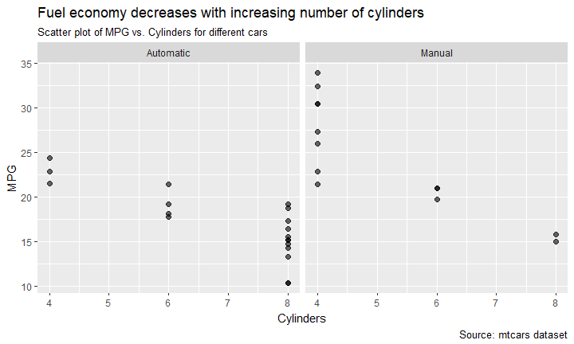

Practical Data Science using R </br> Lesson 1: Data Frame Manipulation with `dplyr`
================
Maher Harb, PhD </br> Assistant Professor of Physics </br> Drexel University

About the lesson
----------------

-   This lesson assumes that you have knowledge of Base R

-   The lesson is mainly on the `dplyr` six verbs and pipe operator (`%>%`)

-   `dplyr` is a package for data manipulation, authored by Hadley Wickham

-   It offers several advantages over equivalent functionality in Base R

But first we'll go through a quick review of some non-dplyr functions needed for completion of the lesson's practice exercises...

Setting up a working directory
------------------------------

Use the `setwd` function to set the working directory:

``` r
setwd("C:/users/maher/Google Drive/GitHub/MATE-T580/Datasets/")
```

Once set, any subsequent calls to functions that save or retrieve files will treat the working directory as the root (home) folder

If in doubt, use `getwd` to check the current path:

``` r
getwd()
```

    ## [1] "C:/Users/Maher/Google Drive/GitHub/MATE-T580/Datasets"

Installing and loading libraries
--------------------------------

Libraries (packages) are installed with the `install.packages` function:

``` r
install.packages("readr")
```

We may install several packages at once:

``` r
install.packages(c("readr", "dplyr"))
```

While a package needs to be installed only once, calling the package functions within a script requires that the package is loaded first:

``` r
library(dplyr)
```

Now is your turn to practice!
-----------------------------

Throughout this lesson we'll be using the following libraries:

`httr`, `readr`, `dplyr`

Check that these libraries are installed in your version of R, and if not, install them using the `install.packages` function

Downloading a file from the web
-------------------------------

The `GET` function (`httr` package) is used to download a file from the web:

``` r
library(httr)
GET("https://goo.gl/mdsf7m", write_disk("mtcars.csv", overwrite = TRUE))
```

    ## Response [https://raw.githubusercontent.com/maherharb/MATE-T580/master/Datasets/mtcars.csv]
    ##   Date: 2018-04-10 16:39
    ##   Status: 200
    ##   Content-Type: text/plain; charset=utf-8
    ##   Size: 1.78 kB
    ## <ON DISK>  C:\Users\maher\Google Drive\GitHub\MATE-T580\Datasets\mtcars.csv

Notice that by not specifying a full destination path, the file is saved in the working directory

Reading a csv file
------------------

The `read_csv` function (`readr` package) is used to load a csv file as an R data frame:

``` r
library(readr)
df_cars <- read_csv("mtcars.csv")
```

`df_cars` contains the contents of the downloaded csv file

``` r
class(df_cars)
```

    ## [1] "tbl_df"     "tbl"        "data.frame"

``` r
dim(df_cars)
```

    ## [1] 32 12

Data frame structure
--------------------

One of the first investigations we should do after reading a csv file is to inspect the structure of the data frame with `str`:

``` r
str(df_cars)
```

    ## Classes 'tbl_df', 'tbl' and 'data.frame':    32 obs. of  12 variables:
    ##  $ X1  : chr  "Mazda RX4" "Mazda RX4 Wag" "Datsun 710" "Hornet 4 Drive" ...
    ##  $ mpg : num  21 21 22.8 21.4 18.7 18.1 14.3 24.4 22.8 19.2 ...
    ##  $ cyl : int  6 6 4 6 8 6 8 4 4 6 ...
    ##  $ disp: num  160 160 108 258 360 ...
    ##  $ hp  : int  110 110 93 110 175 105 245 62 95 123 ...
    ##  $ drat: num  3.9 3.9 3.85 3.08 3.15 2.76 3.21 3.69 3.92 3.92 ...
    ##  $ wt  : num  2.62 2.88 2.32 3.21 3.44 ...
    ##  $ qsec: num  16.5 17 18.6 19.4 17 ...
    ##  $ vs  : int  0 0 1 1 0 1 0 1 1 1 ...
    ##  $ am  : int  1 1 1 0 0 0 0 0 0 0 ...
    ##  $ gear: int  4 4 4 3 3 3 3 4 4 4 ...
    ##  $ carb: int  4 4 1 1 2 1 4 2 2 4 ...
    ##  - attr(*, "spec")=List of 2
    ##   ..$ cols   :List of 12
    ##   .. ..$ X1  : list()
    ##   .. .. ..- attr(*, "class")= chr  "collector_character" "collector"
    ##   .. ..$ mpg : list()
    ##   .. .. ..- attr(*, "class")= chr  "collector_double" "collector"
    ##   .. ..$ cyl : list()
    ##   .. .. ..- attr(*, "class")= chr  "collector_integer" "collector"
    ##   .. ..$ disp: list()
    ##   .. .. ..- attr(*, "class")= chr  "collector_double" "collector"
    ##   .. ..$ hp  : list()
    ##   .. .. ..- attr(*, "class")= chr  "collector_integer" "collector"
    ##   .. ..$ drat: list()
    ##   .. .. ..- attr(*, "class")= chr  "collector_double" "collector"
    ##   .. ..$ wt  : list()
    ##   .. .. ..- attr(*, "class")= chr  "collector_double" "collector"
    ##   .. ..$ qsec: list()
    ##   .. .. ..- attr(*, "class")= chr  "collector_double" "collector"
    ##   .. ..$ vs  : list()
    ##   .. .. ..- attr(*, "class")= chr  "collector_integer" "collector"
    ##   .. ..$ am  : list()
    ##   .. .. ..- attr(*, "class")= chr  "collector_integer" "collector"
    ##   .. ..$ gear: list()
    ##   .. .. ..- attr(*, "class")= chr  "collector_integer" "collector"
    ##   .. ..$ carb: list()
    ##   .. .. ..- attr(*, "class")= chr  "collector_integer" "collector"
    ##   ..$ default: list()
    ##   .. ..- attr(*, "class")= chr  "collector_guess" "collector"
    ##   ..- attr(*, "class")= chr "col_spec"

Data frame structure
--------------------

The structure of the data frame can alternatively be inspected with the `glimpse` function (`dplyr` package):

``` r
glimpse(df_cars)
```

    ## Observations: 32
    ## Variables: 12
    ## $ X1   <chr> "Mazda RX4", "Mazda RX4 Wag", "Datsun 710", "Hornet 4 Dri...
    ## $ mpg  <dbl> 21.0, 21.0, 22.8, 21.4, 18.7, 18.1, 14.3, 24.4, 22.8, 19....
    ## $ cyl  <int> 6, 6, 4, 6, 8, 6, 8, 4, 4, 6, 6, 8, 8, 8, 8, 8, 8, 4, 4, ...
    ## $ disp <dbl> 160.0, 160.0, 108.0, 258.0, 360.0, 225.0, 360.0, 146.7, 1...
    ## $ hp   <int> 110, 110, 93, 110, 175, 105, 245, 62, 95, 123, 123, 180, ...
    ## $ drat <dbl> 3.90, 3.90, 3.85, 3.08, 3.15, 2.76, 3.21, 3.69, 3.92, 3.9...
    ## $ wt   <dbl> 2.620, 2.875, 2.320, 3.215, 3.440, 3.460, 3.570, 3.190, 3...
    ## $ qsec <dbl> 16.46, 17.02, 18.61, 19.44, 17.02, 20.22, 15.84, 20.00, 2...
    ## $ vs   <int> 0, 0, 1, 1, 0, 1, 0, 1, 1, 1, 1, 0, 0, 0, 0, 0, 0, 1, 1, ...
    ## $ am   <int> 1, 1, 1, 0, 0, 0, 0, 0, 0, 0, 0, 0, 0, 0, 0, 0, 0, 1, 1, ...
    ## $ gear <int> 4, 4, 4, 3, 3, 3, 3, 4, 4, 4, 4, 3, 3, 3, 3, 3, 3, 4, 4, ...
    ## $ carb <int> 4, 4, 1, 1, 2, 1, 4, 2, 2, 4, 4, 3, 3, 3, 4, 4, 4, 1, 2, ...

Data frame column names
-----------------------

Another useful function is `names`, to display the column names of the data frame:

``` r
names(df_cars)
```

    ##  [1] "X1"   "mpg"  "cyl"  "disp" "hp"   "drat" "wt"   "qsec" "vs"   "am"  
    ## [11] "gear" "carb"

First and last few rows
-----------------------

And the `head` and `tail` functions to examine the data:

``` r
head(df_cars, 3)
```

    ## # A tibble: 3 x 12
    ##              X1   mpg   cyl  disp    hp  drat    wt  qsec    vs    am
    ##           <chr> <dbl> <int> <dbl> <int> <dbl> <dbl> <dbl> <int> <int>
    ## 1     Mazda RX4  21.0     6   160   110  3.90 2.620 16.46     0     1
    ## 2 Mazda RX4 Wag  21.0     6   160   110  3.90 2.875 17.02     0     1
    ## 3    Datsun 710  22.8     4   108    93  3.85 2.320 18.61     1     1
    ## # ... with 2 more variables: gear <int>, carb <int>

``` r
tail(df_cars, 3)
```

    ## # A tibble: 3 x 12
    ##              X1   mpg   cyl  disp    hp  drat    wt  qsec    vs    am
    ##           <chr> <dbl> <int> <dbl> <int> <dbl> <dbl> <dbl> <int> <int>
    ## 1  Ferrari Dino  19.7     6   145   175  3.62  2.77  15.5     0     1
    ## 2 Maserati Bora  15.0     8   301   335  3.54  3.57  14.6     0     1
    ## 3    Volvo 142E  21.4     4   121   109  4.11  2.78  18.6     1     1
    ## # ... with 2 more variables: gear <int>, carb <int>

Data frame summary statistics
-----------------------------

And the `summary` function to display statistics on numerical variables:

``` r
summary(df_cars)
```

    ##       X1                 mpg             cyl             disp      
    ##  Length:32          Min.   :10.40   Min.   :4.000   Min.   : 71.1  
    ##  Class :character   1st Qu.:15.43   1st Qu.:4.000   1st Qu.:120.8  
    ##  Mode  :character   Median :19.20   Median :6.000   Median :196.3  
    ##                     Mean   :20.09   Mean   :6.188   Mean   :230.7  
    ##                     3rd Qu.:22.80   3rd Qu.:8.000   3rd Qu.:326.0  
    ##                     Max.   :33.90   Max.   :8.000   Max.   :472.0  
    ##        hp             drat             wt             qsec      
    ##  Min.   : 52.0   Min.   :2.760   Min.   :1.513   Min.   :14.50  
    ##  1st Qu.: 96.5   1st Qu.:3.080   1st Qu.:2.581   1st Qu.:16.89  
    ##  Median :123.0   Median :3.695   Median :3.325   Median :17.71  
    ##  Mean   :146.7   Mean   :3.597   Mean   :3.217   Mean   :17.85  
    ##  3rd Qu.:180.0   3rd Qu.:3.920   3rd Qu.:3.610   3rd Qu.:18.90  
    ##  Max.   :335.0   Max.   :4.930   Max.   :5.424   Max.   :22.90  
    ##        vs               am              gear            carb      
    ##  Min.   :0.0000   Min.   :0.0000   Min.   :3.000   Min.   :1.000  
    ##  1st Qu.:0.0000   1st Qu.:0.0000   1st Qu.:3.000   1st Qu.:2.000  
    ##  Median :0.0000   Median :0.0000   Median :4.000   Median :2.000  
    ##  Mean   :0.4375   Mean   :0.4062   Mean   :3.688   Mean   :2.812  
    ##  3rd Qu.:1.0000   3rd Qu.:1.0000   3rd Qu.:4.000   3rd Qu.:4.000  
    ##  Max.   :1.0000   Max.   :1.0000   Max.   :5.000   Max.   :8.000

Now is your turn to practice!
-----------------------------

The following link points to the titanic dataset (a csv file):

`https://raw.githubusercontent.com/maherharb/MATE-T580/master/Datasets/titanic_train.csv`

The titanic dataset contains information on passengers of the titanic and whether they survived the disaster.

Write a script that downloads the csv file to your machine, loads the csv file as an R data frame, and performs some very basic investigations of the data.

Titanic data structure
----------------------

``` r
df_titanic <- read_csv("titanic_train.csv")
glimpse(df_titanic)
```

    ## Observations: 713
    ## Variables: 12
    ## $ PassengerId <int> 325, 598, 694, 316, 601, 241, 203, 552, 592, 603, ...
    ## $ Survived    <int> 0, 0, 0, 1, 1, 0, 0, 0, 1, 0, 0, 0, 0, 0, 1, 1, 0,...
    ## $ Pclass      <int> 3, 3, 3, 3, 2, 3, 3, 2, 1, 1, 3, 3, 1, 2, 3, 2, 3,...
    ## $ Name        <chr> "Sage, Mr. George John Jr", "Johnson, Mr. Alfred",...
    ## $ Sex         <chr> "male", "male", "male", "female", "female", "femal...
    ## $ Age         <dbl> NA, 49.0, 25.0, 26.0, 24.0, NA, 34.0, 27.0, 52.0, ...
    ## $ SibSp       <int> 8, 0, 0, 0, 2, 1, 0, 0, 1, 0, 0, 0, 0, 1, 4, 0, 3,...
    ## $ Parch       <int> 2, 0, 0, 0, 1, 0, 0, 0, 0, 0, 1, 1, 0, 0, 2, 1, 1,...
    ## $ Ticket      <chr> "CA. 2343", "LINE", "2672", "347470", "243847", "2...
    ## $ Fare        <dbl> 69.5500, 0.0000, 7.2250, 7.8542, 27.0000, 14.4542,...
    ## $ Cabin       <chr> NA, NA, NA, NA, NA, NA, NA, NA, "D20", NA, NA, NA,...
    ## $ Embarked    <chr> "S", "S", "C", "S", "S", "C", "S", "S", "C", "S", ...

The `dplyr` library
-------------------

We will do data frame manipulations with the `dplyr` package

The starting point is to learn the six `dplyr` verbs:

1.  `filter`: To select observations (rows) from a data frame
2.  `select`: To select variables (columns) from a data frame
3.  `arrange`: To sort the data according to certain criteria
4.  `mutate`: To add/modify data frame columns
5.  `summarize`: To create summary statistics
6.  `group_by`: To group data by one or more categorical variables

The `filter` function
---------------------

Use `filter` to select a subset of the data frame observations based on certain conditions

Example, for selecting, from the `mtcars` dataset, cars with mpg greater than 25 and horse power greater than 100:

``` r
filter(df_cars, mpg > 25, hp > 100)
```

    ## # A tibble: 1 x 12
    ##             X1   mpg   cyl  disp    hp  drat    wt  qsec    vs    am  gear
    ##          <chr> <dbl> <int> <dbl> <int> <dbl> <dbl> <dbl> <int> <int> <int>
    ## 1 Lotus Europa  30.4     4  95.1   113  3.77 1.513  16.9     1     1     5
    ## # ... with 1 more variables: carb <int>

An alternative call that achieves the same is:

``` r
filter(df_cars, mpg > 25 & hp > 100)
```

The `filter` function
---------------------

Logical operators can be used to combine conditions

Example, for selecting cars that have 4 cylinders or mpg greater than 25:

``` r
df_cars2 <- filter(df_cars, cyl == 4 | mpg > 25)
head(df_cars2)
```

    ## # A tibble: 6 x 12
    ##               X1   mpg   cyl  disp    hp  drat    wt  qsec    vs    am
    ##            <chr> <dbl> <int> <dbl> <int> <dbl> <dbl> <dbl> <int> <int>
    ## 1     Datsun 710  22.8     4 108.0    93  3.85 2.320 18.61     1     1
    ## 2      Merc 240D  24.4     4 146.7    62  3.69 3.190 20.00     1     0
    ## 3       Merc 230  22.8     4 140.8    95  3.92 3.150 22.90     1     0
    ## 4       Fiat 128  32.4     4  78.7    66  4.08 2.200 19.47     1     1
    ## 5    Honda Civic  30.4     4  75.7    52  4.93 1.615 18.52     1     1
    ## 6 Toyota Corolla  33.9     4  71.1    65  4.22 1.835 19.90     1     1
    ## # ... with 2 more variables: gear <int>, carb <int>

The `filter` function
---------------------

We are not restricted to applying `filter` to numerical variables

This call filters cars that are made by Volvo:

``` r
filter(df_cars, grepl("Volvo", X1))
```

    ## # A tibble: 1 x 12
    ##           X1   mpg   cyl  disp    hp  drat    wt  qsec    vs    am  gear
    ##        <chr> <dbl> <int> <dbl> <int> <dbl> <dbl> <dbl> <int> <int> <int>
    ## 1 Volvo 142E  21.4     4   121   109  4.11  2.78  18.6     1     1     4
    ## # ... with 1 more variables: carb <int>

``` r
grepl("Volvo", df_cars$X1)
```

    ##  [1] FALSE FALSE FALSE FALSE FALSE FALSE FALSE FALSE FALSE FALSE FALSE
    ## [12] FALSE FALSE FALSE FALSE FALSE FALSE FALSE FALSE FALSE FALSE FALSE
    ## [23] FALSE FALSE FALSE FALSE FALSE FALSE FALSE FALSE FALSE  TRUE

The `select` function
---------------------

Use `select` to extract a subset of the data frame variables

Example, for selecting the car name and mpg:

``` r
df_cars2 <- select(df_cars, X1, mpg)
head(df_cars2)
```

    ## # A tibble: 6 x 2
    ##                  X1   mpg
    ##               <chr> <dbl>
    ## 1         Mazda RX4  21.0
    ## 2     Mazda RX4 Wag  21.0
    ## 3        Datsun 710  22.8
    ## 4    Hornet 4 Drive  21.4
    ## 5 Hornet Sportabout  18.7
    ## 6           Valiant  18.1

The `select` function
---------------------

When selecting variables, renaming the variables is an option:

``` r
df_cars2 <- select(df_cars, Car = X1, mpg)
head(df_cars2)
```

    ## # A tibble: 6 x 2
    ##                 Car   mpg
    ##               <chr> <dbl>
    ## 1         Mazda RX4  21.0
    ## 2     Mazda RX4 Wag  21.0
    ## 3        Datsun 710  22.8
    ## 4    Hornet 4 Drive  21.4
    ## 5 Hornet Sportabout  18.7
    ## 6           Valiant  18.1

The `select` function
---------------------

We can also remove variables with `select`:

``` r
select(df_cars, -mpg)
```

    ## # A tibble: 32 x 11
    ##                   X1   cyl  disp    hp  drat    wt  qsec    vs    am  gear
    ##                <chr> <int> <dbl> <int> <dbl> <dbl> <dbl> <int> <int> <int>
    ##  1         Mazda RX4     6 160.0   110  3.90 2.620 16.46     0     1     4
    ##  2     Mazda RX4 Wag     6 160.0   110  3.90 2.875 17.02     0     1     4
    ##  3        Datsun 710     4 108.0    93  3.85 2.320 18.61     1     1     4
    ##  4    Hornet 4 Drive     6 258.0   110  3.08 3.215 19.44     1     0     3
    ##  5 Hornet Sportabout     8 360.0   175  3.15 3.440 17.02     0     0     3
    ##  6           Valiant     6 225.0   105  2.76 3.460 20.22     1     0     3
    ##  7        Duster 360     8 360.0   245  3.21 3.570 15.84     0     0     3
    ##  8         Merc 240D     4 146.7    62  3.69 3.190 20.00     1     0     4
    ##  9          Merc 230     4 140.8    95  3.92 3.150 22.90     1     0     4
    ## 10          Merc 280     6 167.6   123  3.92 3.440 18.30     1     0     4
    ## # ... with 22 more rows, and 1 more variables: carb <int>

Now is your turn to practice!
-----------------------------

Starting from the titanic dataset, use a combination of `filter` and `select` to prepare a second dataset that contains only observations for passengers in first class, with the following information:

Name of the passenger

Fare paid

Survival outcome

Titanic survival rates
----------------------

Here's one possible solution for the previous exercise:

``` r
df_titanic2 <- filter(df_titanic, Pclass == 1)
df_titanic3 <- select(df_titanic2, Name, Fare, Survived)
head(df_titanic3, 6)
```

    ## # A tibble: 6 x 3
    ##                                              Name    Fare Survived
    ##                                             <chr>   <dbl>    <int>
    ## 1 Stephenson, Mrs. Walter Bertram (Martha Eustis) 78.2667        1
    ## 2                       Harrington, Mr. Charles H 42.4000        0
    ## 3                     Clifford, Mr. George Quincy 52.0000        0
    ## 4  Chambers, Mrs. Norman Campbell (Bertha Griggs) 53.1000        1
    ## 5                   Cavendish, Mr. Tyrell William 78.8500        0
    ## 6                     Bowerman, Miss. Elsie Edith 55.0000        1

The `arrange` function
----------------------

`arrange` is used for sorting the data frame by one or more variables

Example, to sort cars by mpg from lowest to highest:

``` r
arrange(df_cars, mpg)
```

    ## # A tibble: 32 x 12
    ##                     X1   mpg   cyl  disp    hp  drat    wt  qsec    vs
    ##                  <chr> <dbl> <int> <dbl> <int> <dbl> <dbl> <dbl> <int>
    ##  1  Cadillac Fleetwood  10.4     8 472.0   205  2.93 5.250 17.98     0
    ##  2 Lincoln Continental  10.4     8 460.0   215  3.00 5.424 17.82     0
    ##  3          Camaro Z28  13.3     8 350.0   245  3.73 3.840 15.41     0
    ##  4          Duster 360  14.3     8 360.0   245  3.21 3.570 15.84     0
    ##  5   Chrysler Imperial  14.7     8 440.0   230  3.23 5.345 17.42     0
    ##  6       Maserati Bora  15.0     8 301.0   335  3.54 3.570 14.60     0
    ##  7         Merc 450SLC  15.2     8 275.8   180  3.07 3.780 18.00     0
    ##  8         AMC Javelin  15.2     8 304.0   150  3.15 3.435 17.30     0
    ##  9    Dodge Challenger  15.5     8 318.0   150  2.76 3.520 16.87     0
    ## 10      Ford Pantera L  15.8     8 351.0   264  4.22 3.170 14.50     0
    ## # ... with 22 more rows, and 3 more variables: am <int>, gear <int>,
    ## #   carb <int>

The `arrange` function
----------------------

It makes more sense to show the most economical cars first

In this case, we add a minus sign to reverse the sort order:

``` r
arrange(df_cars, -mpg)
```

    ## # A tibble: 32 x 12
    ##                X1   mpg   cyl  disp    hp  drat    wt  qsec    vs    am
    ##             <chr> <dbl> <int> <dbl> <int> <dbl> <dbl> <dbl> <int> <int>
    ##  1 Toyota Corolla  33.9     4  71.1    65  4.22 1.835 19.90     1     1
    ##  2       Fiat 128  32.4     4  78.7    66  4.08 2.200 19.47     1     1
    ##  3    Honda Civic  30.4     4  75.7    52  4.93 1.615 18.52     1     1
    ##  4   Lotus Europa  30.4     4  95.1   113  3.77 1.513 16.90     1     1
    ##  5      Fiat X1-9  27.3     4  79.0    66  4.08 1.935 18.90     1     1
    ##  6  Porsche 914-2  26.0     4 120.3    91  4.43 2.140 16.70     0     1
    ##  7      Merc 240D  24.4     4 146.7    62  3.69 3.190 20.00     1     0
    ##  8     Datsun 710  22.8     4 108.0    93  3.85 2.320 18.61     1     1
    ##  9       Merc 230  22.8     4 140.8    95  3.92 3.150 22.90     1     0
    ## 10  Toyota Corona  21.5     4 120.1    97  3.70 2.465 20.01     1     0
    ## # ... with 22 more rows, and 2 more variables: gear <int>, carb <int>

The `arrange` function
----------------------

We can also sort by multiple variables

Example, by transmission type (am) and weight (wt):

``` r
arrange(df_cars, am, wt)
```

    ## # A tibble: 32 x 12
    ##                   X1   mpg   cyl  disp    hp  drat    wt  qsec    vs    am
    ##                <chr> <dbl> <int> <dbl> <int> <dbl> <dbl> <dbl> <int> <int>
    ##  1     Toyota Corona  21.5     4 120.1    97  3.70 2.465 20.01     1     0
    ##  2          Merc 230  22.8     4 140.8    95  3.92 3.150 22.90     1     0
    ##  3         Merc 240D  24.4     4 146.7    62  3.69 3.190 20.00     1     0
    ##  4    Hornet 4 Drive  21.4     6 258.0   110  3.08 3.215 19.44     1     0
    ##  5       AMC Javelin  15.2     8 304.0   150  3.15 3.435 17.30     0     0
    ##  6 Hornet Sportabout  18.7     8 360.0   175  3.15 3.440 17.02     0     0
    ##  7          Merc 280  19.2     6 167.6   123  3.92 3.440 18.30     1     0
    ##  8         Merc 280C  17.8     6 167.6   123  3.92 3.440 18.90     1     0
    ##  9           Valiant  18.1     6 225.0   105  2.76 3.460 20.22     1     0
    ## 10  Dodge Challenger  15.5     8 318.0   150  2.76 3.520 16.87     0     0
    ## # ... with 22 more rows, and 2 more variables: gear <int>, carb <int>

The `mutate` function
---------------------

`mutate` is used to add new variables to the data frame or to modify existing variables

In this example, we add a column that displays the weight in Kg:

``` r
df_cars2 <- select(df_cars, X1, wt, mpg)
df_cars3 <- mutate(df_cars2, wt_kg = round(wt * 453.6))
head(df_cars3)
```

    ## # A tibble: 6 x 4
    ##                  X1    wt   mpg wt_kg
    ##               <chr> <dbl> <dbl> <dbl>
    ## 1         Mazda RX4 2.620  21.0  1188
    ## 2     Mazda RX4 Wag 2.875  21.0  1304
    ## 3        Datsun 710 2.320  22.8  1052
    ## 4    Hornet 4 Drive 3.215  21.4  1458
    ## 5 Hornet Sportabout 3.440  18.7  1560
    ## 6           Valiant 3.460  18.1  1569

The `mutate` function
---------------------

In this example, we use `mutate` to create a column of rankings by car weight:

``` r
df_cars2 <- select(df_cars, car = X1, wt, mpg)
df_cars3 <- mutate(df_cars2, wt_rank = rank(wt))
df_cars4 <- arrange(df_cars3, wt_rank)
head(df_cars4)
```

    ## # A tibble: 6 x 4
    ##              car    wt   mpg wt_rank
    ##            <chr> <dbl> <dbl>   <dbl>
    ## 1   Lotus Europa 1.513  30.4       1
    ## 2    Honda Civic 1.615  30.4       2
    ## 3 Toyota Corolla 1.835  33.9       3
    ## 4      Fiat X1-9 1.935  27.3       4
    ## 5  Porsche 914-2 2.140  26.0       5
    ## 6       Fiat 128 2.200  32.4       6

The `summarize` function
------------------------

With `summarize` we can generate various summary statistics on the data:

``` r
summarize(df_cars, mpg_mean = mean(mpg), wt_mean = mean(wt))
```

    ## # A tibble: 1 x 2
    ##   mpg_mean wt_mean
    ##      <dbl>   <dbl>
    ## 1 20.09062 3.21725

But the real power of `summarize` is when used in combination with the `group_by` function

`summarize` and `group_by` functions
------------------------------------

Example, we can compare mpg for cars with different number of cylinders:

``` r
summarize(group_by(df_cars, cyl), mpg_mean = mean(mpg), n = n())
```

    ## # A tibble: 3 x 3
    ##     cyl mpg_mean     n
    ##   <int>    <dbl> <int>
    ## 1     4 26.66364    11
    ## 2     6 19.74286     7
    ## 3     8 15.10000    14

Flash-forward
-------------

In Lesson 4, we'll learn how to generate plots with `ggplot`



The `group_by` function
-----------------------

Note that on its own, `group_by` does not produce an output that is any different from the input:

``` r
group_by(df_cars, cyl)
```

    ## # A tibble: 32 x 12
    ## # Groups:   cyl [3]
    ##                   X1   mpg   cyl  disp    hp  drat    wt  qsec    vs    am
    ##                <chr> <dbl> <int> <dbl> <int> <dbl> <dbl> <dbl> <int> <int>
    ##  1         Mazda RX4  21.0     6 160.0   110  3.90 2.620 16.46     0     1
    ##  2     Mazda RX4 Wag  21.0     6 160.0   110  3.90 2.875 17.02     0     1
    ##  3        Datsun 710  22.8     4 108.0    93  3.85 2.320 18.61     1     1
    ##  4    Hornet 4 Drive  21.4     6 258.0   110  3.08 3.215 19.44     1     0
    ##  5 Hornet Sportabout  18.7     8 360.0   175  3.15 3.440 17.02     0     0
    ##  6           Valiant  18.1     6 225.0   105  2.76 3.460 20.22     1     0
    ##  7        Duster 360  14.3     8 360.0   245  3.21 3.570 15.84     0     0
    ##  8         Merc 240D  24.4     4 146.7    62  3.69 3.190 20.00     1     0
    ##  9          Merc 230  22.8     4 140.8    95  3.92 3.150 22.90     1     0
    ## 10          Merc 280  19.2     6 167.6   123  3.92 3.440 18.30     1     0
    ## # ... with 22 more rows, and 2 more variables: gear <int>, carb <int>

The effect of `group_by` is felt, when `mutate` or `summarize` are applied

`mutate` and `group_by` functions
---------------------------------

Considering once again the example of ranking cars by weight:

``` r
df_cars2 <- select(df_cars, car = X1, cyl, wt)
df_cars3 <- mutate(group_by(df_cars2, cyl), wt_rank = rank(wt))
filter(df_cars3, wt_rank == 1)
```

    ## # A tibble: 3 x 4
    ## # Groups:   cyl [3]
    ##              car   cyl    wt wt_rank
    ##            <chr> <int> <dbl>   <dbl>
    ## 1      Mazda RX4     6 2.620       1
    ## 2   Lotus Europa     4 1.513       1
    ## 3 Ford Pantera L     8 3.170       1

Undoing the grouping
--------------------

Sometimes we may want to `ungroup` the data frame to perform a different `group_by` operation on the same data:

``` r
df_cars2 <- group_by(df_cars, cyl)
summarize(df_cars2, mean(mpg))
```

    ## # A tibble: 3 x 2
    ##     cyl `mean(mpg)`
    ##   <int>       <dbl>
    ## 1     4    26.66364
    ## 2     6    19.74286
    ## 3     8    15.10000

``` r
df_cars3 <- ungroup(df_cars2)
df_cars4 <- group_by(df_cars3, am)
summarize(df_cars4, mean(mpg))
```

    ## # A tibble: 2 x 2
    ##      am `mean(mpg)`
    ##   <int>       <dbl>
    ## 1     0    17.14737
    ## 2     1    24.39231

Now is your turn to practice!
-----------------------------

Let's do some manipulations on the titanic dataset. Generate a table that shows the survival rate (i.e. probability) split by class and gender.

Titanic survival rates
----------------------

Here's one possible solution for the previous exercise:

``` r
df_titanic %>% select(Pclass, Sex, Survived) %>% group_by(Pclass, 
    Sex) %>% summarize(Survival_rate = sum(Survived)/n(), 
    n = n())
```

    ## # A tibble: 6 x 4
    ## # Groups:   Pclass [?]
    ##   Pclass    Sex Survival_rate     n
    ##    <int>  <chr>         <dbl> <int>
    ## 1      1 female     0.9594595    74
    ## 2      1   male     0.3789474    95
    ## 3      2 female     0.9206349    63
    ## 4      2   male     0.1500000    80
    ## 5      3 female     0.5304348   115
    ## 6      3   male     0.1363636   286

The pipe operator
-----------------

The previous example demonstrated use of the pipe operator `%>%`

This chunk of code:

``` r
df_titanic %>% select(Pclass, Sex, Survived) %>% group_by(Pclass, 
    Sex) %>% summarize(Survival_rate = sum(Survived)/n(), 
    n = n())
```

is equivalent to this one:

``` r
df2 <- select(df_titanic, Pclass, Sex, Survived)
df3 <- group_by(df2, Pclass, Sex)
df4 <- summarize(df3, Survival_rate = sum(Survived)/n(), n = n())
df4
```

Now is your turn to practice!
-----------------------------

Let's do some more manipulations on the titanic dataset

Generate a table that shows the survival rate (i.e. probability) of male passengers split by age in decades (e.g. a passenger who is 43 years old would be assigned to the 40s age group).

Titanic survival rates
----------------------

Here's one possible solution for the previous exercise:

``` r
df_titanic %>% filter(Sex == "male") %>% 
    select(Age, Survived) %>% mutate(Age_group = factor(floor(Age/10) * 
    10)) %>% group_by(Age_group) %>% 
    summarize(Survival_rate = sum(Survived)/n(), 
        n = n()) %>% head()
```

    ## # A tibble: 6 x 3
    ##   Age_group Survival_rate     n
    ##      <fctr>         <dbl> <int>
    ## 1         0     0.5925926    27
    ## 2        10     0.1111111    45
    ## 3        20     0.1803279   122
    ## 4        30     0.1875000    80
    ## 5        40     0.1904762    42
    ## 6        50     0.1538462    26

Flash-forward
-------------

In Lesson 7, we'll learn how to model binary classification problems with the Logistic Regression

    ## 
    ## Call:
    ## glm(formula = Survived ~ Sex + Pclass + Age, data = df_titanic)
    ## 
    ## Deviance Residuals: 
    ##      Min        1Q    Median        3Q       Max  
    ## -1.11890  -0.23622  -0.06806   0.22439   0.97411  
    ## 
    ## Coefficients:
    ##              Estimate Std. Error t value Pr(>|t|)    
    ## (Intercept)  1.328124   0.069942  18.989  < 2e-16 ***
    ## Sexmale     -0.489010   0.034305 -14.255  < 2e-16 ***
    ## Pclass      -0.197977   0.021115  -9.376  < 2e-16 ***
    ## Age         -0.005623   0.001208  -4.656 4.02e-06 ***
    ## ---
    ## Signif. codes:  0 '***' 0.001 '**' 0.01 '*' 0.05 '.' 0.1 ' ' 1
    ## 
    ## (Dispersion parameter for gaussian family taken to be 0.1461021)
    ## 
    ##     Null deviance: 136.020  on 563  degrees of freedom
    ## Residual deviance:  81.817  on 560  degrees of freedom
    ##   (149 observations deleted due to missingness)
    ## AIC: 521.72
    ## 
    ## Number of Fisher Scoring iterations: 2

Concluding remarks
------------------

-   The `dplyr` six verbs and pipe operator are a very powerful combination to use for manipulating data frames

-   You can do a lot more than is shown in this short lesson

-   Any Base R functions can be used in conjunction with the `dplyr` verbs

-   Make it a habit to use `dplyr` for manipulating data frames (as opposed to equivalent operations in Base R)

-   Practice, practice, practice!
