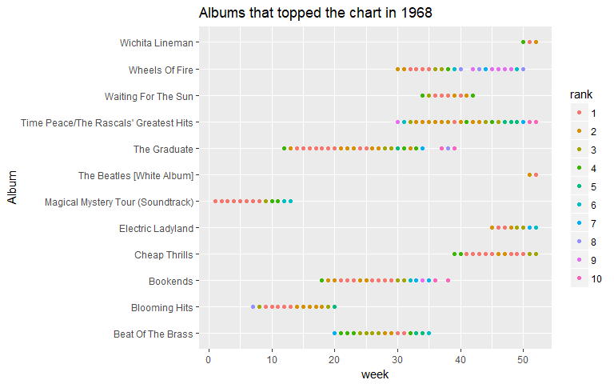
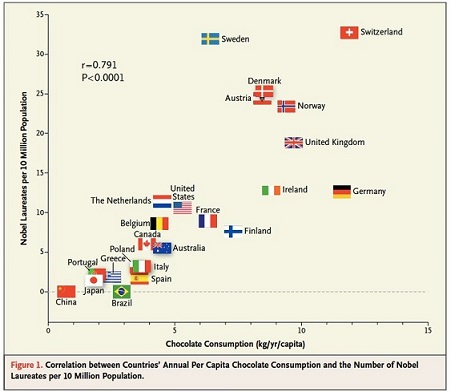
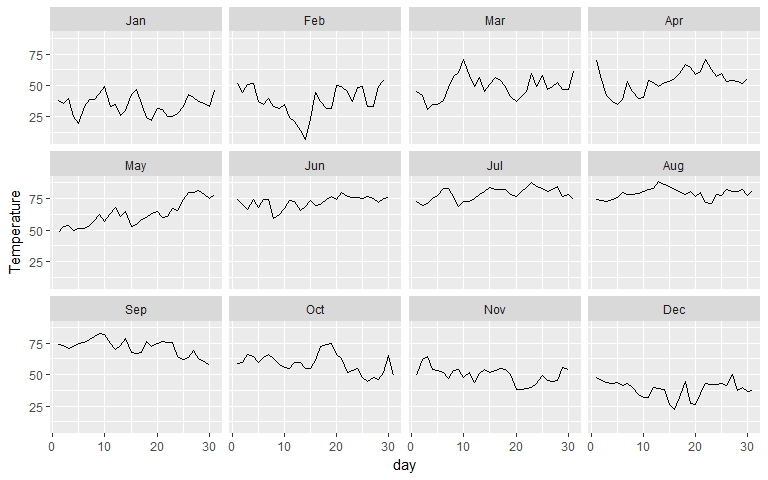

Practical Data Science using R </br> Lesson 2: Data Cleaning
================
Maher Harb, PhD </br> Assistant Professor of Physics </br> Drexel University

<style>
.codefont pre {
    font-size: 18px;
    line-height: 18px;
}
</style>
About the lesson
----------------

-   Data comes from many different sources and is rarely in a format ready for analysis

-   This lesson is about getting the data ready for analysis

-   We'll get introduced to the concept of **tidy data** and the `tidyr` package used for reshaping data frames

-   We'll also learn how to deal with missing values

-   And how to join data frames with the `dplyr` package

Tidy data
---------

Tidy data is a standard way of mapping the meaning of a dataset to its structure. In **tidy data**:

-   Each variable forms a column

-   Each observation forms a row

-   Each type of observational unit forms a table

Preparing the data in this standardized format makes the exploration and analysis processes easier by taking advantage of all the great tools designed to work with the tidy format

Let's take a look at some messy data and try to clean it...

Billboard top 200
-----------------

The following is the top 200 billboard chart from 1968:

``` r
library(readr)
library(dplyr)
df_billboard <- read_csv("billboard_top200_1968_wide.csv")
names(df_billboard)
```

    ##  [1] "Album"  "Artist" "week01" "week02" "week03" "week04" "week05"
    ##  [8] "week06" "week07" "week08" "week09" "week10" "week11" "week12"
    ## [15] "week13" "week14" "week15" "week16" "week17" "week18" "week19"
    ## [22] "week20" "week21" "week22" "week23" "week24" "week25" "week26"
    ## [29] "week27" "week28" "week29" "week30" "week31" "week32" "week33"
    ## [36] "week34" "week35" "week36" "week37" "week38" "week39" "week40"
    ## [43] "week41" "week42" "week43" "week44" "week45" "week46" "week47"
    ## [50] "week48" "week49" "week50" "week51" "week52"

Billboard top 200
-----------------

``` r
glimpse(df_billboard)
```

    ## Observations: 678
    ## Variables: 54
    ## $ Album  <chr> "The Graduate", "Time Peace/The Rascals' Greatest Hits"...
    ## $ Artist <chr> "Soundtrack", "The Rascals", "Jose Feliciano", "Herb Al...
    ## $ week01 <int> NA, NA, NA, NA, NA, NA, 164, NA, 1, NA, NA, NA, 4, NA, ...
    ## $ week02 <int> NA, NA, NA, NA, NA, NA, 134, NA, 1, NA, NA, NA, 4, NA, ...
    ## $ week03 <int> NA, NA, NA, NA, NA, NA, 115, NA, 1, NA, NA, NA, 4, NA, ...
    ## $ week04 <int> NA, NA, NA, NA, NA, NA, 99, NA, 1, 196, NA, NA, 4, NA, ...
    ## $ week05 <int> NA, NA, NA, NA, NA, NA, 73, NA, 1, 48, NA, NA, 3, NA, 2...
    ## $ week06 <int> NA, NA, NA, NA, NA, NA, 36, NA, 1, 5, NA, NA, 3, NA, 2,...
    ## $ week07 <int> NA, NA, NA, NA, NA, NA, 8, NA, 1, 2, NA, NA, 5, NA, 3, ...
    ## $ week08 <int> NA, NA, NA, NA, NA, NA, 3, 33, 1, 2, NA, NA, 5, NA, 6, ...
    ## $ week09 <int> NA, NA, NA, NA, NA, NA, 1, 5, 3, 2, NA, NA, 9, NA, 8, 4...
    ## $ week10 <int> NA, NA, NA, NA, NA, NA, 1, 5, 4, 2, NA, NA, 8, NA, 12, ...
    ## $ week11 <int> 114, NA, NA, NA, NA, NA, 1, 2, 4, 5, NA, NA, 8, NA, 25,...
    ## $ week12 <int> 4, NA, NA, NA, NA, NA, 1, 2, 6, 5, NA, NA, 8, NA, 62, 3...
    ## $ week13 <int> 2, NA, NA, NA, NA, NA, 1, 3, 6, 5, NA, NA, 16, NA, 62, ...
    ## $ week14 <int> 1, NA, NA, NA, NA, NA, 2, 3, 15, 4, NA, NA, 20, NA, 70,...
    ## $ week15 <int> 1, NA, NA, NA, NA, NA, 2, 3, 15, 7, NA, NA, 22, NA, 72,...
    ## $ week16 <int> 1, NA, NA, NA, NA, NA, 2, 3, 20, 14, NA, NA, 22, NA, 74...
    ## $ week17 <int> 1, NA, NA, NA, 71, NA, 2, 3, 21, 14, NA, NA, 20, NA, 88...
    ## $ week18 <int> 1, NA, NA, NA, 4, NA, 2, 3, 19, 23, NA, NA, 16, NA, 119...
    ## $ week19 <int> 1, NA, NA, 83, 2, NA, 3, 5, 19, 20, NA, NA, 16, NA, 119...
    ## $ week20 <int> 1, NA, NA, 7, 2, NA, 5, 6, 17, 23, NA, NA, 19, NA, 116,...
    ## $ week21 <int> 2, NA, NA, 4, 1, NA, 12, 5, 15, 22, NA, NA, 19, NA, 112...
    ## $ week22 <int> 2, NA, NA, 4, 1, NA, 12, 7, 25, 28, NA, NA, 17, NA, 102...
    ## $ week23 <int> 2, NA, NA, 4, 1, NA, 12, 8, 25, 33, NA, NA, 16, NA, 103...
    ## $ week24 <int> 1, NA, NA, 3, 2, NA, 15, 8, 30, 34, NA, NA, 25, NA, 117...
    ## $ week25 <int> 1, NA, NA, 3, 2, NA, 15, 12, 32, 37, NA, NA, 25, NA, 11...
    ## $ week26 <int> 2, NA, NA, 3, 1, NA, 17, 15, 32, 39, NA, NA, 20, NA, 11...
    ## $ week27 <int> 2, NA, NA, 3, 1, NA, 18, 16, 33, 43, NA, NA, 19, NA, 11...
    ## $ week28 <int> 3, 79, NA, 2, 1, NA, 21, 16, 34, 44, NA, 54, 18, NA, 11...
    ## $ week29 <int> 3, 52, 150, 2, 1, NA, 22, 17, 36, 42, NA, 28, 18, NA, N...
    ## $ week30 <int> 5, 9, 141, 1, 3, NA, 39, 19, 75, 47, NA, 2, 20, NA, NA,...
    ## $ week31 <int> 4, 6, 123, 1, 3, NA, 45, 16, 79, 56, NA, 2, 22, NA, NA,...
    ## $ week32 <int> 2, 3, 67, 4, 6, NA, 44, 16, 82, 64, 110, 1, 27, NA, NA,...
    ## $ week33 <int> 4, 2, 28, 5, 7, NA, 46, 15, 80, 65, 29, 1, 31, NA, NA, ...
    ## $ week34 <int> 7, 2, 10, 5, 9, NA, 47, 15, 92, 68, 4, 1, 37, NA, NA, 6...
    ## $ week35 <int> 11, 2, 9, 6, 7, 103, 48, 25, 95, 68, 3, 1, 50, NA, NA, ...
    ## $ week36 <int> 12, 2, 4, 11, 10, 62, 49, 27, 95, 70, 1, 3, 54, NA, NA,...
    ## $ week37 <int> 10, 2, 4, 12, 11, 33, 59, 24, 93, 81, 1, 3, 54, NA, NA,...
    ## $ week38 <int> 8, 2, 3, 11, 10, 13, 71, 31, 92, 138, 1, 4, 45, NA, NA,...
    ## $ week39 <int> 10, 1, 3, 19, 12, 4, 72, 31, 82, 145, 2, 6, 43, NA, NA,...
    ## $ week40 <int> 17, 2, 3, 19, 12, 4, 103, 39, 71, 144, 1, 8, 38, 139, N...
    ## $ week41 <int> 17, 4, 3, 31, 20, 1, 109, 52, 91, 144, 2, 12, 38, 50, N...
    ## $ week42 <int> 15, 2, 3, 32, 26, 1, 109, 46, 92, 141, 4, 9, 42, 28, NA...
    ## $ week43 <int> 13, 2, 3, 35, 26, 1, 108, 45, 100, 151, 11, 8, 44, 23, ...
    ## $ week44 <int> 14, 3, 2, 42, 28, 1, 110, 49, 100, 158, 11, 7, 44, 15, ...
    ## $ week45 <int> 17, 4, 3, 46, 28, 1, NA, 56, 101, 161, 15, 9, 48, 7, NA...
    ## $ week46 <int> 19, 3, 4, 49, 31, 2, NA, 56, 101, 172, 23, 9, 67, 5, NA...
    ## $ week47 <int> 20, 5, 3, 51, 30, 2, 193, 60, 99, 172, 43, 9, 63, 4, NA...
    ## $ week48 <int> 29, 5, 3, 53, 28, 1, 191, 78, 98, 168, 49, 9, 65, 4, NA...
    ## $ week49 <int> 32, 5, 2, 56, 27, 1, 191, 78, 91, 161, 42, 6, 65, 4, NA...
    ## $ week50 <int> 23, 7, 2, 52, 25, 1, NA, 84, 91, 170, 42, 8, 66, 5, NA,...
    ## $ week51 <int> 39, 10, 4, 52, 25, 3, NA, 82, 85, 176, 44, 13, 63, 5, N...
    ## $ week52 <int> 41, 10, 7, 50, 25, 3, NA, 80, 85, 166, 42, 12, 56, 4, N...

Billboard top 200
-----------------

Let's look at few observations:

``` r
df_billboard[1:10, c(1, 3:6)]
```

    ## # A tibble: 10 x 5
    ##                                    Album week01 week02 week03 week04
    ##                                    <chr>  <int>  <int>  <int>  <int>
    ##  1                          The Graduate     NA     NA     NA     NA
    ##  2 Time Peace/The Rascals' Greatest Hits     NA     NA     NA     NA
    ##  3                            Feliciano!     NA     NA     NA     NA
    ##  4                     Beat Of The Brass     NA     NA     NA     NA
    ##  5                              Bookends     NA     NA     NA     NA
    ##  6                         Cheap Thrills     NA     NA     NA     NA
    ##  7                         Blooming Hits    164    134    115     99
    ##  8                     Aretha: Lady Soul     NA     NA     NA     NA
    ##  9     Magical Mystery Tour (Soundtrack)      1      1      1      1
    ## 10                   John Wesley Harding     NA     NA     NA    196

The data is not tidy because the week columns represent values not variables

Such format is referred to as **wide format**

Billboard top 200
-----------------

Chunk of the Billboard data:

    ## # A tibble: 5 x 5
    ##                                   Album week01 week02 week03 week04
    ##                                   <chr>  <int>  <int>  <int>  <int>
    ## 1                          The Graduate     NA     NA     NA     NA
    ## 2 Time Peace/The Rascals' Greatest Hits     NA     NA     NA     NA
    ## 3                            Feliciano!     NA     NA     NA     NA
    ## 4                     Beat Of The Brass     NA     NA     NA     NA
    ## 5                              Bookends     NA     NA     NA     NA

Billboard data is stored in a wide format because it is a convenient form, from the perspective of data entry

To tidy up the data, we need to map the rankings of songs into two new variables: `week` and `rank`

There's just the right function for that in `tidyr` package: `gather`

The `gather` function
---------------------

`gather` converts the format from **wide** to **long**, but be careful with the notation below!

``` r
library(tidyr)
df_billboard2 <- df_billboard %>% gather(week, rank, week01:week52)
head(df_billboard2, 2)
```

    ## # A tibble: 2 x 4
    ##                                   Album      Artist   week  rank
    ##                                   <chr>       <chr>  <chr> <int>
    ## 1                          The Graduate  Soundtrack week01    NA
    ## 2 Time Peace/The Rascals' Greatest Hits The Rascals week01    NA

``` r
dim(df_billboard2)
```

    ## [1] 35256     4

The `gather` function
---------------------

It makes more sense to have information on the week as a numeric variable:

``` r
df_billboard2 <- df_billboard %>% gather(week, 
    rank, week01:week52) %>% mutate(week = extract_numeric(week)) %>% 
    arrange(week, rank)
head(df_billboard2, 10)
```

    ## # A tibble: 10 x 4
    ##                                          Album                    Artist
    ##                                          <chr>                     <chr>
    ##  1           Magical Mystery Tour (Soundtrack)               The Beatles
    ##  2             Their Satanic Majesties Request        The Rolling Stones
    ##  3 Pisces, Aquarius, Capricorn, And Jones Ltd.               The Monkees
    ##  4   Diana Ross And The Supremes Greatest Hits Diana Ross & The Supremes
    ##  5       Sgt. Pepper's Lonely Hearts Club Band               The Beatles
    ##  6                              Doctor Zhivago                Soundtrack
    ##  7                          The Sound Of Music                Soundtrack
    ##  8            Farewell To The First Golden Era     The Mamas & The Papas
    ##  9                                Strange Days                 The Doors
    ## 10                                  Love, Andy             Andy Williams
    ## # ... with 2 more variables: week <dbl>, rank <int>

Flash-forward
-------------

In Lesson 3, we'll learn how to scrape data from a webpage

``` r
chart_long <- data_frame(Album = character(), Artist = character(), 
    Week = numeric(), Rank = numeric())
start_date <- as.Date("1968-01-06")
for (w in 1:52) {
    current_date <- start_date + 7 * (w - 1)
    url <- paste0("https://www.billboard.com/charts/billboard-200/", 
        current_date)
    xmlpage <- htmlParse(rawToChar(GET(url)$content))
    album.title <- xpathSApply(xmlpage, "//h2[@class='chart-row__song']", 
        xmlValue)
    album.author <- xpathSApply(xmlpage, "(//a|//span)[@class='chart-row__artist']", 
        xmlValue)
    chart_long <- chart_long %>% bind_rows(data_frame(Album = album.title, 
        Artist = album.author, Week = w, Rank = 1:200))
    print(paste0("chart for week ", w, "fetched"))
    flush.console()
}
```

Flash-forward
-------------

In Lesson 4, we'll learn how to generate plots with `ggplot`



Now is your turn to practice!
-----------------------------

The NYC weather dataset contains average daily temperatures recorded in NYC (central park) in 2016. The dataset is located at:

`https://raw.githubusercontent.com/maherharb/MATE-T580/master/Datasets/nyc_weather_wide.csv`

Your task is to download the dataset, inspect it, and perform the necessary operations to transform the dataset into the tidy format.

NYC daily temperature in 2016
-----------------------------

``` r
nyc_wide <- read_csv("nyc_weather_wide.csv")
dim(nyc_wide)
```

    ## [1] 12 32

``` r
head(nyc_wide)
```

    ## # A tibble: 6 x 32
    ##   month  day1  day2  day3  day4  day5  day6  day7  day8  day9 day10 day11
    ##   <chr> <dbl> <dbl> <dbl> <dbl> <dbl> <dbl> <dbl> <dbl> <dbl> <dbl> <dbl>
    ## 1   Jan  38.0  36.0  40.0  25.0  20.0    33  38.5  38.5  43.5  49.5  33.0
    ## 2   Feb  51.5  44.0  50.5  51.5  37.5    35  40.0  33.5  31.5  35.0  24.5
    ## 3   Mar  45.5  42.0  31.0  34.5  34.5    38  48.0  57.0  60.5  71.0  58.0
    ## 4   Apr  70.0  55.0  42.0  37.0  34.5    39  53.0  45.0  39.5  40.5  54.0
    ## 5   May  48.0  52.5  53.5  50.0  51.5    51  54.0  57.5  62.0  56.5  63.0
    ## 6   Jun  74.5  70.0  66.5  74.5  68.0    74  74.5  59.5  62.5  67.0  73.5
    ## # ... with 20 more variables: day12 <dbl>, day13 <dbl>, day14 <dbl>,
    ## #   day15 <dbl>, day16 <dbl>, day17 <dbl>, day18 <dbl>, day19 <dbl>,
    ## #   day20 <dbl>, day21 <dbl>, day22 <dbl>, day23 <dbl>, day24 <dbl>,
    ## #   day25 <dbl>, day26 <dbl>, day27 <dbl>, day28 <dbl>, day29 <dbl>,
    ## #   day30 <dbl>, day31 <dbl>

NYC daily temperature in 2016
-----------------------------

``` r
nyc_long <- nyc_wide %>% gather(day, Temperature, 
    day1:day31, na.rm = TRUE) %>% mutate(day = extract_numeric(day)) %>% 
    mutate(Date = as.Date(paste0("2016-", 
        month, "-", day), "%Y-%b-%d"))
head(nyc_long, 5)
```

    ## # A tibble: 5 x 4
    ##   month   day Temperature       Date
    ##   <chr> <dbl>       <dbl>     <date>
    ## 1   Jan     1        38.0 2016-01-01
    ## 2   Feb     1        51.5 2016-02-01
    ## 3   Mar     1        45.5 2016-03-01
    ## 4   Apr     1        70.0 2016-04-01
    ## 5   May     1        48.0 2016-05-01

``` r
dim(nyc_long)
```

    ## [1] 366   4

Missing values
--------------

-   An important part of data cleaning is investigating and deciding what to do with missing values

-   In R, a missing value is represented as `NA`

-   But a missing value in the data source might be represented by something different

-   Example: empty string, -, none, N/A, null, ., etc

-   Thus, the importance of inspecting the data before doing any automated processing

Missing values
--------------

use `is.na` to find missing values:

``` r
sum(is.na(df_billboard))
```

    ## [1] 24856

You may omit missing values using `na.omit`:

``` r
dim(df_billboard)
```

    ## [1] 678  54

``` r
dim(na.omit(df_billboard))
```

    ## [1] 27 54

Notice, we're left out with very few observations! Deleting rows that contain at least one missing value was not a good idea

Billboard top 200
-----------------

Sometimes omitting rows that contain NAs serves an intended purpose

Here's the list of albums that remained in the chart for the whole year in 1968:

``` r
df_billboard %>% na.omit() %>% select(Album, Artist)
```

    ## # A tibble: 27 x 2
    ##                                        Album                    Artist
    ##                                        <chr>                     <chr>
    ##  1         Magical Mystery Tour (Soundtrack)               The Beatles
    ##  2 Diana Ross And The Supremes Greatest Hits Diana Ross & The Supremes
    ##  3         Parsley, Sage, Rosemary And Thyme         Simon & Garfunkel
    ##  4                            Disraeli Gears                     Cream
    ##  5     Sgt. Pepper's Lonely Hearts Club Band               The Beatles
    ##  6                      Are You Experienced?              Jimi Hendrix
    ##  7                               Wildflowers              Judy Collins
    ##  8                         A Day In The Life            Wes Montgomery
    ##  9                        Alice's Restaurant                Soundtrack
    ## 10              By The Time I Get To Phoenix             Glen Campbell
    ## # ... with 17 more rows

Missing values
--------------

using `na.omit` on the long version of the billboard dataset is acceptable, as each observation represents the ranking of an album during a specific week only

``` r
dim(df_billboard2)
```

    ## [1] 35256     4

``` r
dim(na.omit(df_billboard2))
```

    ## [1] 10400     4

The number of rows also makes sense: 10400 = 52 × 200

Missing values
--------------

Strategies for dealing with missing values depend on the nature of the data and its intended use. Some common strategies are:

-   Deleting rows with missing values
-   Replacing missing values with 0
-   Replacing missing values with -1
-   Replacing missing values with the mean or median of the variable across all observations
-   Replacing missing values with values derived from similar observations
-   Keeping missing values and treating them as a level of a categorical variable

Now is your turn to practice!
-----------------------------

The following link points to the titanic dataset (a csv file):

`https://raw.githubusercontent.com/maherharb/MATE-T580/master/Datasets/titanic_train.csv`

The titanic dataset contains information on passengers of the titanic and whether they survived the disaster.

Load the csv file as an R data frame. Investigate whether the dataset contains missing values. If yes, pick a variable of your choice among the ones that contain missing values and attempt to fill the missing values with reasonable numbers/terms.

Missing values in the Titanic dataset
-------------------------------------

Here's how we can find which variables contain missing values:

``` r
df_titanic <- read_csv("titanic_train.csv")
sapply(df_titanic, function(x) {
    sum(is.na(x))
})
```

    ## PassengerId    Survived      Pclass        Name         Sex         Age 
    ##           0           0           0           0           0         149 
    ##       SibSp       Parch      Ticket        Fare       Cabin    Embarked 
    ##           0           0           0           0         549           2

The only two variables that have missing values are Age and Cabin

Let's find out more information about these...

Missing values in the Titanic dataset
-------------------------------------

What is the median age of passengers?

``` r
median(df_titanic$Age, na.rm = TRUE)
```

    ## [1] 28

Let's impute the missing age by the median:

``` r
df_titanic$Age[is.na(df_titanic$Age)] <- median(df_titanic$Age, na.rm = TRUE)
```

Let's check few values for the cabin:

``` r
head(df_titanic$Cabin, 10)
```

    ##  [1] NA    NA    NA    NA    NA    NA    NA    NA    "D20" NA

We can either keep it `NA` or assign `"N/A"`

The `spread` function
---------------------

There could be a need to perform the opposite transformation: i.e. from the **long** format to the **wide** format

This is done with the `spread` function

``` r
df_billboard3 <- df_billboard2 %>% rename(w = week) %>% 
    spread(w, rank, sep = "")
names(df_billboard3)
```

    ##  [1] "Album"  "Artist" "w1"     "w2"     "w3"     "w4"     "w5"    
    ##  [8] "w6"     "w7"     "w8"     "w9"     "w10"    "w11"    "w12"   
    ## [15] "w13"    "w14"    "w15"    "w16"    "w17"    "w18"    "w19"   
    ## [22] "w20"    "w21"    "w22"    "w23"    "w24"    "w25"    "w26"   
    ## [29] "w27"    "w28"    "w29"    "w30"    "w31"    "w32"    "w33"   
    ## [36] "w34"    "w35"    "w36"    "w37"    "w38"    "w39"    "w40"   
    ## [43] "w41"    "w42"    "w43"    "w44"    "w45"    "w46"    "w47"   
    ## [50] "w48"    "w49"    "w50"    "w51"    "w52"

One hot encoding
----------------

One important use of `spread` is to convert a categorical variable into multiple binary variables:

``` r
Aliens <- data_frame(Name = c("Eon", "Zen", "Nya", 
    "Mar"), Height = c(123, 134, 128, 127), Eye = c("Purple", 
    "Red", "Orange", "Orange"))
Aliens
```

    ## # A tibble: 4 x 3
    ##    Name Height    Eye
    ##   <chr>  <dbl>  <chr>
    ## 1   Eon    123 Purple
    ## 2   Zen    134    Red
    ## 3   Nya    128 Orange
    ## 4   Mar    127 Orange

Even though the data is tidy, many machine learning algorithms are not able to deal with non-numeric variables

One hot encoding
----------------

Hence we do the following transformation:

``` r
Aliens %>% mutate(dummy = 1) %>% spread(Eye, dummy, fill = 0)
```

    ## # A tibble: 4 x 5
    ##    Name Height Orange Purple   Red
    ## * <chr>  <dbl>  <dbl>  <dbl> <dbl>
    ## 1   Eon    123      0      1     0
    ## 2   Mar    127      1      0     0
    ## 3   Nya    128      1      0     0
    ## 4   Zen    134      0      0     1

This operation is called **one hot encoding**

Note that it is recommended to delete one of the eye color values, since it is redundant

Joining datasets
----------------

-   Sometimes the observations of interest are spread over multiple tables

-   This is often the case with data retrieved from a relational database

-   The relational database architecture is designed for optimal data entry, storage, and retrieval, not for readiness to perform analysis

-   Hence, we might find that the data of interest is split among two or more tables

-   the `dplyr` family of `join` functions makes it easy to join data from different tables

Nobel wins vs. Chocolate consumption
------------------------------------

Say we're interested in exploring the relationship between per capita Nobel wins and per capita chocolate consumption on a country level. The data of interest resides in two separate datasets:

``` r
df_chocolate <- read_csv("chocolate.csv")
df_nobel <- read_csv("nobel_prizes.csv")
dim(df_chocolate)
```

    ## [1] 90  2

``` r
dim(df_nobel)
```

    ## [1] 79  2

Let's take a look at the data...

Nobel wins vs. Chocolate consumption
------------------------------------

``` r
head(df_chocolate, 3)
```

    ## # A tibble: 3 x 2
    ##       Country Chocolate_Consumption_usd_M
    ##         <chr>                       <dbl>
    ## 1 Afghanistan                   221.87789
    ## 2     Albania                    50.71839
    ## 3     Armenia                    47.51346

``` r
head(df_nobel, 3)
```

    ## # A tibble: 3 x 2
    ##                    Country Prizes
    ##                      <chr>  <int>
    ## 1 United States of America    276
    ## 2                  Germany     89
    ## 3           United Kingdom     88

Nobel wins vs. Chocolate consumption
------------------------------------

The two datasets are joined by `inner_join`:

``` r
df <- inner_join(df_chocolate, df_nobel, by = c(Country = "Country"))
head(df)
```

    ## # A tibble: 6 x 3
    ##                  Country Chocolate_Consumption_usd_M Prizes
    ##                    <chr>                       <dbl>  <int>
    ## 1             Azerbaijan                    11.00631      1
    ## 2             Bangladesh                   300.02713      1
    ## 3                Belarus                   159.27205      4
    ## 4 Bosnia and Herzegovina                   189.48043      2
    ## 5                 Brazil                  5594.36987      1
    ## 6               Bulgaria                   181.68632      1

``` r
dim(df)
```

    ## [1] 27  3

Nobel wins vs. Chocolate consumption
------------------------------------

Or by `full_join`:

``` r
df <- full_join(df_chocolate, df_nobel, by = c(Country = "Country"))
head(df)
```

    ## # A tibble: 6 x 3
    ##       Country Chocolate_Consumption_usd_M Prizes
    ##         <chr>                       <dbl>  <int>
    ## 1 Afghanistan                   221.87789     NA
    ## 2     Albania                    50.71839     NA
    ## 3     Armenia                    47.51346     NA
    ## 4  Azerbaijan                    11.00631      1
    ## 5  Bangladesh                   300.02713      1
    ## 6     Belarus                   159.27205      4

``` r
dim(df)
```

    ## [1] 142   3

Nobel wins vs. Chocolate consumption
------------------------------------

Or by `left_join`:

``` r
df <- left_join(df_chocolate, df_nobel, by = c(Country = "Country"))
head(df)
```

    ## # A tibble: 6 x 3
    ##       Country Chocolate_Consumption_usd_M Prizes
    ##         <chr>                       <dbl>  <int>
    ## 1 Afghanistan                   221.87789     NA
    ## 2     Albania                    50.71839     NA
    ## 3     Armenia                    47.51346     NA
    ## 4  Azerbaijan                    11.00631      1
    ## 5  Bangladesh                   300.02713      1
    ## 6     Belarus                   159.27205      4

``` r
dim(df)
```

    ## [1] 90  3

Nobel wins vs. Chocolate consumption
------------------------------------

Further investigation is useful:

``` r
df_chocolate$Country[1:40]
```

    ##  [1] "Afghanistan"            "Albania"               
    ##  [3] "Armenia"                "Azerbaijan"            
    ##  [5] "Bangladesh"             "Belarus"               
    ##  [7] "Benin"                  "Bhutan"                
    ##  [9] "Bolivia"                "Bosnia and Herzegovina"
    ## [11] "Brazil"                 "Bulgaria"              
    ## [13] "Burkina Faso"           "Burundi"               
    ## [15] "Cambodia"               "Cameroon"              
    ## [17] "Cabo Verde"             "Chad"                  
    ## [19] "China"                  "Colombia"              
    ## [21] "Congo, Dem. Rep."       "Congo, Rep."           
    ## [23] "Cote d'Ivoire"          "Djibouti"              
    ## [25] "Egypt, Arab Rep."       "El Salvador"           
    ## [27] "Ethiopia"               "Fiji"                  
    ## [29] "Gabon"                  "Gambia, The"           
    ## [31] "Ghana"                  "Guatemala"             
    ## [33] "Guinea"                 "Honduras"              
    ## [35] "India"                  "Indonesia"             
    ## [37] "Iraq"                   "Jamaica"               
    ## [39] "Jordan"                 "Kazakhstan"

Nobel wins vs. Chocolate consumption
------------------------------------

Further investigation is useful:

``` r
df_nobel$Country[1:40]
```

    ##  [1] "United States of America" "Germany"                 
    ##  [3] "United Kingdom"           "France"                  
    ##  [5] "Poland"                   "Russia"                  
    ##  [7] "Sweden"                   "Japan"                   
    ##  [9] "Italy"                    "Austria"                 
    ## [11] "Netherlands"              "Canada"                  
    ## [13] "Switzerland"              "Norway"                  
    ## [15] "China"                    "Denmark"                 
    ## [17] "Australia"                "Belgium"                 
    ## [19] "Hungary"                  "Scotland"                
    ## [21] "South Africa"             "India"                   
    ## [23] "Spain"                    "Czech Republic"          
    ## [25] "Egypt"                    "Israel"                  
    ## [27] "Finland"                  "Ireland"                 
    ## [29] "Northern Ireland"         "Romania"                 
    ## [31] "Ukraine"                  "Argentina"               
    ## [33] "Belarus"                  "Pakistan"                
    ## [35] "Algeria"                  "Lithuania"               
    ## [37] "Mexico"                   "New Zealand"             
    ## [39] "Portugal"                 "Turkey"

Flash-forward
-------------

In Lesson 6, we'll learn how to properly interpret correlations



Now is your turn to practice!
-----------------------------

There is another NYC weather dataset that contains daily records of precipitation and snowfall in 2016. The dataset is located at:

`https://raw.githubusercontent.com/maherharb/MATE-T580/master/Datasets/nyc_precipitation.csv`

Use the tools you learned in this lesson to produce a single data frame which contains data on daily temperature, precipitation, and snowfall

NYC precipitation data
----------------------

Let's first retrieve the precipitation dataset:

``` r
nyc_prec <- read_csv("nyc_precipitation.csv")
head(nyc_prec, 4)
```

    ## # A tibble: 4 x 4
    ##   month   day precipitation snow_fall
    ##   <chr> <int>         <chr>     <chr>
    ## 1   Jan     1             0         0
    ## 2   Jan     2             0         0
    ## 3   Jan     3             0         0
    ## 4   Jan     4             0         0

``` r
dim(nyc_prec)
```

    ## [1] 357   4

NYC precipitation data
----------------------

Next, we retrieve the temperature dataset and reshape it:

``` r
nyc_long <- nyc_wide %>% gather(D, Temperature, day1:day31, na.rm = TRUE) %>% 
    mutate(D = extract_numeric(D))
head(nyc_long, 4)
```

    ## # A tibble: 4 x 3
    ##   month     D Temperature
    ##   <chr> <dbl>       <dbl>
    ## 1   Jan     1        38.0
    ## 2   Feb     1        51.5
    ## 3   Mar     1        45.5
    ## 4   Apr     1        70.0

``` r
dim(nyc_long)
```

    ## [1] 366   3

NYC precipitation data
----------------------

Performing a `full_join` on the two datasets:

``` r
nyc_weather <- full_join(nyc_long, nyc_prec, 
    by = c(month = "month", D = "day"))
head(nyc_weather, 4)
```

    ## # A tibble: 4 x 5
    ##   month     D Temperature precipitation snow_fall
    ##   <chr> <dbl>       <dbl>         <chr>     <chr>
    ## 1   Jan     1        38.0             0         0
    ## 2   Feb     1        51.5          0.01         0
    ## 3   Mar     1        45.5             0         0
    ## 4   Apr     1        70.0          0.02         0

``` r
dim(nyc_weather)
```

    ## [1] 366   5

NYC precipitation data
----------------------

Performing an `inner_join` on the two datasets:

``` r
nyc_weather <- inner_join(nyc_long, nyc_prec, 
    by = c(month = "month", D = "day"))
head(nyc_weather, 4)
```

    ## # A tibble: 4 x 5
    ##   month     D Temperature precipitation snow_fall
    ##   <chr> <dbl>       <dbl>         <chr>     <chr>
    ## 1   Jan     1        38.0             0         0
    ## 2   Feb     1        51.5          0.01         0
    ## 3   Mar     1        45.5             0         0
    ## 4   Apr     1        70.0          0.02         0

``` r
dim(nyc_weather)
```

    ## [1] 357   5

NYC precipitation data
----------------------

Performing an `anti_join` on the two datasets:

``` r
nyc_weather <- anti_join(nyc_long, nyc_prec, 
    by = c(month = "month", D = "day"))
head(nyc_weather, 4)
```

    ## # A tibble: 4 x 3
    ##   month     D Temperature
    ##   <chr> <dbl>       <dbl>
    ## 1   Sep     6        75.5
    ## 2   Apr     5        34.5
    ## 3   Nov    12        43.5
    ## 4   Feb    18        31.5

``` r
dim(nyc_weather)
```

    ## [1] 9 3

NYC precipitation data
----------------------

Performing a `left_join` on the two datasets:

``` r
nyc_weather <- full_join(nyc_long, nyc_prec, 
    by = c(month = "month", D = "day")) %>% 
    rename(day = D) %>% mutate(precipitation = extract_numeric(precipitation), 
    snow_fall = extract_numeric(snow_fall), 
    month = factor(month, levels = unique(month)))
head(nyc_weather, 4)
```

    ## # A tibble: 4 x 5
    ##    month   day Temperature precipitation snow_fall
    ##   <fctr> <dbl>       <dbl>         <dbl>     <dbl>
    ## 1    Jan     1        38.0          0.00         0
    ## 2    Feb     1        51.5          0.01         0
    ## 3    Mar     1        45.5          0.00         0
    ## 4    Apr     1        70.0          0.02         0

``` r
dim(nyc_weather)
```

    ## [1] 366   5

Flash-forward
-------------

In Lesson 4, we'll learn how to generate plots with `ggplot`



Concluding remarks
------------------

With `dplyr` and `tidyr`, you should be able to do all sorts of data frame manipulations. We learned to:

-   Subset data frames with `filter`, `select`
-   Reorder with `arrange`
-   Create new variables and summary statistics with `mutate`, `group_by`, `summary`
-   Reshape the data frame with `gather`, `spread`
-   Join data frames with `full_join`, `inner_join`, `left_join`, `anti_join`
-   Write more efficient code with the `%>%` operator

Mastery of the above, is a prerequisite to doing any serious work in data science using R
