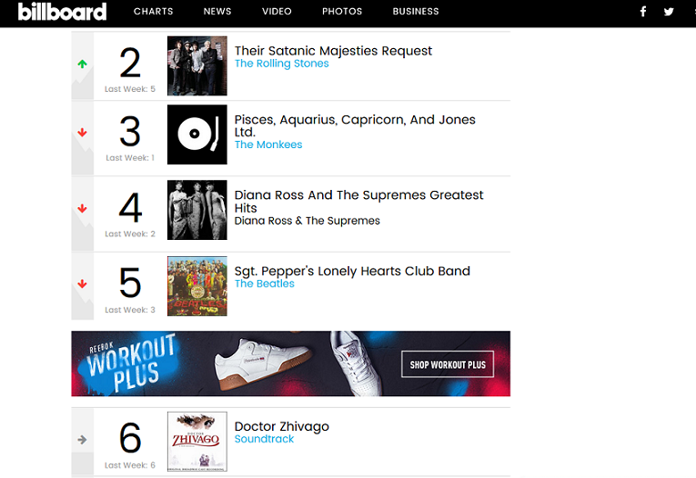
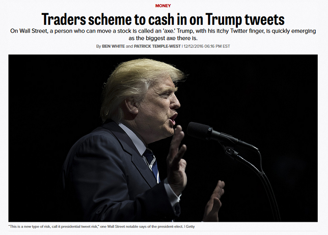
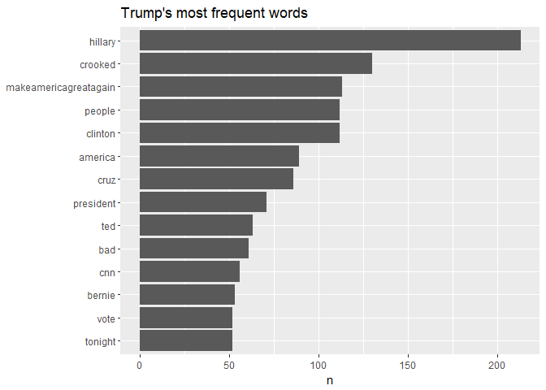

Practical Data Science using R</BR>Lesson 3: Web Scraping with `XML`
================
Maher Harb, PhD</BR>
Assistant Professor of Physics</BR>Drexel University

About the lesson
----------------

-   A lot of interesting data exists in webpages

-   Data in webpages is formatted to display nicely on a browser, but it may not be available for download in a convenient format (such as csv)

-   In this lesson, we'll learn how to retrieve data from a webpage and organize it in a tidy format

-   We'll do so using the `XML` package

-   We'll also learn how to search for patterns in text using **regular expressions**

Retrieving webpages with `httr`
-------------------------------

-   In Lesson 1, we used the `httr` package to download files from the web

-   The same `GET` function in `httr` is used to download a webpage

-   A webpage is a text file with **HTML tags** wrapped around the text

-   The tags tell the browser how to format the text to display according to the intended webpage design

Billboard top 200
-----------------



The HTML code of Billboard top 200
----------------------------------

``` html
.
.
.
<article class="chart-row chart-row--5 js-chart-row" data-hovertracklabel="Song Hover-" data-songtitle="">
<div class="chart-row__primary">
<div class="chart-row__history chart-row__history--falling"></div>
<div class="chart-row__main-display">
<div class="chart-row__rank">
<span class="chart-row__current-week">5</span>
<span class="chart-row__last-week">Last Week: 3</span>
</div>
<div class="chart-row__image" style="background-image: url(https://charts-static.billboard.com/img/1967/06/the-beatles-ism-sgt-peppers-lonely-hearts-club-band-muu.jpg)">
</div>
<div class="chart-row__container">
<div class="chart-row__title">
<h2 class="chart-row__song">Sgt. Pepper&#039;s Lonely Hearts Club Band</h2>
<a class="chart-row__artist" href="/music/the-beatles" data-tracklabel="Artist Name">
The Beatles
</a>
</div>
</div>
<div class="chart-row__links">
<a class="chart-row__link chart-row__link--toggle js-chart-row-toggle" href="javascript:void(0);">
<i class="chart-row__icon fa fa-angle-down"></i>
</a>
.
.
.
```

The HTML code of Billboard top 200
----------------------------------

-   The HTML code indicates that there is a good amount of structure in the tagging scheme

-   Example, album titles are listed within an `<h2></h2>` tag with class name `chart-row__song`:

``` html
<h2 class="chart-row__song">Sgt. Pepper&#039;s Lonely Hearts Club Band</h2>
```

-   And album artists are listed within an `<a></a>` tag with class name `chart-row__artist`:

``` html
<a class="chart-row__artist" href="/music/the-beatles" data-tracklabel="Artist Name">
The Beatles
</a>
```

The HTML code of Billboard top 200
----------------------------------

-   Why do we care about the HTML structure?

-   A well-structured HTML tagging scheme means that we could potentially write some script that can take advantage of the tagging structure to extract all album titles and artists

-   In R, we do not need to do much parsing from scratch

-   Extracting data from the HTML page is done with the `XML` package

Let's take a look at the implementation...

Extracting data from Billboard.com
----------------------------------

Going back to the Billboard example, first we retrieve the webpage (top 200 chart on Jan 6, 1968):

``` r
library(httr)
library(XML)
url <- "https://www.billboard.com/charts/billboard-200/1968-01-06"
xmlpage <- htmlParse(rawToChar(GET(url)$content))
length(capture.output(xmlpage))
```

    ## [1] 10244

``` r
capture.output(xmlpage)[1:4]
```

    ## [1] "<!DOCTYPE html>"             "<html class=\"\" lang=\"\">"
    ## [3] "<head>"                      "<meta charset=\"utf-8\">"

Extracting data from Billboard.com
----------------------------------

Next, we extract the album titles:

``` r
searchfor <- "//h2[@class='chart-row__song']"
album <- xpathSApply(xmlpage, searchfor, xmlValue)
length(album)
```

    ## [1] 200

``` r
head(album, 6)
```

    ## [1] "Magical Mystery Tour (Soundtrack)"          
    ## [2] "Their Satanic Majesties Request"            
    ## [3] "Pisces, Aquarius, Capricorn, And Jones Ltd."
    ## [4] "Diana Ross And The Supremes Greatest Hits"  
    ## [5] "Sgt. Pepper's Lonely Hearts Club Band"      
    ## [6] "Doctor Zhivago"

Extracting data from Billboard.com
----------------------------------

And then we extract the artists:

``` r
searchfor <- "//a[@class='chart-row__artist']"
artist <- xpathSApply(xmlpage, searchfor, xmlValue)
length(artist)
```

    ## [1] 189

``` r
head(artist,6)
```

    ## [1] "\nThe Beatles\n"        "\nThe Rolling Stones\n"
    ## [3] "\nThe Monkees\n"        "\nThe Beatles\n"       
    ## [5] "\nSoundtrack\n"         "\nSoundtrack\n"

The number of albums does not match the number of artists!

We must find out why...

Extracting data from Billboard.com
----------------------------------

It turns out that some artists are listed within the `<span></span>` tag:

``` html
<span class="chart-row__artist">
Herb Alpert &amp; The Tijuana Brass
</span>
```

But the class name is still the same `chart-row__artist`

We can easily deal with that...

Extracting data from Billboard.com
----------------------------------

Here's the second attempt at extracting the artists:

``` r
searchfor <- "(//a|//span)[@class='chart-row__artist']"
artist <- xpathSApply(xmlpage, searchfor, xmlValue)
length(artist)
```

    ## [1] 200

``` r
head(artist,6)
```

    ## [1] "\nThe Beatles\n"               "\nThe Rolling Stones\n"       
    ## [3] "\nThe Monkees\n"               "\nDiana Ross & The Supremes\n"
    ## [5] "\nThe Beatles\n"               "\nSoundtrack\n"

Works like a charm!

Extracting data from Billboard.com
----------------------------------

We may also extract http links to the Artist's catalogue on Billboard

Note that the HTML `<a></a>` tag for the artist contains information other than the artist's name:

``` html
<a class="chart-row__artist" href="/music/the-beatles" data-tracklabel="Artist Name">
The Beatles
</a>
```

The `href` attribute of the `<a></a>` tag points to the Artist's catalogue

Extracting data from Billboard.com
----------------------------------

Here's the second attempt at extracting the artists:

``` r
searchfor <- "(//a|//span)[@class='chart-row__artist']"
artist_library <- xpathSApply(xmlpage, searchfor, xmlGetAttr, "href")
artist_library  <- paste0("https://www.billboard.com", artist_library )
artist_library [grep("NULL$", artist_library ) ] <- NA
head(artist_library ,6)
```

    ## [1] "https://www.billboard.com/music/the-beatles"       
    ## [2] "https://www.billboard.com/music/the-rolling-stones"
    ## [3] "https://www.billboard.com/music/the-monkees"       
    ## [4] NA                                                  
    ## [5] "https://www.billboard.com/music/the-beatles"       
    ## [6] "https://www.billboard.com/music/soundtrack"

Extracting data from a webpage
------------------------------

-   The ability to extract data from a webpage depends on how well structured the HTML code is

-   First, inspect the HTML code within the web browser and locate examples of chucks of codes that contain the data of interest

-   Then apply the search logic to extract the information of interest using the `XML` package, but be aware that things might not work from the first go

-   You might need to modify the search criteria to deal with exceptions

-   Always do some manual checks; Nothing replaces a human eye to validate the output

Chart data for entire 1968
--------------------------

Once we figure out how to extract data for one week, applying the same scheme over the entire year is straight forward

However, it is important to write well-organized, efficient, and easy to follow script:

``` r
chart_long <- data_frame(Album = character(), Artist = character(), 
    Week = numeric(), Rank = numeric())
start_date <- as.Date("1968-01-06")
for (w in 1:52) {
    current_date <- start_date + 7 * (w - 1)
    url <- paste0("https://www.billboard.com/charts/billboard-200/", 
        current_date)
    xmlpage <- htmlParse(rawToChar(GET(url)$content))
    album.title <- xpathSApply(xmlpage, "//h2[@class='chart-row__song']", 
        xmlValue)
    album.author <- xpathSApply(xmlpage, "(//a|//span)[@class='chart-row__artist']", 
        xmlValue)
    chart_long <- chart_long %>% bind_rows(data_frame(Album = album.title, 
        Artist = album.author, Week = w, Rank = 1:200))
    print(paste0("chart for week ", w, "fetched"))
    flush.console()
}
```

Is web scraping legal?
----------------------

-   The legality of web scraping is an intricate issue

-   On the one hand, search engines such as Google and Bing rely on web scraping to catalogue the web

-   At the same time, many websites terms of service prohibit unauthorized scraping

From the perspective of data science, be mindful that:

1.  While scraping might not be illegal, the data itself could be copyrighted. Do not be aggressive in the extent of the data you retrieve from a website

2.  A poorly written scrapping script could bring down a web site by overwhelming the server with requests. Avoid `while` loops and always test the script on a small subset of the data before running it on the full set

Now is your turn to practice!
-----------------------------

The president of the united states is an avid tweeter. We'd like to fetch all the tweets from his twitter webpage to do some textual analysis on. For this first task, all you need to do is:

-   Retrieve the twitter page of @realDonaldTrump
-   Extract from the page all tweets made by @realDonaldTrump

All the President's tweets
--------------------------

Retrieving the twitter feed for @realDonaldTrump

    ## [1] 6780

    ## [1] "<!DOCTYPE html>"                                                                                                                                                                                  
    ## [2] "<html lang=\"en\" data-scribe-reduced-action-queue=\"true\">"                                                                                                                                     
    ## [3] "<head>"                                                                                                                                                                                           
    ## [4] "<meta charset=\"utf-8\">"                                                                                                                                                                         
    ## [5] "<noscript><meta http-equiv=\"refresh\" content=\"0; URL=https://mobile.twitter.com/i/nojs_router?path=%2FrealDonaldTrump&amp;ref_src=twsrc%5Egoogle%7Ctwcamp%5Eserp%7Ctwgr%5Eauthor\"></noscript>"

All the President's tweets
--------------------------

Next, we extract the tweets:

    ## [1] 20

    ## [1] "JOBS, JOBS, JOBS! #MAGApic.twitter.com/YAaqRcA7ZS"                                                                                                                                                                                                                                
    ## [2] "Kim Jong Un talked about denuclearization with the South Korean Representatives, not just a freeze. Also, no missile testing by North Korea during this period of time. Great progress being made but sanctions will remain until an agreement is reached. Meeting being planned!"
    ## [3] "<U+0093>Presidential Proclamation on Adjusting Imports of Aluminum into the United States<U+0094> \n \nProclamation: http://45.wh.gov/Aluminum \nRemarks: http://45.wh.gov/SteelAluminumRemarks <U+0085>pic.twitter.com/rcrkpvChkz"                                                                    
    ## [4] "<U+0093>Presidential Proclamation on Adjusting Imports of Steel into the United States<U+0094>\n \nProclamation: http://45.wh.gov/Steel \nRemarks: http://45.wh.gov/SteelAluminumRemarks <U+0085>pic.twitter.com/q92FDYZeUl"                                                                           
    ## [5] "Great meeting with @Cabinet at the @WhiteHouse today! #MAGApic.twitter.com/InWj0QTosz"

But some of these might be retweets of other users

All the President's tweets
--------------------------

Here's a more proper approach:

    ##  [1] "Donald J. Trump" "Donald J. Trump" "Donald J. Trump"
    ##  [4] "Donald J. Trump" "Donald J. Trump" "Donald J. Trump"
    ##  [7] "Donald J. Trump" "Donald J. Trump" "Donald J. Trump"
    ## [10] "Donald J. Trump" "Donald J. Trump" "Donald J. Trump"
    ## [13] "Donald J. Trump" "Donald J. Trump" "Donald J. Trump"
    ## [16] "Eric Trump"      "Donald J. Trump" "Donald J. Trump"
    ## [19] "Donald J. Trump" "Donald J. Trump"

All the President's tweets
--------------------------

    ## # A tibble: 19 x 1
    ##                                                                           Text
    ##                                                                          <chr>
    ##  1                           JOBS, JOBS, JOBS! #MAGApic.twitter.com/YAaqRcA7ZS
    ##  2 Kim Jong Un talked about denuclearization with the South Korean Representat
    ##  3 "<U+0093>Presidential Proclamation on Adjusting Imports of Aluminum into the Unite
    ##  4 "<U+0093>Presidential Proclamation on Adjusting Imports of Steel into the United S
    ##  5 Great meeting with @Cabinet at the @WhiteHouse today! #MAGApic.twitter.com/
    ##  6 "Happy #InternationalWomensDay\n\n<U+0093>First Lady Melania Trump to Present the 
    ##  7 Looking forward to 3:30 P.M. meeting today at the White House. We have to p
    ##  8 The U.S. is acting swiftly on Intellectual Property theft. We cannot allow 
    ##  9 China has been asked to develop a plan for the year of a One Billion Dollar
    ## 10 From Bush 1 to present, our Country has lost more than 55,000 factories, 6,
    ## 11 Great couple, great book!https://twitter.com/markburnetttv/status/971187506
    ## 12 Will be making a decision soon on the appointment of new Chief Economic Adv
    ## 13 Possible progress being made in talks with North Korea. For the first time 
    ## 14 Federal Judge in Maryland has just ruled that <U+0093>President Trump has the righ
    ## 15 Lowest rated Oscars in HISTORY. Problem is, we don<U+0092>t have Stars anymore - e
    ## 16 We will see what happens!https://twitter.com/drudge_report/status/970627841
    ## 17 We are getting it done - jobs and security!https://twitter.com/drudge_repor
    ## 18          Total inaction on DACA by Dems. Where are you? A deal can be made!
    ## 19 The new Fake News narrative is that there is CHAOS in the White House. Wron

Flash-forward
-------------

In Lesson 9, we'll learn how to extract predictive value from text



Text processing
---------------

-   Even though we were able to capture data from a webpage into an R data frame, our job is not done

-   Textual data is messy by default; we might need to do some cleaning to make it more presentable

-   Example, in the Billboard chart data, album titles contain the newline character `\n`

<!-- -->

    ## [1] "\nThe Beatles\n"

-   And in the twitter data, some tweets had web addresses included within the text

-   We are not able yet to do full treatment of textual data, but we can do some gentle processing with Base R and `stringr`

The `gsub` function
-------------------

Use `gsub` to match and substitute a pattern within an input string:

``` r
txt = "Hello world! Hello world! Hello world!"
gsub("Hello", "Goodbye", txt)
```

    ## [1] "Goodbye world! Goodbye world! Goodbye world!"

Note that the pattern specified can be a **regular expression**:

``` r
txt = "a man and a woman"
gsub("\\bman\\b", "woman", txt)
```

    ## [1] "a woman and a woman"

The `gsub` function
-------------------

With `gsub` we can clean the artist names in the Billboard data:

``` r
head(artist, 6)
```

    ## [1] "\nThe Beatles\n"               "\nThe Rolling Stones\n"       
    ## [3] "\nThe Monkees\n"               "\nDiana Ross & The Supremes\n"
    ## [5] "\nThe Beatles\n"               "\nSoundtrack\n"

``` r
artist <- gsub("\\n", "", artist)
head(artist, 6)
```

    ## [1] "The Beatles"               "The Rolling Stones"       
    ## [3] "The Monkees"               "Diana Ross & The Supremes"
    ## [5] "The Beatles"               "Soundtrack"

The `grep` function
-------------------

`grep` is similar to `gsub` in the syntax of the search pattern, but it is used solely for searching (no string substitution is done)

How many of the top albums in 1968 are Beatles albums?

``` r
result <- grep("beatles", artist, ignore.case = TRUE)
result
```

    ## [1]   1   5 153

``` r
album[result]
```

    ## [1] "Magical Mystery Tour (Soundtrack)"    
    ## [2] "Sgt. Pepper's Lonely Hearts Club Band"
    ## [3] "Revolver"

The `grepl` function
--------------------

`grepl` is equivalent to `grep` but returns a Boolean vector instead of indices of matched elements:

``` r
result <- grep("beatles", artist, ignore.case = TRUE)
result
```

    ## [1]   1   5 153

``` r
result <- grepl("beatles", artist, ignore.case = TRUE)
result[1:10]
```

    ##  [1]  TRUE FALSE FALSE FALSE  TRUE FALSE FALSE FALSE FALSE FALSE

Regular expressions
-------------------

-   A regular expression is special notation for a search pattern

-   The regular expression notation is universal (i.e. it is independent of the programming language)

-   Regular expressions are characterized by their compactness and efficiency

-   Examples of regular expression notation: `\b` represents word boundary, `^` beginning of a string, `$` end of a string, `[a-z]` any character from a to z (lower case)

-   These are just few examples; the complete set of notation is very expansive and is best learned on a needs basis

Regular expressions
-------------------

Albums that have a number in the title:

``` r
grep("[0-9]", album, ignore.case = TRUE, 
    value = TRUE)
```

    ## [1] "Bee Gees' 1st"                  "Album 1700"                    
    ## [3] "Sergio Mendes & Brasil '66"     "$1,000,000.00 Weekend"         
    ## [5] "Evergreen, Vol. 2"              "16 Original Big Hits, Volume 7"
    ## [7] "Best Of The Beach Boys, Vol. 2" "16 Original Big Hits, Volume 8"

Albums that have a one-word title:

``` r
grep("^[a-z0-9]+$", album, ignore.case = TRUE, 
    value = TRUE)
```

    ##  [1] "Camelot"       "Headquarters"  "Revenge"       "SRO"          
    ##  [5] "Clambake"      "Respect"       "Claudine"      "United"       
    ##  [9] "Wonderfulness" "Equinox"       "Flowers"       "Joan"         
    ## [13] "Wildflowers"   "Revolver"      "Collage"       "Collections"  
    ## [17] "Camelot"

Regular expressions
-------------------

Albums that have a repeated word:

``` r
grep("\\b([a-z0-9]+) \\1", album, ignore.case = TRUE, 
    value = TRUE)
```

    ## [1] "Pata Pata"

Bands whose name is a single word preceded by "the":

``` r
grep("^the [a-z0-9]+$", artist, ignore.case = TRUE, 
    value = TRUE) %>% unique()
```

    ##  [1] "The Beatles"     "The Monkees"     "The Doors"      
    ##  [4] "The Turtles"     "The Temptations" "The Cowsills"   
    ##  [7] "The Rascals"     "The Byrds"       "The Association"
    ## [10] "The Lettermen"   "The Miracles"    "The Animals"    
    ## [13] "The Ventures"    "The Who"         "The Yardbirds"

Now is your turn to practice!
-----------------------------

Starting from the full set of tweets extracted from @realDonaldTrump twitter page, use the string search functions introduced in this lesson to display the tweets that end with an exclamation mark.

All the President's tweets
--------------------------

    ## [1] "Kim Jong Un talked about denuclearization with the South Korean Representatives, not just a freeze. Also, no missile testing by North Korea during this period of time. Great progress being made but sanctions will remain until an agreement is reached. Meeting being planned!"       
    ## [2] "The U.S. is acting swiftly on Intellectual Property theft. We cannot allow this to happen as it has for many years!"                                                                                                                                                                     
    ## [3] "China has been asked to develop a plan for the year of a One Billion Dollar reduction in their massive Trade Deficit with the United States. Our relationship with China has been a very good one, and we look forward to seeing what ideas they come back with. We must act soon!"      
    ## [4] "Will be making a decision soon on the appointment of new Chief Economic Advisor. Many people wanting the job - will choose wisely!"                                                                                                                                                      
    ## [5] "Possible progress being made in talks with North Korea. For the first time in many years, a serious effort is being made by all parties concerned. The World is watching and waiting! May be false hope, but the U.S. is ready to go hard in either direction!"                          
    ## [6] "Federal Judge in Maryland has just ruled that <U+0093>President Trump has the right to end DACA.<U+0094> President Obama had 8 years to fix this problem, and didn<U+0092>t. I am waiting for the Dems, they are running for the hills!"                                                                      
    ## [7] "Lowest rated Oscars in HISTORY. Problem is, we don<U+0092>t have Stars anymore - except your President (just kidding, of course)!"                                                                                                                                                              
    ## [8] "Total inaction on DACA by Dems. Where are you? A deal can be made!"                                                                                                                                                                                                                      
    ## [9] "The new Fake News narrative is that there is CHAOS in the White House. Wrong! People will always come & go, and I want strong dialogue before making a final decision. I still have some people that I want to change (always seeking perfection). There is no Chaos, only great Energy!"

Now is your turn to practice!
-----------------------------

Starting from the full set of tweets extracted from @realDonaldTrump twitter page, use the string search functions introduced in this lesson to display the tweets that contain acronyms (eg. USA, E.U, NRA, etc.).

All the President's tweets
--------------------------

    ##  [1] "JOBS, JOBS, JOBS! #MAGApic.twitter.com/YAaqRcA7ZS"                                                                                                                                                                                                                                       
    ##  [2] "<U+0093>Presidential Proclamation on Adjusting Imports of Steel into the United States<U+0094>\n \nProclamation: http://45.wh.gov/Steel \nRemarks: http://45.wh.gov/SteelAluminumRemarks <U+0085>pic.twitter.com/q92FDYZeUl"                                                                                  
    ##  [3] "Great meeting with @Cabinet at the @WhiteHouse today! #MAGApic.twitter.com/InWj0QTosz"                                                                                                                                                                                                   
    ##  [4] "Looking forward to 3:30 P.M. meeting today at the White House. We have to protect & build our Steel and Aluminum Industries while at the same time showing great flexibility and cooperation toward those that are real friends  and treat us fairly on both trade and the military."    
    ##  [5] "The U.S. is acting swiftly on Intellectual Property theft. We cannot allow this to happen as it has for many years!"                                                                                                                                                                     
    ##  [6] "From Bush 1 to present, our Country has lost more than 55,000 factories, 6,000,000 manufacturing jobs and accumulated Trade Deficits of more than 12 Trillion Dollars. Last year we had a Trade Deficit of almost 800 Billion Dollars. Bad Policies & Leadership. Must WIN again!  #MAGA"
    ##  [7] "Possible progress being made in talks with North Korea. For the first time in many years, a serious effort is being made by all parties concerned. The World is watching and waiting! May be false hope, but the U.S. is ready to go hard in either direction!"                          
    ##  [8] "Federal Judge in Maryland has just ruled that <U+0093>President Trump has the right to end DACA.<U+0094> President Obama had 8 years to fix this problem, and didn<U+0092>t. I am waiting for the Dems, they are running for the hills!"                                                                      
    ##  [9] "Lowest rated Oscars in HISTORY. Problem is, we don<U+0092>t have Stars anymore - except your President (just kidding, of course)!"                                                                                                                                                              
    ## [10] "Congratulations @FoxNews: Fox has 15 of the top 20 shows with @SeanHannity and @TuckerCarlson leading the pack at 1st and 2nd respectively. CNN has become totally irrelevant, down 19% from last year with only 1 show in the Top 25 (#24th).pic.twitter.com/5IcwYEbFRR"                
    ## [11] "Total inaction on DACA by Dems. Where are you? A deal can be made!"                                                                                                                                                                                                                      
    ## [12] "The new Fake News narrative is that there is CHAOS in the White House. Wrong! People will always come & go, and I want strong dialogue before making a final decision. I still have some people that I want to change (always seeking perfection). There is no Chaos, only great Energy!"

    ##  [1] "JOBS"     "JOBS"     "JOBS"     "MAGA"     "YA"       "ZS"      
    ##  [7] "FDYZ"     "MAGA"     "QT"       "P.M."     "U.S."     "WIN"     
    ## [13] "MAGA"     "U.S."     "DACA."    "HISTORY." "CNN"      "YE"      
    ## [19] "FRR"      "DACA"

The `str_extract` function
--------------------------

The `str_extract_all` function of the `stringr` package is used to extract matched patterns from text

`str_extract` uses the same regular expression notation we're now familiar with

``` r
txt <- c("this sentence has some words", 
    "some words are short and some are long", 
    "one, two, three, red, blue, green")
str_extract_all(txt, "\\b[a-zA-z]{3,3}\\b") %>% 
    unlist()
```

    ## [1] "has" "are" "and" "are" "one" "two" "red"

Now is your turn to practice!
-----------------------------

Starting from the full set of tweets extracted from @realDonaldTrump twitter page, use the string search functions introduced in this lesson to extract web addresses embedded in the tweets.

All the President's tweets
--------------------------

Here's a possible solution to the exercise:

    ## [1] "http://45.wh.gov/Aluminum"                                  
    ## [2] "http://45.wh.gov/Steel"                                     
    ## [3] "https://www.whitehouse.gov/briefings"                       
    ## [4] "https://twitter.com/markburnetttv/status/971187506300444677"
    ## [5] "https://twitter.com/"                                       
    ## [6] "https://twitter.com/"

Note that the search pattern assumes that a web address starts with http or https

Flash-forward
-------------

In Lesson 9, we'll learn how to model text using **bag of words** approach



Concluding remarks
------------------

-   By now, we should be able to obtain data that exists in the form of a well structured csv file as well as data on a webpage

-   We learned how the `XML` package simplifies the job of extracting data from the web

-   Once the data is loaded in R as data frame, we are able to manipulate it using functions from `dplyr` and `tidyr`

-   Textual data, is more messy than numeric or categorical data

-   But we are able to do some basic text manipulation with Base R and `stringr`

-   We were introduced to regular expressions as a way to efficiently search for patterns in text
