Practical Data Science using R </br> Lesson 4: Visualizing Data with `ggplot`
================
Maher Harb, PhD </br> Assistant Professor of Physics </br> Drexel University

About the lesson
----------------

-   Visualizing data is the core activity of the exploratory analysis phase

-   In this lesson, we learn how to produce plots using the `ggplot2` package

-   The focus of the lesson is on scatterplots, barplots, boxplots, and histograms

-   We'll also learn how to improve the readability of the plot by using facets

Plotting with Base R
--------------------

Base R has basic plotting functions that suffice for basic tasks

Example, generating scatterplots with `plot` is straight forward:

``` r
data(mtcars)
par(mar=c(4,4,0,0))
plot(mtcars$wt, mtcars$mpg, xlab="Weight", ylab="mpg")
```

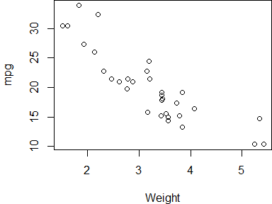

Plotting with Base R
--------------------

So is generating barplots with `barplot`:

``` r
par(mar=c(4,4,0,0))
barplot(table(mtcars$cyl), xlab="Cylinders", ylab="Count")
```

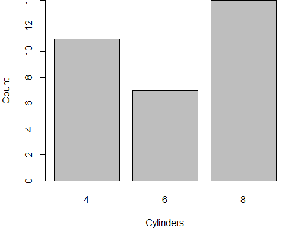

Plotting with Base R
--------------------

Histograms with `hist`:

``` r
par(mar=c(4,4,4,0))
hist(mtcars$wt, xlab="Weight", main="Histogram of car weights")
```

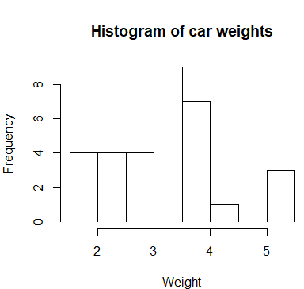

Plotting with Base R
--------------------

And boxplots with `boxplot`:

``` r
par(mar=c(4,4,0,0))
boxplot(mtcars$mpg ~ mtcars$cyl, xlab="Cylinders", ylab="mpg")
```


Plotting with Base R
--------------------

`pairs` is a quick way for visualizing pairwise comparisons:

``` r
pairs(mtcars[,c("mpg", "am", "wt")])
```

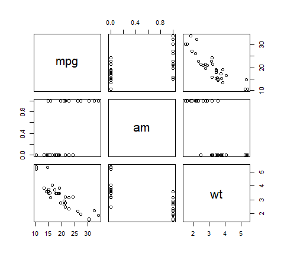

Motivation for using `ggplot`
-----------------------------

-   Nicer looking plots (publication quality)

-   Uses a layered approach to plotting (easy to add elements to existing plots)

-   Allows showing multiple plots through faceting

-   Integrates statistical analysis within the same package

-   Works with **tidy data**

-   Is an implementation of **The Grammar of Graphics** (a well founded approach to plotting data in quantitative fields)

The Grammar of Graphics
-----------------------

There are seven elements to a plot:

-   **Data**: The dataset being plotted

-   **Aesthetics**: The scale onto which we map the data

-   **Geometries**: The visual elements used for the data

-   **Statistics**: The data analysis performed on the plotted data

-   **Coordinates**: The dimensions of the plot

-   **Facets**: The splitting of a single plot into multiple plots

-   **Themes**: Visual elements that are not part of the data

`ggplot` Scatterplots
---------------------

The `ggplot` function deals with the data and aesthetics elements:

``` r
library(ggplot2)
ggplot(data = mtcars, aes(x = wt, y = mpg))
```


The plot is empty! We need to define the geometrical element

`ggplot` Scatterplots
---------------------

We specify a scatterplot by the `geom_point` function:

``` r
ggplot(data = mtcars, aes(x = wt, y = mpg)) +
  geom_point()
```

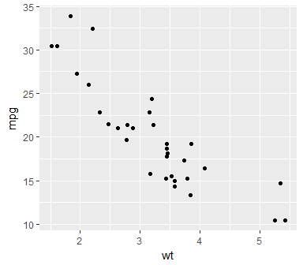

`ggplot` Scatterplots
---------------------

We could've made this a line plot instead by using the `geom_line` function:

``` r
ggplot(data = mtcars, aes(x = wt, y = mpg)) +
  geom_line()
```


But that doesn't make sense for the plotted data

`ggplot` Scatterplots
---------------------

We control the properties of the data points within `geom_point`:

``` r
ggplot(data = mtcars, aes(x = wt, y = mpg)) +
  geom_point(size = 2, col = "blue", alpha = 0.6)
```

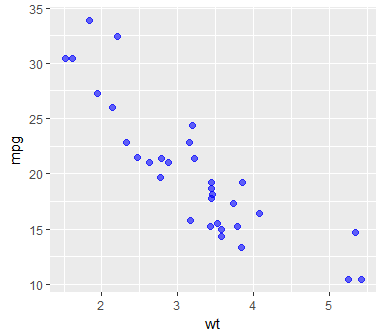

`ggplot` Scatterplots
---------------------

We can add other dimensions to the plot within `aes`:

``` r
ggplot(data = mtcars, aes(x = wt, y = mpg, col = factor(cyl))) +
  geom_point(size = 2, alpha = 0.6)
```

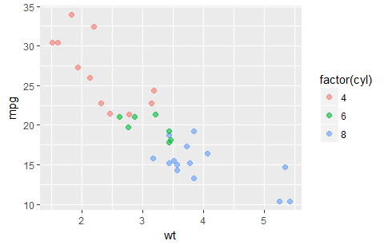

The number of cylinders are mapped to the color

`ggplot` Scatterplots
---------------------

``` r
ggplot(data = mtcars, aes(x = wt, y = mpg, 
    col = factor(cyl), shape = factor(am))) + 
    geom_point(size = 2, alpha = 0.6)
```


And the transmission type is mapped to the shape

Now is your turn to practice!
-----------------------------

The iris dataset is a record of petal and sepal dimensions for three different species of the iris flower. The dataset can be loaded in R by calling:

``` r
data(iris)
```

Use `ggplot` to generate a scatterplot of petal width vs. petal length with the color of the data point indicating the iris species.

Iris Petal Length and Width
---------------------------

Here's a possible solution to the previous exercise:

``` r
 ggplot(iris, aes(x= Petal.Length, y = Petal.Width, col = Species )) +
   geom_point()
```

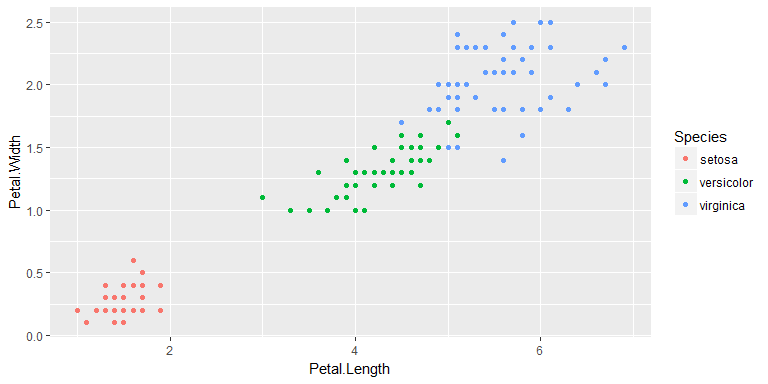

Now is your turn to practice!
-----------------------------

Update the scatterplot of petal width vs. petal length by changing the size, transparency, and shape of the data points.

Iris Petal Length and Width
---------------------------

Here's a possible solution to the previous exercise:

``` r
 ggplot(iris, aes(x= Petal.Length, y = Petal.Width, col = Species )) +
   geom_point(size=3, alpha=0.6, shape=8)
```


Faceted plots
-------------

Faceted plots is a way to split a 'busy' looking plot into multiple plots for better readability

This is done with `facet_wrap`:

``` r
ggplot(data = mtcars, aes(x = wt, y = mpg, col = factor(cyl)) ) +
  geom_point(size = 2, alpha = 0.6) +
  facet_wrap(~am)
```


Faceted plots
-------------

`facet_grid` allows faceting by two variables:

``` r
ggplot(data = mtcars, aes(x = wt, y = mpg)) +
  geom_point(size = 2, alpha = 0.6) +
  facet_grid(am~cyl)
```


Dataframe format
----------------

To map a variable onto a ggplot aesthetic or facet, the variable has to be in a proper tidy format

Example, here's another look at the iris dataset:

``` r
head(iris)
```

    ##   Sepal.Length Sepal.Width Petal.Length Petal.Width Species
    ## 1          5.1         3.5          1.4         0.2  setosa
    ## 2          4.9         3.0          1.4         0.2  setosa
    ## 3          4.7         3.2          1.3         0.2  setosa
    ## 4          4.6         3.1          1.5         0.2  setosa
    ## 5          5.0         3.6          1.4         0.2  setosa
    ## 6          5.4         3.9          1.7         0.4  setosa

The format of the dataset allows faceting by Species, but not by part (e.g. Petal vs. Sepal)

Now is your turn to practice!
-----------------------------

Generate a facet plot that shows sepal and petal dimensions in separate panels. Each panel is a scatterplot of width vs. length, with the color of the data point indicating iris species.

As the `iris` dataset as loaded directly from R is not in the proper format to do the required analysis, I created this alternative tidy version:

`https://raw.githubusercontent.com/maherharb/MATE-T580/master/Datasets/iris_alt.csv`

    ## # A tibble: 4 x 5
    ##   Species    Id  Part Length Width
    ##     <chr> <int> <chr>  <dbl> <dbl>
    ## 1  setosa     1 Petal    1.4   0.2
    ## 2  setosa     1 Sepal    5.1   3.5
    ## 3  setosa     2 Petal    1.4   0.2
    ## 4  setosa     2 Sepal    4.9   3.0

Iris Petal Length and Width
---------------------------

Let's take a look at the iris dataset:

``` r
head(iris)
```

    ##   Sepal.Length Sepal.Width Petal.Length Petal.Width Species
    ## 1          5.1         3.5          1.4         0.2  setosa
    ## 2          4.9         3.0          1.4         0.2  setosa
    ## 3          4.7         3.2          1.3         0.2  setosa
    ## 4          4.6         3.1          1.5         0.2  setosa
    ## 5          5.0         3.6          1.4         0.2  setosa
    ## 6          5.4         3.9          1.7         0.4  setosa

Sepal and Petal dimensions need not be in separate columns. We need to do some work with `gather` and `spread`

Iris Petal Length and Width
---------------------------

First, we combine all variables:

``` r
library(dplyr)
library(tidyr)
iris2 <- iris %>% 
  mutate(Id = 1:n()) %>%
  gather(Measure, Value, Sepal.Length:Petal.Width) 
head(iris2)
```

    ##   Species Id      Measure Value
    ## 1  setosa  1 Sepal.Length   5.1
    ## 2  setosa  2 Sepal.Length   4.9
    ## 3  setosa  3 Sepal.Length   4.7
    ## 4  setosa  4 Sepal.Length   4.6
    ## 5  setosa  5 Sepal.Length   5.0
    ## 6  setosa  6 Sepal.Length   5.4

Iris Petal Length and Width
---------------------------

Then we separate the Part (Sepal vs. Petal) from the Dimension (Length vs. Width):

``` r
iris3 <- separate(iris2, Measure, c("Part", "Dimension"), "[.]") 
head(iris3)
```

    ##   Species Id  Part Dimension Value
    ## 1  setosa  1 Sepal    Length   5.1
    ## 2  setosa  2 Sepal    Length   4.9
    ## 3  setosa  3 Sepal    Length   4.7
    ## 4  setosa  4 Sepal    Length   4.6
    ## 5  setosa  5 Sepal    Length   5.0
    ## 6  setosa  6 Sepal    Length   5.4

Iris Petal Length and Width
---------------------------

And finally, we spread the Dimension into separate Width and Length columns:

``` r
iris4 <- spread(iris3, Dimension, Value)
head(iris4)
```

    ##   Species Id  Part Length Width
    ## 1  setosa  1 Petal    1.4   0.2
    ## 2  setosa  1 Sepal    5.1   3.5
    ## 3  setosa  2 Petal    1.4   0.2
    ## 4  setosa  2 Sepal    4.9   3.0
    ## 5  setosa  3 Petal    1.3   0.2
    ## 6  setosa  3 Sepal    4.7   3.2

Iris Petal Length and Width
---------------------------

Here's a possible solution to the previous exercise:

``` r
 ggplot(iris4, aes(x= Length, y = Width, col = Species )) +
   geom_point(alpha=0.6) +
  facet_wrap(~Part)
```


Iris Petal Length and Width
---------------------------

Here's another way to visualize the data:

``` r
 ggplot(iris4, aes(x= Length, y = Width )) +
   geom_point(alpha=0.6) +
  facet_grid(Part~Species)
```

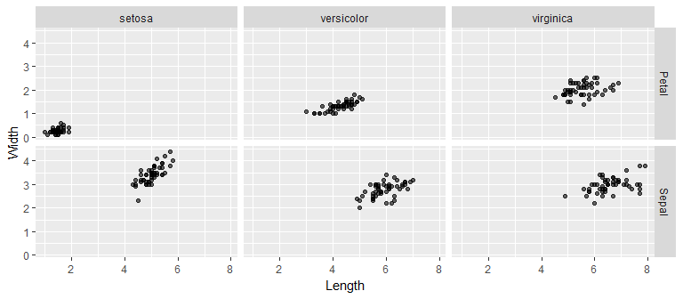

Adding statistical elements to plots
------------------------------------

In `ggplot`, statistical analysis is treated like a separate element that can be added to plots:

``` r
ggplot(data = mtcars, aes(x = wt, y = mpg, col = factor(cyl))) +
  geom_point(size = 2, alpha = 0.6) +
  stat_smooth(method="lm")
```

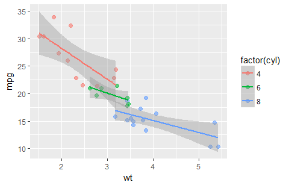

Adding statistical elements to plots
------------------------------------

Alternatively, we can perform the fit on the entire data:

``` r
ggplot(data = mtcars, aes(x = wt, y = mpg, col = factor(cyl))) +
  geom_point(size = 2, alpha = 0.6) +
  stat_smooth(aes(group = 1), method="lm", se=FALSE)
```

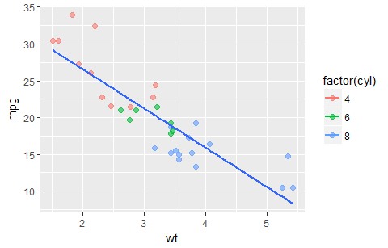

Flash-forward
-------------

In lesson 6, we'll learn how the line of best fit is generated

``` r
ggplot(data = mtcars, aes(x = wt, y = mpg, col = factor(cyl))) +
  geom_point(size = 2, alpha = 0.6) +
  stat_smooth(aes(group = 1), method="lm", se=FALSE)
```

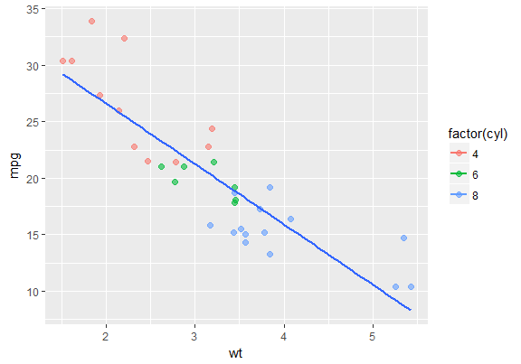

Adding statistical elements to plots
------------------------------------

We can also add trend lines with `stat_smooth`:

``` r
ggplot(data = mtcars, aes(x = wt, y = mpg, col = factor(cyl))) +
  geom_point(size = 2, alpha = 0.6) +
  stat_smooth(aes(group = 1), se=FALSE, lwd=0.5, col="gray")
```

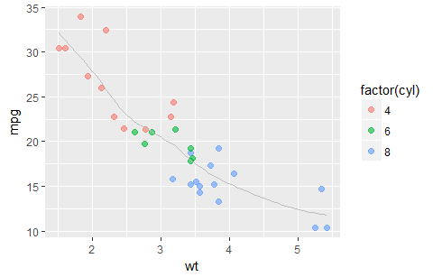

`ggplot` Barplots
-----------------

The very basic purpose of a barplot is to count:

``` r
ggplot(data = mtcars, aes(x = factor(cyl))) +
  geom_bar()
```


Notice that cylinder is a categorical variable

`ggplot` Histograms
-------------------

If the *x* variable is numeric, we use `geom_histogram` instead:

``` r
ggplot(data = mtcars, aes(x = wt)) +
  geom_histogram(bins=10)
```

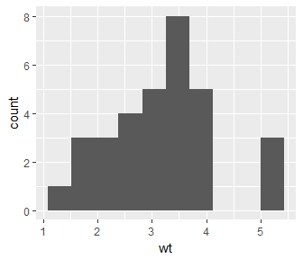

`ggplot` Boxplots
-----------------

Displaying statistics of a numerical variable against a categorical variable is done with `geom_boxplot`:

``` r
ggplot(data = mtcars, aes(x = factor(cyl), y=mpg)) +
  geom_boxplot()
```

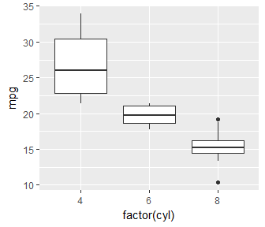

`ggplot` Barplots
-----------------

We can use `geom_bar` for multivariate plots:

``` r
ggplot(data = mtcars, aes(x = factor(cyl), fill=factor(am))) +
  geom_bar(position="fill")
```

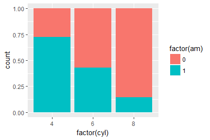

`ggplot` Barplots
-----------------

An alternative way to display the same data:

``` r
ggplot(data = mtcars, aes(x = factor(cyl), fill=factor(am))) +
  geom_bar(position = "dodge")
```

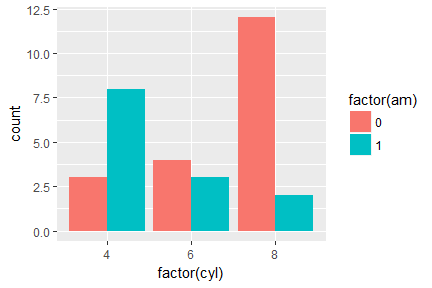

`ggplot` Barplots
-----------------

An alternative way to display the same data:

``` r
ggplot(data = mtcars, aes(x = factor(cyl), fill=factor(am))) +
  geom_bar(position = "stack")
```

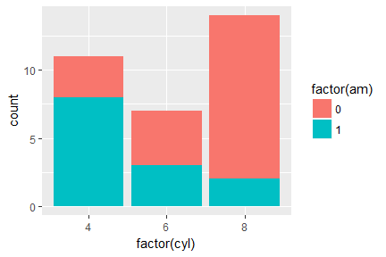

Now is your turn to practice!
-----------------------------

Here's a barplot showing survival rates for the titanic passengers, by class and gender:

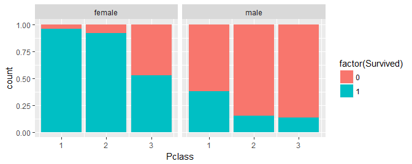

Your task is to reproduce the same plot. Link to the titanic dataset:

`https://raw.githubusercontent.com/maherharb/MATE-T580/master/Datasets/titanic_train.csv`

Titanic survival by class, gender
---------------------------------

Here's the code that generated the previous plot:

``` r
df_titanic %>% ggplot(aes(x = Pclass, fill = factor(Survived))) + 
    geom_bar(position = "fill") + facet_wrap(~Sex)
```

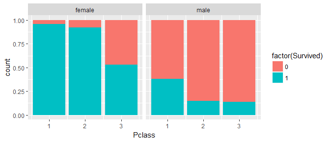

Now is your turn to practice!
-----------------------------

Using the same titanic data, make a plot with `ggplot` that explores the relationship between survival, age, and gender. This's an open ended exercise, you may generate any type of plot you wish as long as it effectively communicates the relationship of interest.

Titanic survival by age, gender
-------------------------------

``` r
df_titanic %>% filter(!is.na(Age), !is.na(Survived), 
    !is.na(Sex)) %>% mutate(Age_group = cut(Age, 
    breaks = c(seq(0, 90, 10), Inf), labels = seq(5, 
        95, 10))) %>% mutate(Survived = factor(ifelse(Survived, 
    "Yes", "No"))) %>% ggplot(aes(x = Age_group, 
    fill = Survived)) + geom_bar(position = "stack") + 
    facet_wrap(~Sex) + xlab("Age") + ylab("Passengers")
```

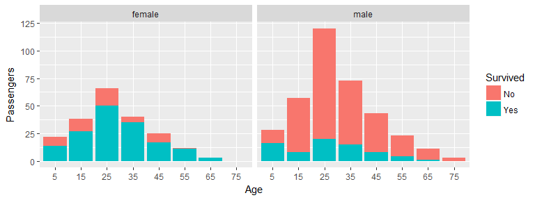

Now is your turn to practice!
-----------------------------

Let's work with the Nobel prizes dataset found here:

`https://raw.githubusercontent.com/maherharb/MATE-T580/master/Datasets/Nobel_data_full.csv`

Generate a visualization that ranks countries by total number of prizes, and at the same time shows breakdown of prizes by prize category

Nobel prizes
------------

Start by selecting the relevant columns and rows:

``` r
df_nobel <- read_csv("Nobel_data_full.csv") %>% 
    select(Year, Category, Country1 = `Organization Country`, 
        Country2 = `Birth Country`)

df_nobel$Country1[is.na(df_nobel$Country1)] <- df_nobel$Country2[is.na(df_nobel$Country1)]
df_nobel <- na.omit(df_nobel)
dim(df_nobel)
```

    ## [1] 943   4

``` r
head(df_nobel)
```

    ## # A tibble: 6 x 4
    ##    Year   Category    Country1          Country2
    ##   <int>      <chr>       <chr>             <chr>
    ## 1  1901  Chemistry     Germany       Netherlands
    ## 2  1901 Literature      France            France
    ## 3  1901   Medicine     Germany  Prussia (Poland)
    ## 4  1901      Peace Switzerland       Switzerland
    ## 5  1901      Peace      France            France
    ## 6  1901    Physics     Germany Prussia (Germany)

Nobel prizes
------------

Then do a bit of cleaning to the country names:

``` r
library("stringr")
df_nobel <- df_nobel %>% mutate(Country1 = str_replace(Country1, 
    "Federal Republic of Germany", "Germany")) %>% 
    mutate(Country1 = str_replace(Country1, 
        "Union of Soviet Socialist Republics", 
        "Russia")) %>% mutate(Country1 = str_replace(Country1, 
    "Alsace.+", "France")) %>% group_by(Country1) %>% 
    mutate(Total = n()) %>% ungroup() %>% 
    filter(Total > 2)
head(df_nobel)
```

    ## # A tibble: 6 x 5
    ##    Year   Category    Country1          Country2 Total
    ##   <int>      <chr>       <chr>             <chr> <int>
    ## 1  1901  Chemistry     Germany       Netherlands    88
    ## 2  1901 Literature      France            France    61
    ## 3  1901   Medicine     Germany  Prussia (Poland)    88
    ## 4  1901      Peace Switzerland       Switzerland    26
    ## 5  1901      Peace      France            France    61
    ## 6  1901    Physics     Germany Prussia (Germany)    88

Nobel prizes
------------

Then make a bar plot with `ggplot`:

``` r
df_nobel %>% ggplot(aes(x = reorder(Country1, -Total), fill = Category)) + geom_bar(position = "stack") + 
    theme(axis.text.x = element_text(angle = 60, hjust = 1))
```

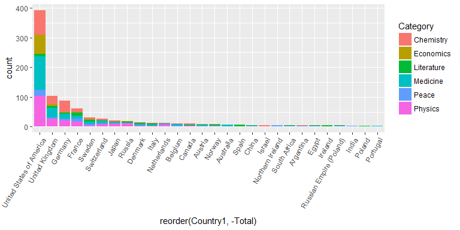

Billboard Top 10 Albums
-----------------------

With `ggplot` we can create some nonintuitive mappings:

``` r
ggplot(df_billboard3, aes(x = Week, y = Album, 
    col = Rank)) + geom_point() + labs(titles = "Albums that topped the chart")
```

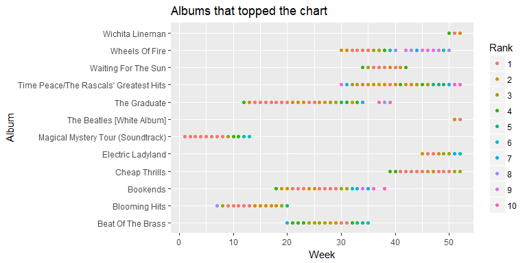

Average temperature in NYC
--------------------------

We did not discuss line plots, but here's an example:

``` r
p <- ggplot(nyc_long, aes(x = day, y = Temperature)) + geom_line() + facet_wrap(~month)
p
```

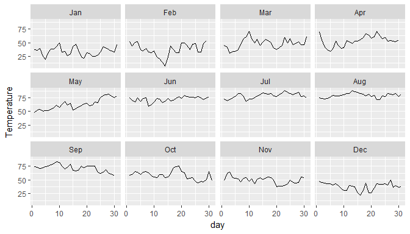

Average temperature in NYC
--------------------------

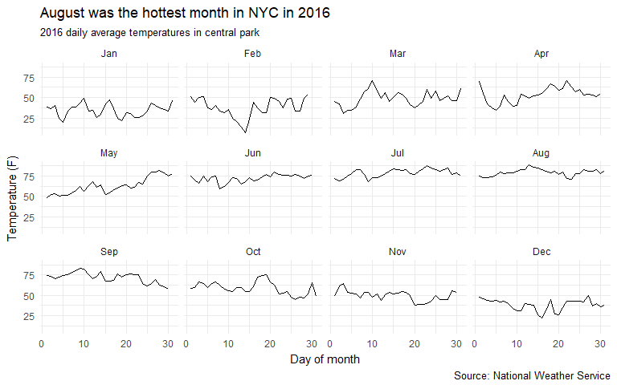

Concluding remarks
------------------

-   Visualizing your data is important for a multitude of reasons

-   It allows you to explore the data and generate insights to help you proceed with later stages of the analysis (e.g. building a predictive model)

-   Sometimes, data visualization is a goal on its own, as the case with producing plots for [manuscripts](http://journals.sagepub.com/doi/abs/10.1177/0003702817715496) or reports

-   `ggplot` is a great package to use for data visualizing and it offers a lot more than what was covered in this lesson

-   With `ggplot` you can generate publication quality plots for a large variety of geometries (over 30 geoms)
