Practical Data Science using R</BR>Lesson 5: Introduction to Statistical Learning
================
Maher Harb, PhD</BR>
Assistant Professor of Physics</BR>Drexel University

About the lesson
----------------

-   In this lesson, we'll learn about the core concepts of statistical learning

-   We'll define statistical learning in the context of prediction and inference problems

-   We'll learn about the trade-off between bias and variance, which is a fundamental concept in statistical learning

-   We'll also learn about the different approaches to model validation

-   And about the difference between regression and classification type problems

What is Statistical Learning?
-----------------------------

-   Suppose that we have a set of input variables 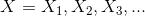 (also called predictors, independent variables, features)

-   And an output variable *Y* (also called response, outcome, dependent variable)

-   Let's further assume that *Y* is a quantitative response and that there exists some relationship between *X* and *Y* described by

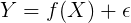

-   where *f* is some fixed but unknown function

-   Statistical learning refers to a set of approaches for estimating *f*

Why bother estimate *f*
-----------------------

**Prediction**

-   Inputs *X* are readily available, but not output *Y*

-   We can estimate *Y* using

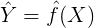

-   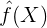 can be a black box: we do not care what the exact form of  is, as long as it gives accurate predictions

**Inference**

-   We are interested in understanding how *Y* is affected by *X* (i.e. what is the relationship between the response and each predictor)

-    cannot be treated as a black box

Prediction or Inference?
------------------------

A company is interested in conducting a direct-marketing campaign. The goal of the campaign is to identify individuals who will respond positively to a mailing, based on observations of demographic variables measured on each individual.

In this case, the demographic variables serve as predictors, and the response to the marketing campaign (either positive or negative) serves as the outcome.

Is this a prediction or an inference problem?

Prediction or Inference?
------------------------

Consultants are hired by a client to provide advice on how to improve sales of a particular product. The Advertising data set consists of the sales of that product in 200 different markets, along with advertising budgets for the product in each of those markets for three different media: TV, radio, and newspaper.

It is not possible for the client to directly increase sales of the product. On the other hand, they can control the advertising expenditure in each of the three media. Therefore, if it were determined that there is an association between advertising and sales, then the client can be instructed to adjust advertising budgets accordingly, thereby indirectly increasing sales.

Is this a prediction or an inference problem?

Prediction or Inference?
------------------------

-   Calculating credit scores for personal banking customers

-   Identifying cats in youtube videos

-   Classifying emails as spam, non-spam

-   Calculating life expectancy based on person's lifestyle

-   Detecting fraudulent activity on a credit card

-   Predicting a company's financial outlook from news articles

-   Estimating the value of a house

The Sales-advertising relation
------------------------------

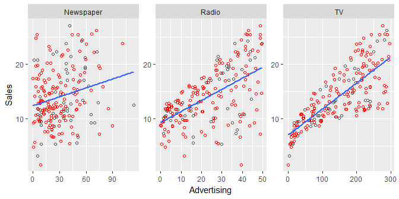

Sometimes the relationship between outcome and predictor(s) is obvious, as in this example

The error term
--------------

Let's look again at the equation:


*ϵ* is a random error:

-   It is independent of *X*

-   It has zero mean

Since *ϵ* cannot be predicted using *X*, it is called the **irreducible error**

The error term
--------------

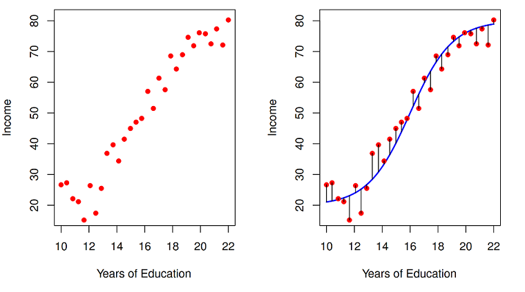

The blue line represents the true relation *f*

The error term
--------------

In this simulated data, the true relationship is *f*(*x*)=*x*<sup>2</sup>

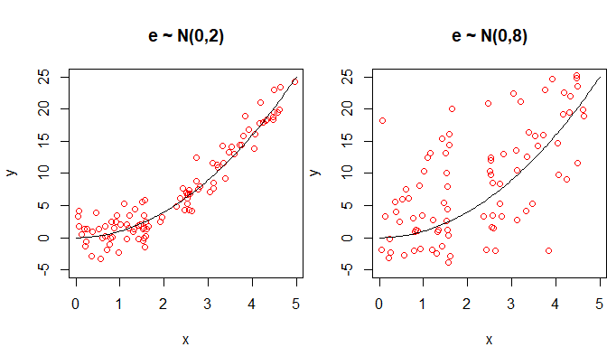

Our job is to come up with the best estimate , given *ϵ*

The error term
--------------

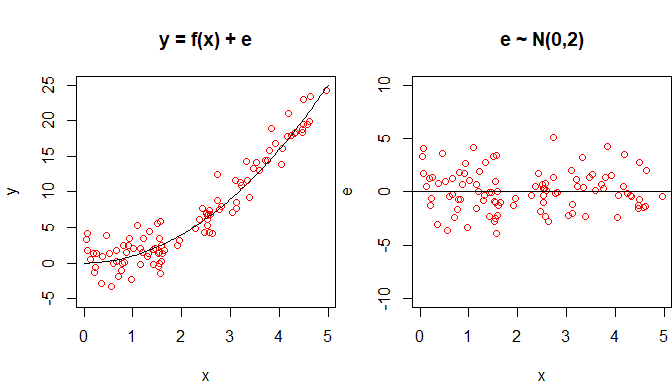

The error term *ϵ* is independent of *X*, and has zero mean

Assessing model accuracy
------------------------

-   A regression refers to the problem in which the response variable is quantitative

-   In the regression setting, a common metric used for evaluating model accuracy is the mean squared error (MSE)

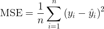

-   If MSE is calculated on the training data that was used to fit the model, then it is referred to as the training MSE

-   The training MSE is not a very useful measure of model accuracy!

Let's see why...

Training MSE
------------

Going back to the simulated data *y* = *x*<sup>2</sup> + *ϵ*, with *ϵ* ∼ *N*(0, 2)

Assume, that we correctly guessed that  =*x*<sup>2</sup>

The training MSE can be easily calculated:

``` r
set.seed(1234)
x <- runif(100, 0, 5)
e <- rnorm(100, 0, 2)
y <- x^2 + e
y_hat <- x^2
MSE <- sum((y - y_hat)^2)/length(x)
print(paste0("MSE: ", round(MSE, 2)))
```

    ## [1] "MSE: 3.6"

Training MSE
------------

Here's another function I "came up with":

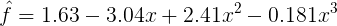

The training MSE for this function is:

``` r
y_hat <- 1.63 - 3.04 * x + 2.41 * x^2 - 0.181 * x^3
MSE <- sum((y - y_hat)^2)/length(x)
print(paste0("MSE: ", round(MSE, 2)))
```

    ## [1] "MSE: 3.38"

The MSE for this function is smaller than the one for the true relationship!

Training MSE
------------

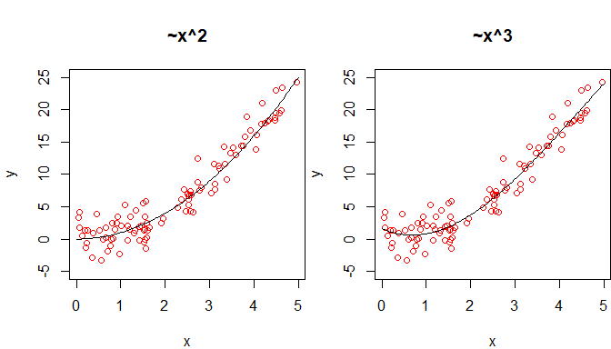

The third degree polynomial is a better fit according to training MSE because of the noise

The model is **overfitting** the data!

Training MSE
------------

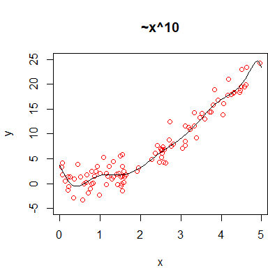

    ## [1] "MSE: 3.11"

For a tenth degree polynomial, **overfitting** is very obvious

Training MSE
------------

This plot shows how the training MSE varies as function of polynomial degree for the data simulated from *f*(*x*)=*x*<sup>2</sup>

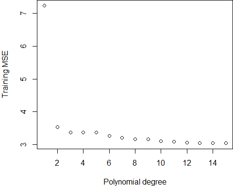

How to avoid overfitting
------------------------

There are two approaches to avoiding overfitting:

1.  Use an alternative measure to MSE, such that a more **flexible** model is penalized

    -   Example, for a linear regression, such one measure is the **adjusted R-squared**

2.  Evaluate the model performance on a portion of the data that was not used to fit the model

    -   This portion is called the **validation sample** or **holdout sample**

    -   The most basic approach to create a **holdout sample** is by splitting the data 80/20 for training/validation

Calculating the test MSE
------------------------

The simulated data assumes *f*(*x*)=3*x*

``` r
set.seed(1234)
x <- runif(100, 0, 5)  # x points
e <- rnorm(100, 0, 2)  # error term ~ N(0,2)
y <- 3 * x + e  # y = f(x) + e
dfram <- data.frame(x = x, y = y)  # all the data points
tr <- sample(1:nrow(dfram), round(0.8 * nrow(dfram)))  # indices of train smaple
dfram1 <- dfram[tr, ]  # training data (80%)
dfram2 <- dfram[-tr, ]  # test data (20%)
p <- 10  # highest degree polynomial to fit
MSE.tr <- rep(0, p)  # save training MSE here 
MSE.tst <- rep(0, p)  # save test MSE here
for (n in 1:p) {
    mod <- lm(y ~ poly(x, n), data = dfram1)
    MSE.tr[n] <- sum((dfram1$y - predict(mod, dfram1))^2)/(nrow(dfram1))
    MSE.tst[n] <- sum((dfram2$y - predict(mod, dfram2))^2)/(nrow(dfram2))
}
par(mar = c(4, 4, 4, 0), mfrow = c(1, 2))
plot(c(1:p), MSE.tr, xlab = "Polynomial degree", ylab = "Training MSE")
plot(c(1:p), MSE.tst, xlab = "Polynomial degree", ylab = "Test MSE", 
    col = "red")
```

Calculating the test MSE
------------------------

Here's how the training and test MSE respond to increased model **flexibility**:

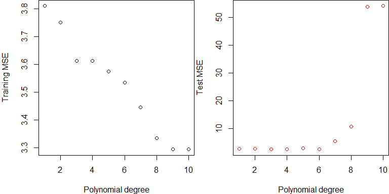

K-fold cross-validation
-----------------------

Yet, a better validation approach is the k-fold cross-validation:

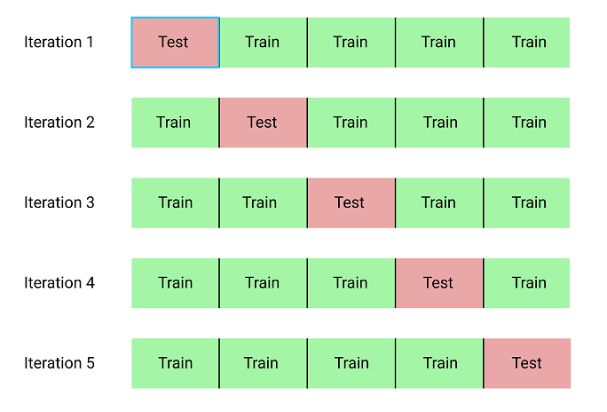

The prediction error
--------------------

*Y* is related to *X* by


We would be tempted to think that the irreducible error *ϵ* is extracted from the difference between response variable and predictions 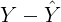

But this is only true if the we know the true relationship between *Y* and *X* (i.e. if 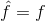)

As this's never the case, what does the variation in the quantity  signify?

The Bias-variance trade-off
---------------------------

There are three contributions to the variation in :

1.  **Variance** of : If we had a different training dataset to work with, our estimate  would probably be different

2.  **Bias** of : if we assume that a certain relationship is linear when in fact it is not, or if we fail to consider a certain predictor which is related to the outcome, then the model captured by  is biased

3.  Variance of *ϵ*: This is the irreducible error that will always be there

The Bias-variance trade-off
---------------------------

-   A model with higher flexibility has low bias but high variance

-   Vice versa, a model with low flexibility (e.g. linear regression model with one predictor) has high bias but low variance

-   **A "good" model strikes a balance between bias and variance**, reflected in a low MSE on the test data

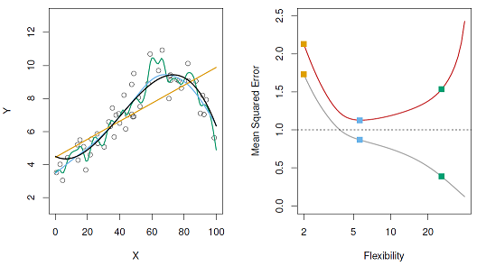

The Bias-variance trade-off
---------------------------

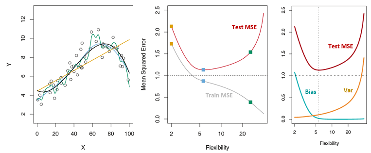

In this example, we're able to see the contributions of bias and variance to the total error because the data is simulated

In a real problem setting, we're not able to isolate these contributions

Regression vs. Classification problems
--------------------------------------

-   So far we've been assuming that the response variable is **quantitative**

-   Problems with quantitative response variable are referred to as regression problems

-   If the response variable is **categorical** (qualitative) then the problem becomes a classification problem

-   The discussion on bias-variance applies to both types of problems

-   But the statistical learning methods and the error evaluation metrics are specific to each class of problems

Regression or Classification?
-----------------------------

-   Calculating credit scores for personal banking customers

-   Identifying cats in youtube videos

-   Classifying emails as spam, non-spam

-   Calculating life expectancy based on person's lifestyle

-   Detecting fraudulent activity on a credit card

-   Predicting a company's financial outlook from news articles

-   Estimating the value of a house

Iris Classification problem
---------------------------

An example of a classification problem is to identify iris species based on the sepal and petal dimensions

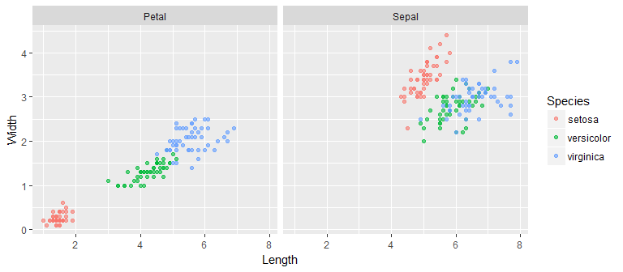

The error rate
--------------

For classification problems, the MSE is not a suitable error metric

One common metric is the classification **error rate** defined as

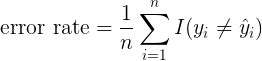

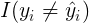 takes the value of 1 if 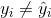 and 0 if 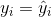

The approach of measuring the error on the test data applies, same as with regression problems

K-Nearest Neighbors Classifier
------------------------------

-   KNN is an example of a statistical learning approach used for classification problems

-   A KNN classifier identifies the *k* points in the training data that are closest to a give point **x** and assigns the class for **x** based on the majority class of the nearest neighbors

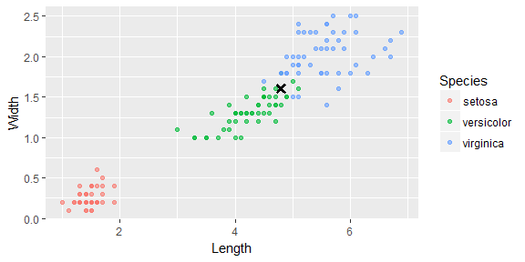

K-Nearest Neighbors Classifier
------------------------------

As an example, this figure shows simulated data in which we're trying to classify points into either the blue class or the orange class

The purple line represents the "true" decision boundary

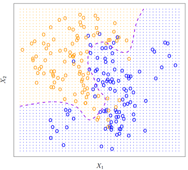

K-Nearest Neighbors Classifier
------------------------------

We wish to classify point **x** as either blue or orange

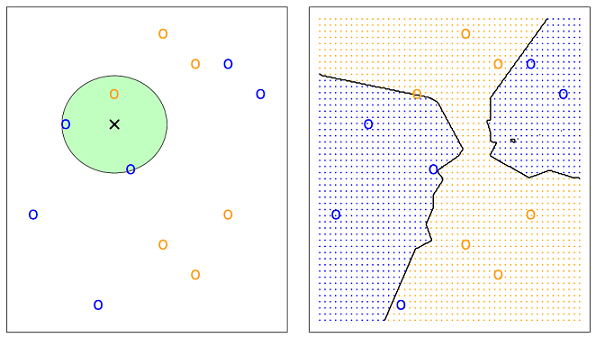

If *k=3* then *Pr(blue)=2/3* and *Pr(orange)=1/3*

We can easily map the decision boundaries for blue and orange

K-Nearest Neighbors Classifier
------------------------------

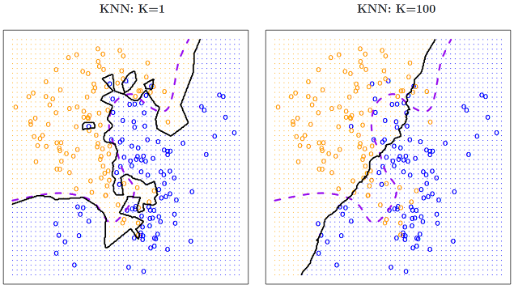

The *k* = 1 model corresponds to the high variance regime; it clearly overfits the data. While the *k* = 100 fit corresponds to the high bias regime; it does not capture the actual decision boundary

K-Nearest Neighbors Classifier
------------------------------

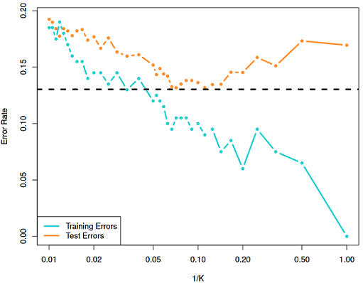

The error rate curve suggests that a *k* value of 10 (1/*k* = 0.1) strikes a good balance between bias and variance

Supervised vs. unsupervised Learning
------------------------------------

-   Classification and Regression problems both fall under the category of supervised learning problems

-   There is another category of problems, the **unsupervised** learning problems

-   These are more challenging problems because the response variable *Y* is absent!

-   With the absence of a response variable, the objective is to understand relationships between variables and observations

-   And to determine if there are distinct groups of observations

Supervised vs. unsupervised Learning
------------------------------------

An example of unsupervised learning problem is identifying distinct groups of flowers within the iris data, with the absence of labels

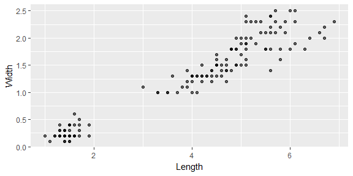

This is a task for a **clustering algorithm**

How to approach a Statistical Learning problem
----------------------------------------------

1.  Statement of a problem (the big question)

2.  Getting and cleaning data

3.  Exploratory analysis (Data Visualization)

4.  Statistical Learning: Ask the following:

    -   Is this a regression or a classification problem

    -   Which error metric to use

    -   What is the validation strategy

    -   Which statistical learning approach to apply

Key concepts
------------

-   *X*, Independent Variables, Features, Predictors

-   , Dependent Variable, Response, Outcome, Labels

-   Statistical Learning, an approach to find  (an estimate of *f*)

-   Regression problem (quantitative response), Classification problem (qualitative response)

-   Irreducible error, Bias (inflexible model), Variance (highly flexible model)

-   Validation metric, MSE (regression), error rate (classification)

-   Validation strategy, holdout sample (80/20), k-fold cross-validation

Concluding remarks
------------------

-   This lesson introduced you to the basic concepts of statistical learning

-   At its core, statistical learning is about estimating a true but unknown relationship between independent variables and an outcome

-   The irreducible error makes it impossible to discern the true nature of the relationship

-   The best we can do is balance bias and variance by minimizing the error on the test sample

-   Carrying out this task requires coming up with a proper evaluation metric and validation strategy
