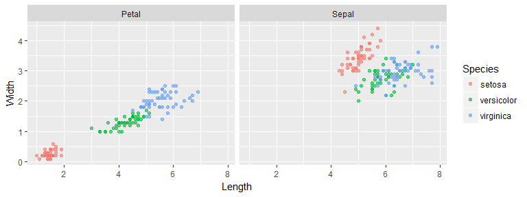
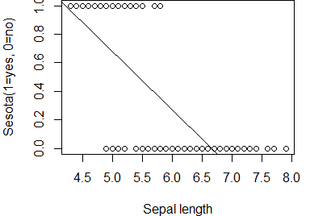
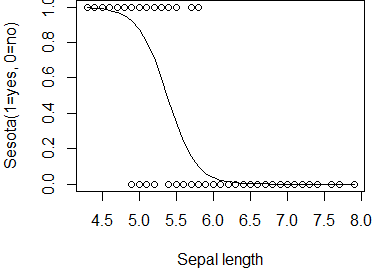
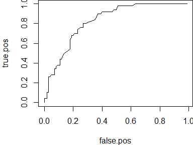

Practical Data Science using R </br> Lesson 7: The Logistic Regression
================
Maher Harb, PhD </br> Assistant Professor of Physics </br> Drexel University

<style>
.codefont pre {
    font-size: 18px;
    line-height: 18px;
}
</style>
About the lesson
----------------

-   This lesson introduces the logistic regression

-   The logistic regression is the equivalent to the linear regression for classification type problems

-   We'll learn how to build a logistic regression in R with two or more classes

-   We'll learn how to generate predictions in the form of class probabilities

-   We'll learn how to assess the model performance by generating a confusion matrix

-   We'll also learn about assessing model performance through an alternative metric: the ROC curve

Classification problems
-----------------------

Classification type problems have a qualitative (categorical) response variable

The categorical response variable may have two or more levels

Example, if we consider the species of the iris dataset to be the response variable, then the levels are:

``` r
levels(iris$Species)
```

    ## [1] "setosa"     "versicolor" "virginica"

An example of a classification problem would be to predict the iris species based on the sepal and petal dimensions

This is a multiclass problem because the number of levels is greater than two

Iris classification
-------------------

How do we build a statistical model to predict the iris class?



``` r
head(iris$Species, 10)
```

    ##  [1] versicolor versicolor virginica  setosa     setosa     versicolor
    ##  [7] versicolor setosa     setosa     versicolor
    ## Levels: setosa versicolor virginica

One hot encoding
----------------

Regardless of whether the classification problem has two or more classes, each class (label) can be converted to a binary variable by one hot encoding:

``` r
library(tidyr)
library(dplyr)
iris_binary <- iris %>% mutate(id = 1:n(), 
    dummy = 1) %>% spread(Species, dummy, 
    fill = 0) %>% arrange(id) %>% select(-id) %>% 
    rename(Sepal.L = Sepal.Length, Sepal.W = Sepal.Width, 
        Petal.L = Petal.Length, Petal.W = Petal.Width)
```

One hot encoding converts an *n*-level categorical variable into *n* binary variables

Let's take a look at the data...

One hot encoding
----------------

``` r
head(iris_binary, 5)
```

    ##   Sepal.L Sepal.W Petal.L Petal.W setosa versicolor virginica
    ## 1     5.7     2.8     4.5     1.3      0          1         0
    ## 2     6.1     2.8     4.0     1.3      0          1         0
    ## 3     6.1     3.0     4.9     1.8      0          0         1
    ## 4     5.1     3.8     1.5     0.3      1          0         0
    ## 5     5.1     3.5     1.4     0.2      1          0         0

``` r
colSums(select(iris_binary, setosa, versicolor, virginica))
```

    ##     setosa versicolor  virginica 
    ##         50         50         50

``` r
table(iris$Species)
```

    ## 
    ##     setosa versicolor  virginica 
    ##         50         50         50

A binary response variable
--------------------------

We may think of the problem as three separate modeling problems with three separate response variables

Each model predicts whether the observation belongs to a specific label:

*y*<sub>*s**e**t**o**s**a*</sub> ∈ {0, 1},*y*<sub>*v**e**r**s**i**c**o**l**o**r*</sub> ∈ {0, 1},*y*<sub>*v**i**r**g**i**n**i**c**a*</sub> ∈ {0, 1}

This is not very different than the formulation of a prediction problem for a quantitative response

Except that we have to find three different functions $\\hat{f}\_i(X)$, one for each species, and that each of the outputs is a binary variable

Can we use a linear regression? Let's see next...

The linear regression
---------------------

Here's a linear regression applied to the problem:

``` r
par(mar = c(4, 4, 0, 1))
plot(iris_binary$Sepal.L, iris_binary$setosa, 
    xlab = "Sepal length", ylab = "Sesota(1=yes, 0=no)")
mod_lm <- lm(setosa ~ Sepal.L, iris_binary)
abline(mod_lm)
```



What is wrong with this picture?

The logistic regression
-----------------------

Here's a logistic regression applied to the problem:

``` r
par(mar = c(4, 4, 0, 1))
plot(iris_binary$Sepal.L, iris_binary$setosa, xlab = "Sepal length", ylab = "Sesota(1=yes, 0=no)")
mod_glm <- glm(setosa ~ Sepal.L, iris_binary, family = binomial)
yhat <- predict(mod_glm, iris_binary, type = "response")
idx <- sort(iris_binary$Sepal.L, index.return = T)$ix
lines(iris_binary$Sepal.L[idx], yhat[idx])
```



The logistic regression
-----------------------

The logistic regression is based on the logistic function:

$$\\textrm{Pr}\_{y=1}(x) = \\frac{1}{1+e^{-(\\beta\_0 + \\beta\_1x)}}$$
 The model produces a probability that an observation belongs to the modeled class (e.g. that the iris is a *setosa*)

There is a linear relationship in the exponential, but the interpretation is not as straight forward as in the linear regression

Probabilities can be easily converted into class predictions, by applying a threshold

Pr(*x*)≥0.5 then class = *s**e**s**o**t**a*

The logistic regression in R
----------------------------

In R, the logistic regression is performed with the `glm` function

The syntax is similar to `lm`, with one additional argument, `family=binomial`:

``` r
mod_glm <- glm(versicolor ~ Petal.L + Sepal.L, iris_binary, family = binomial)
mod_glm
```

    ## 
    ## Call:  glm(formula = versicolor ~ Petal.L + Sepal.L, family = binomial, 
    ##     data = iris_binary)
    ## 
    ## Coefficients:
    ## (Intercept)      Petal.L      Sepal.L  
    ##      3.0440       0.7369      -1.1262  
    ## 
    ## Degrees of Freedom: 149 Total (i.e. Null);  147 Residual
    ## Null Deviance:       191 
    ## Residual Deviance: 178.3     AIC: 184.3

The logistic regression in R
----------------------------

Since this is a classification problem, MSE and R-squared are no longer valid performance metrics

``` r
summary(mod_glm)
```

    ## 
    ## Call:
    ## glm(formula = versicolor ~ Petal.L + Sepal.L, family = binomial, 
    ##     data = iris_binary)
    ## 
    ## Deviance Residuals: 
    ##     Min       1Q   Median       3Q      Max  
    ## -1.5493  -0.9437  -0.6451   1.2645   1.7894  
    ## 
    ## Coefficients:
    ##             Estimate Std. Error z value Pr(>|z|)   
    ## (Intercept)   3.0440     1.9752   1.541  0.12328   
    ## Petal.L       0.7369     0.2282   3.229  0.00124 **
    ## Sepal.L      -1.1262     0.4611  -2.443  0.01459 * 
    ## ---
    ## Signif. codes:  0 '***' 0.001 '**' 0.01 '*' 0.05 '.' 0.1 ' ' 1
    ## 
    ## (Dispersion parameter for binomial family taken to be 1)
    ## 
    ##     Null deviance: 190.95  on 149  degrees of freedom
    ## Residual deviance: 178.32  on 147  degrees of freedom
    ## AIC: 184.32
    ## 
    ## Number of Fisher Scoring iterations: 4

Making predictions
------------------

Predictions are made with the same `predict` function:

``` r
pred1 <- predict(mod_glm, iris_binary, type = "response")
head(pred1)
```

    ##         1         2         3         4         5         6 
    ## 0.4852206 0.2935798 0.4464946 0.1688009 0.1587123 0.4495837

We can easily obtain the predicted classes:

``` r
pred2 <- ifelse(pred1 >= 0.5, 1, 0)
head(pred2)
```

    ## 1 2 3 4 5 6 
    ## 0 0 0 0 0 0

``` r
table(pred2)
```

    ## pred2
    ##   0   1 
    ## 133  17

How well does the model perform?

Model accuracy
--------------

Most of the important metrics are obtained using the `confusionMatrix` function (`caret`):

``` r
library(caret)
confusionMatrix(pred2, iris_binary$versicolor)
```

    ## Confusion Matrix and Statistics
    ## 
    ##           Reference
    ## Prediction  0  1
    ##          0 88 45
    ##          1 12  5
    ##                                           
    ##                Accuracy : 0.62            
    ##                  95% CI : (0.5372, 0.6979)
    ##     No Information Rate : 0.6667          
    ##     P-Value [Acc > NIR] : 0.902           
    ##                                           
    ##                   Kappa : -0.024          
    ##  Mcnemar's Test P-Value : 2.25e-05        
    ##                                           
    ##             Sensitivity : 0.8800          
    ##             Specificity : 0.1000          
    ##          Pos Pred Value : 0.6617          
    ##          Neg Pred Value : 0.2941          
    ##              Prevalence : 0.6667          
    ##          Detection Rate : 0.5867          
    ##    Detection Prevalence : 0.8867          
    ##       Balanced Accuracy : 0.4900          
    ##                                           
    ##        'Positive' Class : 0               
    ## 

Model accuracy
--------------

The accuracy of our model is:

``` r
cm <- confusionMatrix(pred2, iris_binary$versicolor)
cm$overall["Accuracy"]
```

    ## Accuracy 
    ##     0.62

How good is that?

Once again, we compare against a dummy model that assigns the majority class:

``` r
1 - sum(iris_binary$versicolor/nrow(iris_binary))
```

    ## [1] 0.6666667

Our model is worse than the dummy model!

Classifying iris versicolor
---------------------------

We may do better if we include other variables:

``` r
mod_glm <- glm(versicolor ~ Petal.L + Petal.W + 
    Sepal.L + Sepal.W, iris_binary, family = binomial)
pred1 <- predict(mod_glm, iris_binary, type = "response")
pred2 <- ifelse(pred1 >= 0.5, 1, 0)
cm <- confusionMatrix(pred2, iris_binary$versicolor)
cm$overall["Accuracy"]
```

    ## Accuracy 
    ##     0.74

But remember, we are evaluating the performance on the training data

A more proper approach is to split the data into train/test portions

Now is your turn to practice!
-----------------------------

The following link points to the titanic dataset (a csv file):

`https://raw.githubusercontent.com/maherharb/MATE-T580/master/Datasets/titanic_train.csv`

The titanic dataset contains information on passengers of the titanic and whether they survived the disaster.

Build a logistic regression model to predict survival based on few predictors you pick. What is the accuracy of the model as evaluated on the training data? How does that compare to a dummy model?

Titanic survival model
----------------------

Here's how we build a basic survival model:

``` r
df_titanic <- read_csv("titanic_train.csv")
mod_titanic <- glm(Survived ~ Age + Sex + Fare, df_titanic, family = binomial)
mod_titanic
```

    ## 
    ## Call:  glm(formula = Survived ~ Age + Sex + Fare, family = binomial, 
    ##     data = df_titanic)
    ## 
    ## Coefficients:
    ## (Intercept)          Age      Sexmale         Fare  
    ##     1.06754     -0.01241     -2.44023      0.01172  
    ## 
    ## Degrees of Freedom: 563 Total (i.e. Null);  560 Residual
    ##   (149 observations deleted due to missingness)
    ## Null Deviance:       761.8 
    ## Residual Deviance: 557.7     AIC: 565.7

Notice, we ignored missing values!

Next, we check the model accuracy on the training set...

Titanic survival model
----------------------

By creating a confusion matrix:

``` r
pred <- predict(mod_titanic, df_titanic, type = "response")
confusionMatrix(ifelse(pred >= 0.5, 1, 0), df_titanic$Survived)
```

    ## Confusion Matrix and Statistics
    ## 
    ##           Reference
    ## Prediction   0   1
    ##          0 282  69
    ##          1  53 160
    ##                                          
    ##                Accuracy : 0.7837         
    ##                  95% CI : (0.7474, 0.817)
    ##     No Information Rate : 0.594          
    ##     P-Value [Acc > NIR] : <2e-16         
    ##                                          
    ##                   Kappa : 0.5465         
    ##  Mcnemar's Test P-Value : 0.1745         
    ##                                          
    ##             Sensitivity : 0.8418         
    ##             Specificity : 0.6987         
    ##          Pos Pred Value : 0.8034         
    ##          Neg Pred Value : 0.7512         
    ##              Prevalence : 0.5940         
    ##          Detection Rate : 0.5000         
    ##    Detection Prevalence : 0.6223         
    ##       Balanced Accuracy : 0.7702         
    ##                                          
    ##        'Positive' Class : 0              
    ## 

Now is your turn to practice!
-----------------------------

Evaluating the model on the training data is not a good indicator of the model's out of sample performance.

The following link points to the titanic test dataset (a csv file):

`https://raw.githubusercontent.com/maherharb/MATE-T580/master/Datasets/titanic_test.csv`

Evaluate the model you built on this dataset and compare the prediction accuracy to the prediction done on the training data.

Titanic survival model
----------------------

This is the same as before, except that the predictions are generated on the test data:

``` r
df_titanic_test <- read_csv("titanic_test.csv")
pred2 <- predict(mod_titanic, df_titanic_test, type = "response")
confusionMatrix(ifelse(pred2 >= 0.5, 1, 0), df_titanic_test$Survived)
```

    ## Confusion Matrix and Statistics
    ## 
    ##           Reference
    ## Prediction  0  1
    ##          0 74 21
    ##          1 15 40
    ##                                           
    ##                Accuracy : 0.76            
    ##                  95% CI : (0.6835, 0.8259)
    ##     No Information Rate : 0.5933          
    ##     P-Value [Acc > NIR] : 1.333e-05       
    ##                                           
    ##                   Kappa : 0.4949          
    ##  Mcnemar's Test P-Value : 0.4047          
    ##                                           
    ##             Sensitivity : 0.8315          
    ##             Specificity : 0.6557          
    ##          Pos Pred Value : 0.7789          
    ##          Neg Pred Value : 0.7273          
    ##              Prevalence : 0.5933          
    ##          Detection Rate : 0.4933          
    ##    Detection Prevalence : 0.6333          
    ##       Balanced Accuracy : 0.7436          
    ##                                           
    ##        'Positive' Class : 0               
    ## 

The regression coefficients
---------------------------

How do we explain the regression coefficients for a logistic regression?

Let's look at the titanic survival model:

``` r
mod_titanic$coefficients
```

    ## (Intercept)         Age     Sexmale        Fare 
    ##  1.06754348 -0.01241159 -2.44022663  0.01171537

In general, the coefficient *β*<sub>*i*</sub> relates how predictor *x*<sub>*i*</sub> affects the log odds of the response:

$$\\log \\bigg(\\frac{p}{1-p} \\bigg) = \\beta \_0 + \\beta \_1 x\_1 + \\beta \_2 x\_2 + . . . $$

The regression coefficients
---------------------------

Let's first consider the effect of the fare paid:

``` r
mod_titanic$coefficients
```

    ## (Intercept)         Age     Sexmale        Fare 
    ##  1.06754348 -0.01241159 -2.44022663  0.01171537

The value *β* ≈ 0.012 suggests that every extra dollar spent on the fare increases survival odds on average by *e*<sup>0.012</sup> = 1.01, if sex and age are held constant

This doesn't seem like much, but we must consider the average fare difference between ticket classes...

The regression coefficients
---------------------------

``` r
df_titanic %>% group_by(Pclass) %>% summarize(mean_fare = mean(Fare), n = n())
```

    ## # A tibble: 3 x 3
    ##   Pclass mean_fare     n
    ##    <int>     <dbl> <int>
    ## 1      1      86.6   169
    ## 2      2      21.2   143
    ## 3      3      13.4   401

The average difference between first and third class tickets is $73

That translates into a factor of *e*<sup>73 × 0.012</sup> = 2.4 improved survival odds!

The regression coefficients
---------------------------

The effect of gender is even more dramatic:

``` r
mod_titanic$coefficients
```

    ## (Intercept)         Age     Sexmale        Fare 
    ##  1.06754348 -0.01241159 -2.44022663  0.01171537

Being a male reduces the odds of survival on average by a factor of *e*<sup>2.4</sup> = 11.5, if fare paid and age are held constant

Dealing with multi-classes
--------------------------

Back to the *iris* classification problem...

So far we've built a model for a single class: *versicolor*

But the classification problem has two additional classes: *sesota* and *virginica *

We need to build two additional models

Once we have predictions on the three classes, for each observation we assign the class with the highest probability

We could also normalize the probabilities for each observation to add up to 1

Let's see how this is implemented...

Dealing with multi-classes
--------------------------

Fortunately, this is made easy by the `glmnet` package:

``` r
library(glmnet)
x <- as.matrix(select(iris, -Species))
y <- iris$Species
mod_glmnet <- glmnet(x, y, family = "multinomial", lambda = 0)
pred_glmnet <- predict(mod_glmnet, x, type = "response")
head(pred_glmnet[, , 1])
```

    ##           setosa   versicolor    virginica
    ## 56  1.956756e-12 9.998816e-01 1.184022e-04
    ## 72  3.250900e-10 9.999996e-01 4.213055e-07
    ## 128 7.287213e-16 1.999803e-01 8.000197e-01
    ## 20  1.000000e+00 1.938361e-10 1.566636e-36
    ## 1   1.000000e+00 5.136295e-10 1.943645e-36
    ## 90  3.673525e-11 9.999868e-01 1.321581e-05

The classes are obtained by:

``` r
pred <- predict(mod_glmnet, x, type = "class")
```

Let's check the model performance...

Dealing with multi-classes
--------------------------

``` r
table(pred)
```

    ## pred
    ##     setosa versicolor  virginica 
    ##         50         50         50

``` r
confusionMatrix(pred, iris$Species)
```

    ## Confusion Matrix and Statistics
    ## 
    ##             Reference
    ## Prediction   setosa versicolor virginica
    ##   setosa         50          0         0
    ##   versicolor      0         49         1
    ##   virginica       0          1        49
    ## 
    ## Overall Statistics
    ##                                           
    ##                Accuracy : 0.9867          
    ##                  95% CI : (0.9527, 0.9984)
    ##     No Information Rate : 0.3333          
    ##     P-Value [Acc > NIR] : < 2.2e-16       
    ##                                           
    ##                   Kappa : 0.98            
    ##  Mcnemar's Test P-Value : NA              
    ## 
    ## Statistics by Class:
    ## 
    ##                      Class: setosa Class: versicolor Class: virginica
    ## Sensitivity                 1.0000            0.9800           0.9800
    ## Specificity                 1.0000            0.9900           0.9900
    ## Pos Pred Value              1.0000            0.9800           0.9800
    ## Neg Pred Value              1.0000            0.9900           0.9900
    ## Prevalence                  0.3333            0.3333           0.3333
    ## Detection Rate              0.3333            0.3267           0.3267
    ## Detection Prevalence        0.3333            0.3333           0.3333
    ## Balanced Accuracy           1.0000            0.9850           0.9850

Iris classification problem
---------------------------


How do we ensure that the model performs well out of sample?

We need to do cross-validation

Logistic regression with `caret`
--------------------------------

Here's how we train a `glmnet` model in `caret`, with k-fold cross-validation:

``` r
set.seed(1234)
myControl <- trainControl(method = "cv", 
    number = 5)
grid <- expand.grid(alpha = 1, lambda = 0)
mod <- train(Species ~ ., iris, method = "glmnet", 
    family = "multinomial", trControl = myControl, 
    tuneGrid = grid, metric = "Accuracy")
```

Notice that by forcing *λ* = 0, we are not performing any regularization

How does the model perform?

Logistic regression with `caret`
--------------------------------

Here's the out-of-sample accuracy:

``` r
mod$results$Accuracy
```

    ## [1] 0.96

``` r
mod$results$AccuracySD
```

    ## [1] 0.04346135

The results are pretty good!

Now is your turn to practice!
-----------------------------

Use `glm` within the `caret` package to build a titanic survival model. Use cross-validation to estimate the out-of-sample accuracy and once done check the performance of the model on the held out (test) sample. Note that:

`caret` does not like missing values

`caret` assumes that classification problems have a factor type response (not binary 1/0)

Titanic survival model
----------------------

Here's how we train a `glm` model in `caret`, with k-fold cross-validation:

``` r
set.seed(1234)
myControl <- trainControl(method = "cv", number = 5, 
    classProbs = TRUE)
df_titanic$Survived <- factor(ifelse(df_titanic$Survived == 
    1, "Y", "N"))
df_titanic$Age[is.na(df_titanic$Age)] <- mean(df_titanic$Age, 
    na.rm = TRUE)
mod <- train(Survived ~ Age + Sex + Pclass, df_titanic, 
    method = "glm", family = binomial, trControl = myControl, 
    metric = "Accuracy")
mod$results$Accuracy
```

    ## [1] 0.789625

The cross validation model accuracy is 0.789625

How does the model perform on the test sample?

Titanic survival model
----------------------

Let's generate class predictions:

``` r
df_titanic_test$Survived <- factor(ifelse(df_titanic_test$Survived == 
    1, "Y", "N"))
df_titanic_test$Age[is.na(df_titanic_test$Age)] <- mean(df_titanic_test$Age, 
    na.rm = TRUE)
pred <- predict(mod, df_titanic_test, type = "prob")
head(pred)
```

    ##           N          Y
    ## 1 0.3858777 0.61412234
    ## 2 0.9136980 0.08630203
    ## 3 0.9353441 0.06465590
    ## 4 0.4286664 0.57133358
    ## 5 0.7936190 0.20638101
    ## 6 0.9136980 0.08630203

``` r
pred2 <- ifelse(pred$Y >= 0.5, "Y", "N")
cm <- confusionMatrix(pred2, df_titanic_test$Survived)
```

Next, we check the confusion matrix...

Titanic survival model
----------------------

``` r
cm
```

    ## Confusion Matrix and Statistics
    ## 
    ##           Reference
    ## Prediction  N  Y
    ##          N 93 20
    ##          Y 20 45
    ##                                           
    ##                Accuracy : 0.7753          
    ##                  95% CI : (0.7068, 0.8343)
    ##     No Information Rate : 0.6348          
    ##     P-Value [Acc > NIR] : 3.971e-05       
    ##                                           
    ##                   Kappa : 0.5153          
    ##  Mcnemar's Test P-Value : 1               
    ##                                           
    ##             Sensitivity : 0.8230          
    ##             Specificity : 0.6923          
    ##          Pos Pred Value : 0.8230          
    ##          Neg Pred Value : 0.6923          
    ##              Prevalence : 0.6348          
    ##          Detection Rate : 0.5225          
    ##    Detection Prevalence : 0.6348          
    ##       Balanced Accuracy : 0.7577          
    ##                                           
    ##        'Positive' Class : N               
    ## 

Alternative performance metric
------------------------------

-   The prediction accuracy (1 - error rate) is the most basic metric for classification problems

-   Prediction accuracy is very easy to calculate from the confusion matrix

-   It is also very easy to explain/communicate

-   However, it is not the best metric to assess model performance

-   For one thing, it requires applying a threshold to derive class predictions from probabilities

-   Information is lost in the process

The ROC Curve
-------------

Let's go back to the iris model for a single iris species: *versicolor*

``` r
mod_glm
```

    ## 
    ## Call:  glm(formula = versicolor ~ Petal.L + Petal.W + Sepal.L + Sepal.W, 
    ##     family = binomial, data = iris_binary)
    ## 
    ## Coefficients:
    ## (Intercept)      Petal.L      Petal.W      Sepal.L      Sepal.W  
    ##      7.3785       1.3136      -2.7783      -0.2454      -2.7966  
    ## 
    ## Degrees of Freedom: 149 Total (i.e. Null);  145 Residual
    ## Null Deviance:       191 
    ## Residual Deviance: 145.1     AIC: 155.1

The ROC curve maps out the True Positive rate vs. False Positive rate as the probability threshold is varied

The ROC Curve
-------------

Here's how we generate class probabilities:

``` r
pred <- predict(mod_glm, type = "response")
head(pred)
```

    ##          1          2          3          4          5          6 
    ## 0.61042772 0.42412709 0.25501144 0.03347754 0.08491322 0.66381248

Let's explore what happens if we vary the cut-off threshold between zero and one:

``` r
true.pos <- rep(0, 100)
false.pos <- rep(0, 100)
for (i in 1:100) {
    pred2 <- ifelse(pred >= (i/100), 1, 0)
    cm <- confusionMatrix(pred2, iris_binary$versicolor)
    true.pos[i] <- sum(pred2 == 1 & iris_binary$versicolor == 
        1)/sum(iris_binary$versicolor)
    false.pos[i] <- sum(pred2 == 1 & iris_binary$versicolor == 
        0)/sum(iris_binary$versicolor == 
        0)
}
```

The ROC Curve
-------------

Here's a plot of the ROC curve:

``` r
par(mar = c(4, 4, 0, 0))
plot(false.pos, true.pos, type = "l")
```



The larger the area under the ROC curve the better the model

The ROC Curve
-------------

For a binary variable, we can use the `Metrics` package to calculate the auc:

``` r
library(Metrics)
auc(actual = iris_binary$versicolor, predicted = pred)
```

    ## [1] 0.8258

In addition, depending on the package used for training a logistic regression, `caret` allows choosing `ROC` as a metric within the `train` function call

Concluding remarks
------------------

-   Logistic regression is suited to deal with classification type problems

-   For a 2-level response, `glm` will do the job

-   For a 3- (or more) level response, `glmnet` allows modeling the response without the need to split the levels into separate binary variables

-   We can also use `caret` for both types of problems to take advantage of the built in cross-validation and preprocessing capabilities

-   Model performance is assessed according the **accuracy** = 1 - **error rate** or the area under the curve **ROC/AUC**

-   All of the statistical learning concepts discussed before apply to the logistic regression (bias-variance trade-off, variable selection, regularization)
