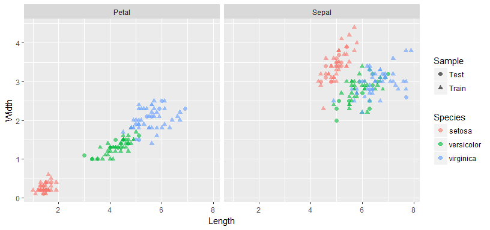
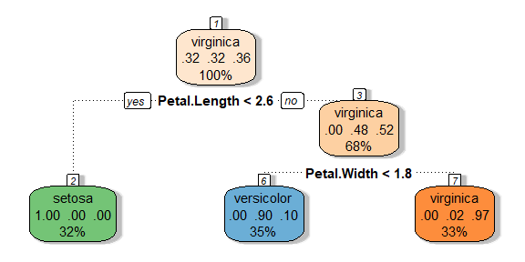
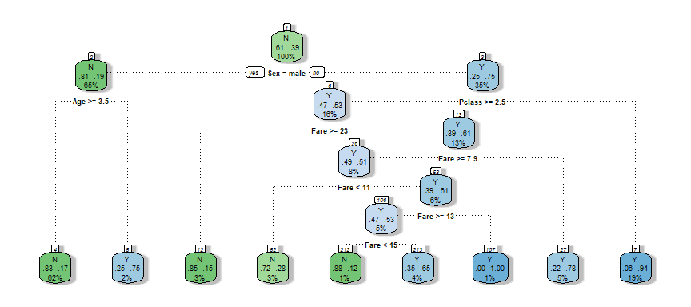
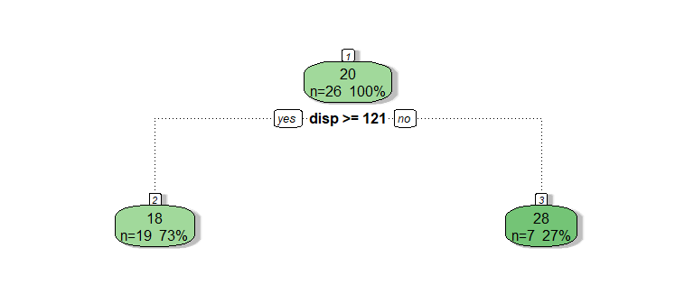
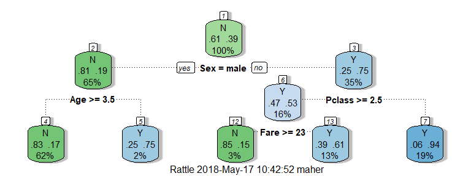
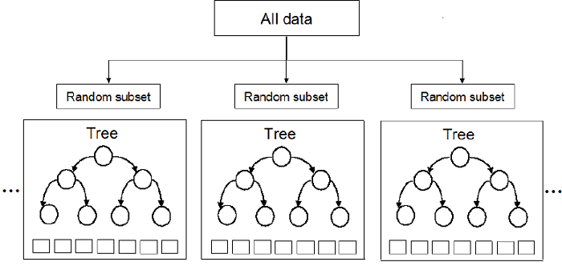

Practical Data Science using R </br> Lesson 8: Decision Trees
================
Maher Harb, PhD </br> Assistant Professor of Physics </br> Drexel University

<style>
.codefont pre {
    font-size: 18px;
    line-height: 18px;
}
</style>
About the lesson
----------------

-   This lesson introduces decision trees: a "rule-based" type of statistical learning models

-   We'll see that decision trees can be applied to both classification and regression problems

-   We'll learn about the R implementation of tree models with the `rpart` package

-   We'll discuss the tuning of tree models hyper-parameters

-   And we'll introduce boosting as an approach to enhance performance of tree models, with focus on two types of algorithms: **random forest** and **eXtreme gradient boosting**

Classifying iris species
------------------------

We'll introduce tree models through the iris classification problem

Let's first split the iris dataset into train/test portions:

``` r
data(iris)
```

``` r
set.seed(1234)
idx <- sample(1:nrow(iris), round(0.8 * nrow(iris)))
iris_train <- iris[idx, ]
iris_test <- iris[-idx, ]
table(iris_train$Species)
```

    ## 
    ##     setosa versicolor  virginica 
    ##         38         39         43

``` r
table(iris_test$Species)
```

    ## 
    ##     setosa versicolor  virginica 
    ##         12         11          7

Classifying iris species
------------------------

Here's a view of where the train/test samples fall:



Can you come up with some rules to classify the iris species?

Building a tree model
---------------------

The `rpart` package is used to train a tree model

`rpart` will decide on whether the problem is a classification or a regression problem based on the class of the response variable:

``` r
class(iris_train$Species)
```

    ## [1] "factor"

``` r
library(rpart)
tree_mod <- rpart(Species ~ ., iris_train)
tree_mod
```

    ## n= 120 
    ## 
    ## node), split, n, loss, yval, (yprob)
    ##       * denotes terminal node
    ## 
    ## 1) root 120 77 virginica (0.3166667 0.3250000 0.3583333)  
    ##   2) Petal.Length< 2.6 38  0 setosa (1.0000000 0.0000000 0.0000000) *
    ##   3) Petal.Length>=2.6 82 39 virginica (0.0000000 0.4756098 0.5243902)  
    ##     6) Petal.Width< 1.75 42  4 versicolor (0.0000000 0.9047619 0.0952381) *
    ##     7) Petal.Width>=1.75 40  1 virginica (0.0000000 0.0250000 0.9750000) *

Visualizing a decision tree
---------------------------

The decision tree model is easy to visualize with `fancyRpartPlot` (`rattle` package):

``` r
library(rattle)
fancyRpartPlot(tree_mod, sub = "")
```



What is the objective of the algorithm behind `rpart`?

Making predictions
------------------

Predictions are generated with `predict`. Here we predict classes:

``` r
pred_cls <- predict(tree_mod, iris_test, type = "class")
head(pred_cls)
```

    ##        129         90        119        101        144        134 
    ##  virginica versicolor  virginica  virginica  virginica versicolor 
    ## Levels: setosa versicolor virginica

We can also generate the class probabilities:

``` r
pred_prb <- predict(tree_mod, iris_test, type = "prob")
head(pred_prb)
```

    ##     setosa versicolor virginica
    ## 129      0  0.0250000 0.9750000
    ## 90       0  0.9047619 0.0952381
    ## 119      0  0.0250000 0.9750000
    ## 101      0  0.0250000 0.9750000
    ## 144      0  0.0250000 0.9750000
    ## 134      0  0.9047619 0.0952381

Model performance
-----------------

As with any classification problem, standard performance metrics are generated with `confusionMatrix` (`caret` package):

``` r
library(caret)
confusionMatrix(pred_cls, iris_test$Species)
```

    ## Confusion Matrix and Statistics
    ## 
    ##             Reference
    ## Prediction   setosa versicolor virginica
    ##   setosa         12          0         0
    ##   versicolor      0         11         1
    ##   virginica       0          0         6
    ## 
    ## Overall Statistics
    ##                                           
    ##                Accuracy : 0.9667          
    ##                  95% CI : (0.8278, 0.9992)
    ##     No Information Rate : 0.4             
    ##     P-Value [Acc > NIR] : 5.303e-11       
    ##                                           
    ##                   Kappa : 0.9485          
    ##  Mcnemar's Test P-Value : NA              
    ## 
    ## Statistics by Class:
    ## 
    ##                      Class: setosa Class: versicolor Class: virginica
    ## Sensitivity                    1.0            1.0000           0.8571
    ## Specificity                    1.0            0.9474           1.0000
    ## Pos Pred Value                 1.0            0.9167           1.0000
    ## Neg Pred Value                 1.0            1.0000           0.9583
    ## Prevalence                     0.4            0.3667           0.2333
    ## Detection Rate                 0.4            0.3667           0.2000
    ## Detection Prevalence           0.4            0.4000           0.2000
    ## Balanced Accuracy              1.0            0.9737           0.9286

Now is your turn to practice!
-----------------------------

The following links points to the titanic datasets (csv files):

`https://raw.githubusercontent.com/maherharb/MATE-T580/master/Datasets/titanic_train.csv`

and

`https://raw.githubusercontent.com/maherharb/MATE-T580/master/Datasets/titanic_test.csv`

The titanic dataset contains information on passengers of the titanic and whether they survived the disaster.

Build a classification tree to predict survival. Visualize the tree and check the accuracy of the model as evaluated on the training and test dataset.

Titanic survival model
----------------------

Here's one possible approach to the problem. First, remove variables that are suspected to cause overfitting:

Since this's a classification problem, convert the response variable to a factor:

Then train the tree model:

Let's visualize the decision tree...

Titanic survival model
----------------------



Is there reason to believe that the model is overfitting?

Titanic survival model
----------------------

Here's the confusion matrix based on training set predictions:

    ## Confusion Matrix and Statistics
    ## 
    ##           Reference
    ## Prediction   N   Y
    ##          N 407  84
    ##          Y  29 193
    ##                                           
    ##                Accuracy : 0.8415          
    ##                  95% CI : (0.8126, 0.8676)
    ##     No Information Rate : 0.6115          
    ##     P-Value [Acc > NIR] : < 2.2e-16       
    ##                                           
    ##                   Kappa : 0.6539          
    ##  Mcnemar's Test P-Value : 3.776e-07       
    ##                                           
    ##             Sensitivity : 0.9335          
    ##             Specificity : 0.6968          
    ##          Pos Pred Value : 0.8289          
    ##          Neg Pred Value : 0.8694          
    ##              Prevalence : 0.6115          
    ##          Detection Rate : 0.5708          
    ##    Detection Prevalence : 0.6886          
    ##       Balanced Accuracy : 0.8151          
    ##                                           
    ##        'Positive' Class : N               
    ## 

Titanic survival model
----------------------

And the on based on test set predictions:

    ## Confusion Matrix and Statistics
    ## 
    ##           Reference
    ## Prediction   N   Y
    ##          N 105  24
    ##          Y   8  41
    ##                                           
    ##                Accuracy : 0.8202          
    ##                  95% CI : (0.7558, 0.8737)
    ##     No Information Rate : 0.6348          
    ##     P-Value [Acc > NIR] : 4.937e-08       
    ##                                           
    ##                   Kappa : 0.5909          
    ##  Mcnemar's Test P-Value : 0.00801         
    ##                                           
    ##             Sensitivity : 0.9292          
    ##             Specificity : 0.6308          
    ##          Pos Pred Value : 0.8140          
    ##          Neg Pred Value : 0.8367          
    ##              Prevalence : 0.6348          
    ##          Detection Rate : 0.5899          
    ##    Detection Prevalence : 0.7247          
    ##       Balanced Accuracy : 0.7800          
    ##                                           
    ##        'Positive' Class : N               
    ## 

Regression trees
----------------

Building a regression tree with `rpart` follows the same syntax:

``` r
data("mtcars")
tr <- sample(1:nrow(mtcars), round(0.8 * nrow(mtcars)))
mod_cars <- rpart(mpg ~ ., mtcars[tr, ])
mod_cars
```

    ## n= 26 
    ## 
    ## node), split, n, deviance, yval
    ##       * denotes terminal node
    ## 
    ## 1) root 26 827.2804 20.48077  
    ##   2) disp>=120.65 19 186.8200 17.80000 *
    ##   3) disp< 120.65 7 133.2971 27.75714 *

Regression trees
----------------

``` r
fancyRpartPlot(mod_cars, sub = "")
```



Notice that the diagram is less informative compared to the classification tree

Regression trees
----------------

The training MSE:

``` r
pred <- predict(mod_cars, mtcars[tr, ])
sum((pred - mtcars$mpg[tr])^2)/nrow(mtcars[tr, ])
```

    ## [1] 12.3122

The test MSE:

``` r
pred <- predict(mod_cars, mtcars[-tr, ])
sum((pred - mtcars$mpg[-tr])^2)/nrow(mtcars[-tr, ])
```

    ## [1] 21.34078

It seems that the regression tree is not a good method to apply to the mtcars modeling problem

Decision boundaries
-------------------

The decision boundaries of a problem give clues as to which learning model might be most suitable

Here's an example of a problem that is better suited for a parametric model (e.g. linear or logistic regression):


Decision boundaries
-------------------

And here's one that is better suited for a tree model:


Properties of Tree models
-------------------------

-   Decision trees are easy to build, visualize, and interpret

-   The `rpart` implementation of decision trees supports multiclass problems

-   They can also be used for regression problems

-   However, they suffer from one major drawback: susceptibility to overfitting

-   Overfitting can be avoided by tuning the tree hyper-parameters against performance on a cross-validation sample

`rpart` Hyper-parameters
------------------------

`rpart` (and decision trees in general) offers some control over certain properties of the tree

Here are some of the most important ones used for tuning:

-   `minsplit` defines the minimum number of observations that must exist in a node in order for a split to be attempted

-   `maxdepth`: The maximum depth of any node of the final tree

-   `cp` (complexity parameter): Any split that does not decrease the overall lack of fit by a factor of cp is not attempted

Can you guess the bias-variance trade-off in the above?

Now is your turn to practice!
-----------------------------

Rebuild your titanic survival model. But this time experiment with limiting the tree complexity by changing any one of these three parameters:

`minsplit`, `maxdepth`, `cp`

Here's an example of how to change the default value for `maxdepth`:

``` r
    rpart( formula = _ _ _  , data = _ _ _ , control = list(maxdepth=12)) 
```

Visualize the tree and check its performance on the test dataset.

Titanic survival model
----------------------

We can limit the model's complexity by restricting the depth of the tree to 3:

    ## n= 713 
    ## 
    ## node), split, n, loss, yval, (yprob)
    ##       * denotes terminal node
    ## 
    ##  1) root 713 277 N (0.61150070 0.38849930)  
    ##    2) Sex=male 461  87 N (0.81127983 0.18872017)  
    ##      4) Age>=3.5 445  75 N (0.83146067 0.16853933) *
    ##      5) Age< 3.5 16   4 Y (0.25000000 0.75000000) *
    ##    3) Sex=female 252  62 Y (0.24603175 0.75396825)  
    ##      6) Pclass>=2.5 115  54 Y (0.46956522 0.53043478)  
    ##       12) Fare>=23.35 20   3 N (0.85000000 0.15000000) *
    ##       13) Fare< 23.35 95  37 Y (0.38947368 0.61052632) *
    ##      7) Pclass< 2.5 137   8 Y (0.05839416 0.94160584) *

Let's visualize the tree...

Titanic survival model
----------------------

Here's a plot of the new model:



We have definitely reduced the variance of the tree, but we might have introduced more bias than before

Titanic survival model
----------------------

Here's the confusion matrix based on test set predictions:

    ## Confusion Matrix and Statistics
    ## 
    ##           Reference
    ## Prediction   N   Y
    ##          N 100  21
    ##          Y  13  44
    ##                                           
    ##                Accuracy : 0.809           
    ##                  95% CI : (0.7434, 0.8639)
    ##     No Information Rate : 0.6348          
    ##     P-Value [Acc > NIR] : 3.225e-07       
    ##                                           
    ##                   Kappa : 0.577           
    ##  Mcnemar's Test P-Value : 0.2299          
    ##                                           
    ##             Sensitivity : 0.8850          
    ##             Specificity : 0.6769          
    ##          Pos Pred Value : 0.8264          
    ##          Neg Pred Value : 0.7719          
    ##              Prevalence : 0.6348          
    ##          Detection Rate : 0.5618          
    ##    Detection Prevalence : 0.6798          
    ##       Balanced Accuracy : 0.7809          
    ##                                           
    ##        'Positive' Class : N               
    ## 

Tuning the `cp` with `caret`
----------------------------

`caret` supports tuning the `cp` parameter only:

``` r
myControl <- trainControl(method = "cv", number = 5, classProbs = TRUE)
grid <- expand.grid(cp = c(0, 0.1, 0.3, 0.6))
mod <- train(Species ~ ., iris_train, method = "rpart", trControl = myControl, 
    tuneGrid = grid, metric = "Accuracy")
mod$results
```

    ##    cp  Accuracy     Kappa AccuracySD   KappaSD
    ## 1 0.0 0.9235507 0.8851294 0.07092339 0.1066386
    ## 2 0.1 0.9235507 0.8851294 0.07092339 0.1066386
    ## 3 0.3 0.9235507 0.8851294 0.07092339 0.1066386
    ## 4 0.6 0.3582319 0.0000000 0.01798391 0.0000000

Tuning other hyperparameters requires writing our own tuning script

Performing a grid search
------------------------

This script scans the hyperparameter space for best `rpart` model:

``` r
set.seed(1234)
k = 5
folds <- createFolds(iris$Species, k, list = FALSE)
mygrid <- expand.grid(minsplit = c(1, 2, 5, 10, 20), maxdepth = c(1, 2, 3, 4, 
    5), cp = c(0, 0.01, 0.1, 0.3, 0.5, 1))
mod_accuracy <- rep(0, nrow(mygrid))
for (i in 1:nrow(mygrid)) {
    acc <- rep(0, k)
    for (j in 1:k) {
        iris_train <- iris[folds != j, ]
        iris_test <- iris[folds == j, ]
        mod <- rpart(Species ~ ., iris_train, control = list(minsplit = mygrid$minsplit[i], 
            maxdepth = mygrid$maxdepth[i], cp = mygrid$cp[i]))
        pred <- predict(mod, iris_test, type = "class")
        cm <- confusionMatrix(pred, iris_test$Species)
        acc[j] <- cm$overall["Accuracy"]
    }
    mod_accuracy[i] <- mean(acc)
    print(paste0("Iteration ", i, " out of ", nrow(mygrid), " completed."))
    flush.console()
}
bst.mod <- which.max(mod_accuracy)
mygrid[bst.mod, ]
mod_accuracy[bst.mod]
```

Bagging and Boosting
--------------------

-   Aside from the issue of overfitting, plain tree models are not typically among the best performing statistical learning models

-   The performance of tree models can be significantly enhanced by bagging or boosting

-   In **bagging**/**boosting**, separate models are built on subsets of the data and the results are aggregated to generate a single set of predictions

-   There's a subtle difference between bagging and boosting: Bagging subsets observations but keeps all variables, while boosting subsets both observations and variables

Next, We'll learn about a specific boosting method: the **random forest**

The Random Forest
-----------------

In a **Random Forest**, the random subset of the data is a subset both of observations (rows) and of variables (columns)



The R packages `randomForest` and `ranger` offer alternative implementations of the random forest algorithm

The RF hyperparameters
----------------------

Since a random forest samples data and builds decision trees on these sample, any hyperparameter specific to decision trees is also a random forest hyperparameter

The random forest has additional hyperparameters related to the boosting method:

-   Size of the sample (number of observations)

-   Number of variables included in the sample

-   Number of trees to build (default = 500)

Training a Random Forest
------------------------

This's how a random forest is trained with the `ranger` package:

``` r
library(ranger)
mod <- ranger(Species ~ ., iris)
mod
```

    ## Ranger result
    ## 
    ## Call:
    ##  ranger(Species ~ ., iris) 
    ## 
    ## Type:                             Classification 
    ## Number of trees:                  500 
    ## Sample size:                      150 
    ## Number of independent variables:  4 
    ## Mtry:                             2 
    ## Target node size:                 1 
    ## Variable importance mode:         none 
    ## OOB prediction error:             4.67 %

A nice feature about random forests is getting the out of bag performance for free!

Training a Random Forest
------------------------

Another nice feature is the built-in confusion matrix:

``` r
mod$confusion.matrix
```

    ##             predicted
    ## true         setosa versicolor virginica
    ##   setosa         50          0         0
    ##   versicolor      0         47         3
    ##   virginica       0          4        46

OOB prediction error and accuracy are easily extracted:

``` r
print(mod$prediction.error)
```

    ## [1] 0.04666667

``` r
print(1 - mod$prediction.error)
```

    ## [1] 0.9533333

`ranger` parameters
-------------------

`ranger` offers an extensive list of parameters to add to the main function call

These are best viewed within the help page, but few notable parameters are:

-   `num.trees`: specifies the number of trees to train

-   `mtry`: the number of variables to use at each node

-   `sample.fraction`: the fraction of observations to sample

-   `min.node.size`: the minimal node size

Tuning is done in the same fashion as with any other learning model: by checking the model performance on the cross-validation sample

Now is your turn to practice!
-----------------------------

Rebuild your titanic survival model, this time using the `ranger` package.

For now, don't tweak any of the hyperparameters beyond the default values.

But note that `ranger` doesn't like missing values.

Titanic survival model
----------------------

Here's a random forest model built on the titanic data:

    ## Ranger result
    ## 
    ## Call:
    ##  ranger(Survived ~ ., df_titanic) 
    ## 
    ## Type:                             Classification 
    ## Number of trees:                  500 
    ## Sample size:                      713 
    ## Number of independent variables:  7 
    ## Mtry:                             2 
    ## Target node size:                 1 
    ## Variable importance mode:         none 
    ## OOB prediction error:             17.25 %

Note that we needed first to impute missing values

Titanic survival model
----------------------

Let's compare the OOB performance to the performance on the test sample:

    ## Confusion Matrix and Statistics
    ## 
    ##           Reference
    ## Prediction   N   Y
    ##          N 105  22
    ##          Y   8  43
    ##                                           
    ##                Accuracy : 0.8315          
    ##                  95% CI : (0.7682, 0.8833)
    ##     No Information Rate : 0.6348          
    ##     P-Value [Acc > NIR] : 6.52e-09        
    ##                                           
    ##                   Kappa : 0.6191          
    ##  Mcnemar's Test P-Value : 0.01762         
    ##                                           
    ##             Sensitivity : 0.9292          
    ##             Specificity : 0.6615          
    ##          Pos Pred Value : 0.8268          
    ##          Neg Pred Value : 0.8431          
    ##              Prevalence : 0.6348          
    ##          Detection Rate : 0.5899          
    ##    Detection Prevalence : 0.7135          
    ##       Balanced Accuracy : 0.7954          
    ##                                           
    ##        'Positive' Class : N               
    ## 

eXtreme Gradient Boosting (XGB)
-------------------------------

-   XGB is another boosting method based on decision trees

-   It is among the most powerful machine learning algorithms today

-   It is somewhat recent (Friedman, 2001)

-   It is the one machine learning algorithm that consistently wins competitions on Kaggle

-   However, it is more complex than the random forest both in terms of the basic principle and in terms of the usage of XGB packages in R

eXtreme Gradient Boosting (XGB)
-------------------------------

The mathematical theory behind XGB is too complex for this lesson, but here's a simplified narrative of what the algorithm does (in the context of a regression problem)

Recall from our discussion on statistical learning that the general problem is to estimate a true but unknow relationship

*y* = *f*(*x*)+*ϵ*

Say we build a first regression tree on a subset of the observations and a subset of the variables (hence, **boosting**) to estimate *f*(*x*)

The residual error of this first model $\\hat{f}\_1(x)$ is

$$h\_1(x) = y - \\hat{f}\_1 (x)$$

eXtreme Gradient Boosting (XGB)
-------------------------------

What we do next is build a second model $\\hat{f}\_2(x)$ to estimate the residual error term *h*<sub>1</sub>(*x*) itself (the assumption is: *if we model the error, we can correct the error*)

What we are in effect doing is modeling the difference between the response and predictions, or what is known as the **gradient**

This second model will also have a residual error term

$$h\_2(x) = h\_1(x)- \\hat{f}\_2 (x)$$

We continue to iteratively improve the predictions of *y* by building models of the ever diminishing residsual error terms

We continue with this process hundreds or thousands of times; hence the term **eXtreme**

The `xgboost` package
---------------------

-   `xgboost` is the most popular implementation of the XGB algorithm in R and python

-   It can solve a wide variety of problems including: regression trees, two and multi-class classification trees, regularized linear and logistic regression, ranking

-   The core algorithm is based on boosted trees, but it supports various flavors of the algorithm

-   It has a built-in cross-validation capability and supports a large number of performance metrics

-   It allows multi-threading; hence it can run efficiently on multi-core systems

When to apply RF and XGB
------------------------

So far we demonstrated the implementation of various learning algorithms on the mtcars, iris, and titanic datasets

This is ok for educational purposes, but in reality algorithms like RF and XGB are an overkill for simple datasets

RF and XGB are more suited for problems where:

-   The number of observations is very large

-   The dimensionality is high

-   The human intuition about the relationships is limited, or

-   the variables are totally anonymized

In the next lesson, we will practice building RF and XGB models on a more motivating dataset

Concluding Remarks
------------------

-   Decision trees are popular statistical learning approaches due to their simplicity and ease of interpretation

-   They can be applied for classification as well as regression type problems

-   They work well when the true decision boundary corresponds to a "set of rules"

-   Boosting significantly enhances performance of tree-based models:

*Random forest and extreme gradient boosting are among the most powerful and versatile machine learning algorithms*
