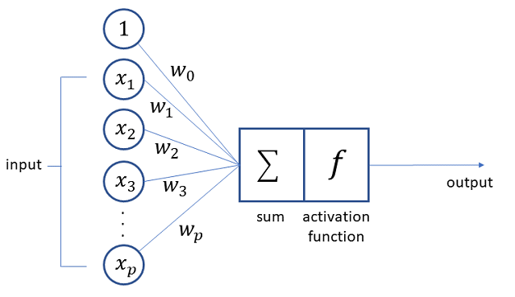
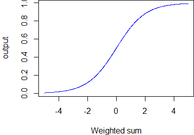
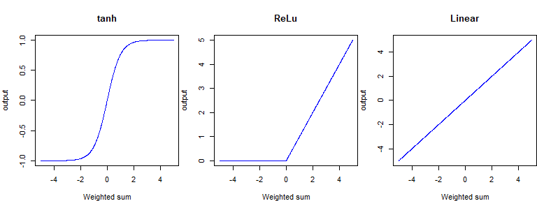
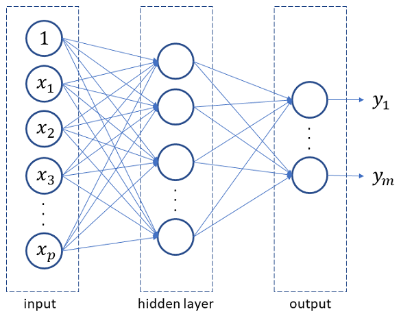
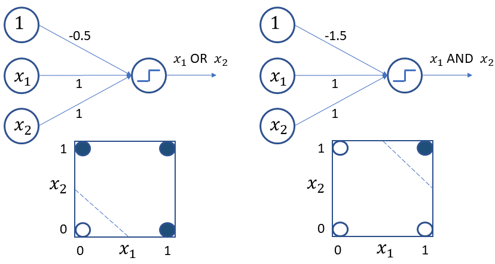
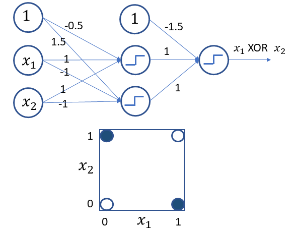
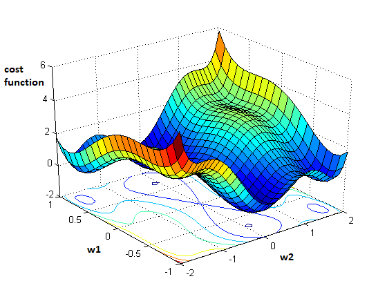
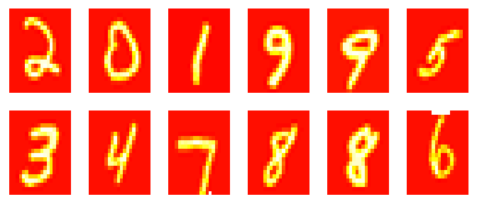
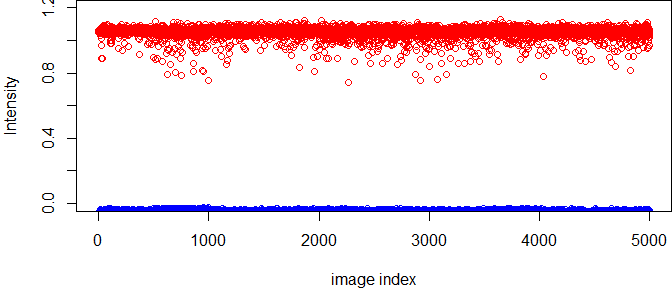
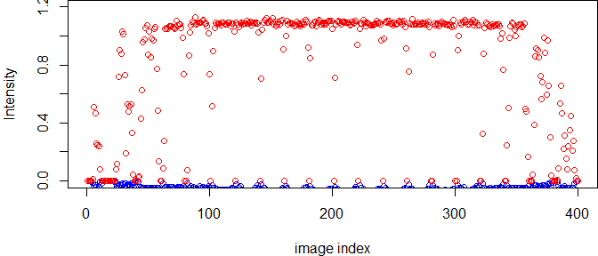

Practical Data Science using R </br> Lesson 9: Artificial Neural Network
================
Maher Harb, PhD </br> Assistant Professor of Physics </br> Drexel University

About the lesson
----------------

-   In this lesson we'll learn about the basic concept behind an artificial neural network (ANN)

-   You'll be introduced to the ANN architecture and the differnet properties that a user can define to build an ANN

-   We'll see how an ANN allows access to non-linear decision boundaries

-   And we'll learn to use the `neuralnet` R package to train an ANN, through the Optical Character Recognition (OCR) problem

The Perceptron
--------------

The **perceptron** is the very basic unit of an artificial neural network: it generates an output by feeding the weighted sum of the input to an **activation function**



The Activation function
-----------------------

In its simplest form, the activation function attempts to mimic the behavior of a biological neuron: it fires or does not fire

A simple function that can achieve the above is a step function:


If weighted sum ≥0.5, then output =1 (fire), else output =0

The Activation function
-----------------------

A step function has drawbacks: it does not work beyond a simple binary classification task and it is not differentiable

A more commonly used activation function is the **Sigmoid**:

$$f(x) = \\frac{1}{1 + \\exp(-x)}$$



The Activation function
-----------------------

There are many other types of activation functions:



The choice of activation function depends on the characteristics of the function we are trying to approximate

ANN Architecture
----------------

An artificial neural network is constructed by stacking layers of perceptrons



ANN Architecture
----------------

-   An ANN has one or more hidden layers

-   The number of perceptrons (nodes) of the input and output layers are fixed

-   The number of perceptrons (nodes) of each hidden layer can take any value

-   Hidden layers can have any choice of activation function

-   The output layer activation function has to match the type of problem

    -   Example: for a linear regression problem, the output perceptron uses a linear activation function

Linear decision boundary
------------------------

Linearly separable problems can be solved without a hidden layer (using the so called primitive network)



Non-linear decision boundary
----------------------------

But a hidden layer allows the ANN to access non-linear decision boundaries



Training an ANN
---------------

Mathematically, training an ANN involves solving for weights *w*<sub>0</sub>, *w*<sub>1</sub>, *w*<sub>2</sub>, ..., *w*<sub>*N*</sub> such that some measure of the model fitness is optimized (e.g. minimizing $\\sum\_{i,j}(\\hat{y}\_{i,j}-y\_{i,j})^2$, where *i* runs over observations and *j* runs over outputs)

Note that the number of weights depends on the number of hidden layers and the number of nodes per hidden layer

Example, for an input of 20 independent variables, first hidden layer with 50 perceptrons, second hidden layer with 40 perceptrons, and classification problem with 3 levels:

*N* = (20 + 1)×50 + (50 + 1)×40 + (40 + 1)×3 = 3, 213

Gradient Descent algorithm
--------------------------



In a gradient descent algorithm, starting from a random position in parameter space, small steps are taken in the direction that minimizes the cost function

The backpropagation method
--------------------------

The backward propagation method (an implementation of the general gradient descent) optimizes the ANN weights by:

-   First, randomly assigning weights on the ANN

-   Calculating the output and the prediction error (also known as the cost function, loss function)

-   Propagating backward and readjusting the weights by calculating the gradient of the cost function relative to the adjusted weight

-   Repeating this process iteratively until the cost function converges

Note, there is no guarantee that the converged result is the absolute optimal solution

Training an ANN in R
--------------------

There are several R packages that support ANN training:

-   `nnet`: Most simple to use; but allows only a single hidden layer

-   `neuralnet`: More advanced; allows multiple hidden layers

-   `keras`: Offers an R interface to the very popular and powerful keras python library; requires python to be installed

In this lesson, we'll use the `neuralnet` package

Detecting hand written digits
-----------------------------

We'll demonstrate training an ANN on a dataset of 5,000 images of scanned hand written digits (0-9)

Here's a sample of the images:



Extracting features from images
-------------------------------

When it comes to images, feature extraction is typically the most challenging step

In this exmaple however, the images are only 20 × 20 pixels, and are monocromatic (gray scale)

A quick approach would be to treat each intensity point as a variable

Hence, the 5, 000 images will be converted into a 5, 000 × 400 matrix

The target variable is a vector of length 400, with 10 factor levels (0-9)

The OCR dataset
---------------

The csv file for the dataset is available at:

`https://raw.githubusercontent.com/maherharb/MATE-T580/master/Datasets/OCR_data.csv`

Here's a quick look at the data:

``` r
df_OCR <- read_csv("OCR_data.csv")
dim(df_OCR)
```

    ## [1] 5000  401

``` r
names(df_OCR)[1:10]
```

    ##  [1] "V1"  "V2"  "V3"  "V4"  "V5"  "V6"  "V7"  "V8"  "V9"  "V10"

``` r
names(df_OCR)[401]
```

    ## [1] "y"

The OCR dataset
---------------

Let's look at the levels of the target variable:

``` r
table(df_OCR$y)
```

    ## 
    ##   1   2   3   4   5   6   7   8   9  10 
    ## 500 500 500 500 500 500 500 500 500 500

We can guess that level 0 was replaced by level 10:

``` r
i <- which(df_OCR$y == 10)[1]
mtx <- matrix(as.numeric((df_OCR[i, 1:400])), nrow = 20, byrow = FALSE)
par(mar = c(1, 1, 0, 0), mfrow = c(1, 1))
image(rotate(mtx), useRaster = TRUE, axes = FALSE, col = heat.colors(50, alpha = 1))
```


ANN architecture
----------------

We'll train an ANN using the `neuralnet` package

We'll start with a single hidden layer with 50 nodes

The number of weights for the ANN will be

(401)×50 + (50 + 1)×10 = 2, 101

We'll use the sigmoid activation function for the hidden layer as well as the output

But first we have to do some housekeeping...

Pre-training tasks
------------------

-   Dealing with missing values in the dataset

-   Checking the distribution of input variables and renormalizing if needed (center and scale)

-   Reshaping the output according to the `neuralnet` requirements

-   Checking the formula syntax for `neuralnet`

    -   e.g. `(y~., data)` vs. `(x, y)`
-   Deciding on a validation strategy

-   Deciding on a performance measure metric

NA Imputation
-------------

Let's check first if the dataset contains missing values:

``` r
sum(is.na(df_OCR))
```

    ## [1] 2784

The names of the columns that have missing values:

``` r
names(which(apply(df_OCR, 2, function(x) {
    sum(is.na(x))
}) > 0))
```

    ##  [1] "V13"  "V14"  "V15"  "V16"  "V17"  "V18"  "V19"  "V21"  "V40"  "V41" 
    ## [11] "V60"  "V61"  "V80"  "V81"  "V101" "V121" "V141" "V161" "V181" "V201"
    ## [21] "V221" "V241" "V261" "V280" "V281" "V300" "V301" "V320" "V321" "V340"
    ## [31] "V341" "V360" "V361" "V380" "V382" "V399"

And lastly, replace missing values with zeroes:

``` r
df_OCR[is.na(df_OCR)] <- 0
```

Checking the image intensity range
----------------------------------

``` r
Intensity_min <- apply(df_OCR[, 1:400], 1, min)
Intensity_max <- apply(df_OCR[, 1:400], 1, max)
par(mar = c(4, 4, 0, 0))
plot(1:5000, Intensity_min, xlab = "image index", ylab = "Intensity", col = "blue", 
    ylim = c(0, 1.2))
points(1:5000, Intensity_max, col = "red")
```



The images have intensity values within 0-1, which is ok (no further processing is needed)

Checking the input value range
------------------------------

``` r
Intensity_min <- apply(df_OCR[, 1:400], 2, min)
Intensity_max <- apply(df_OCR[, 1:400], 2, max)
par(mar = c(4, 4, 0, 0))
plot(1:400, Intensity_min, xlab = "image index", ylab = "Intensity", col = "blue", 
    ylim = c(0, 1.2))
points(1:400, Intensity_max, col = "red")
```



The variation is expected as the pixel coordinates at the edges of the image are close to the noise level

Reshaping the output
--------------------

`neuralnet` does not accept a multi-level factor as output

We have to convert the 10-level output into 10 binary variables:

``` r
library(tidyr)
library(dplyr)
y_binary <- df_OCR %>% select(y) %>% mutate(Id = 1:n(), dummy = 1) %>% spread(y, 
    dummy, fill = 0) %>% select(-Id)
names(y_binary) <- paste0("Y", 1:10)
idx <- sample(1:nrow(y_binary), 5)
y_binary[idx, ]
```

    ## # A tibble: 5 x 10
    ##      Y1    Y2    Y3    Y4    Y5    Y6    Y7    Y8    Y9   Y10
    ##   <dbl> <dbl> <dbl> <dbl> <dbl> <dbl> <dbl> <dbl> <dbl> <dbl>
    ## 1     0     0     1     0     0     0     0     0     0     0
    ## 2     0     0     0     1     0     0     0     0     0     0
    ## 3     1     0     0     0     0     0     0     0     0     0
    ## 4     0     0     0     0     1     0     0     0     0     0
    ## 5     0     0     0     0     0     1     0     0     0     0

``` r
df_OCR$y[idx]
```

    ## [1] 3 4 1 5 6

Specifying the formula
----------------------

`neuralnet` uses the formula notation `y~x` but does not accept the shotrhand `y~.`

We have to build the formula with the `as.formula` function:

``` r
xs <- gsub("\\+$", "", paste0("V", 1:400, "+", collapse = ""))
ys <- gsub("\\+$", "", paste0("Y", 1:10, "+", collapse = ""))
frml <- as.formula(paste0(ys, "~", xs))
frml
```

    ## Y1 + Y2 + Y3 + Y4 + Y5 + Y6 + Y7 + Y8 + Y9 + Y10 ~ V1 + V2 + 
    ##     V3 + V4 + V5 + V6 + V7 + V8 + V9 + V10 + V11 + V12 + V13 + 
    ##     V14 + V15 + V16 + V17 + V18 + V19 + V20 + V21 + V22 + V23 + 
    ##     V24 + V25 + V26 + V27 + V28 + V29 + V30 + V31 + V32 + V33 + 
    ##     V34 + V35 + V36 + V37 + V38 + V39 + V40 + V41 + V42 + V43 + 
    ##     V44 + V45 + V46 + V47 + V48 + V49 + V50 + V51 + V52 + V53 + 
    ##     V54 + V55 + V56 + V57 + V58 + V59 + V60 + V61 + V62 + V63 + 
    ##     V64 + V65 + V66 + V67 + V68 + V69 + V70 + V71 + V72 + V73 + 
    ##     V74 + V75 + V76 + V77 + V78 + V79 + V80 + V81 + V82 + V83 + 
    ##     V84 + V85 + V86 + V87 + V88 + V89 + V90 + V91 + V92 + V93 + 
    ##     V94 + V95 + V96 + V97 + V98 + V99 + V100 + V101 + V102 + 
    ##     V103 + V104 + V105 + V106 + V107 + V108 + V109 + V110 + V111 + 
    ##     V112 + V113 + V114 + V115 + V116 + V117 + V118 + V119 + V120 + 
    ##     V121 + V122 + V123 + V124 + V125 + V126 + V127 + V128 + V129 + 
    ##     V130 + V131 + V132 + V133 + V134 + V135 + V136 + V137 + V138 + 
    ##     V139 + V140 + V141 + V142 + V143 + V144 + V145 + V146 + V147 + 
    ##     V148 + V149 + V150 + V151 + V152 + V153 + V154 + V155 + V156 + 
    ##     V157 + V158 + V159 + V160 + V161 + V162 + V163 + V164 + V165 + 
    ##     V166 + V167 + V168 + V169 + V170 + V171 + V172 + V173 + V174 + 
    ##     V175 + V176 + V177 + V178 + V179 + V180 + V181 + V182 + V183 + 
    ##     V184 + V185 + V186 + V187 + V188 + V189 + V190 + V191 + V192 + 
    ##     V193 + V194 + V195 + V196 + V197 + V198 + V199 + V200 + V201 + 
    ##     V202 + V203 + V204 + V205 + V206 + V207 + V208 + V209 + V210 + 
    ##     V211 + V212 + V213 + V214 + V215 + V216 + V217 + V218 + V219 + 
    ##     V220 + V221 + V222 + V223 + V224 + V225 + V226 + V227 + V228 + 
    ##     V229 + V230 + V231 + V232 + V233 + V234 + V235 + V236 + V237 + 
    ##     V238 + V239 + V240 + V241 + V242 + V243 + V244 + V245 + V246 + 
    ##     V247 + V248 + V249 + V250 + V251 + V252 + V253 + V254 + V255 + 
    ##     V256 + V257 + V258 + V259 + V260 + V261 + V262 + V263 + V264 + 
    ##     V265 + V266 + V267 + V268 + V269 + V270 + V271 + V272 + V273 + 
    ##     V274 + V275 + V276 + V277 + V278 + V279 + V280 + V281 + V282 + 
    ##     V283 + V284 + V285 + V286 + V287 + V288 + V289 + V290 + V291 + 
    ##     V292 + V293 + V294 + V295 + V296 + V297 + V298 + V299 + V300 + 
    ##     V301 + V302 + V303 + V304 + V305 + V306 + V307 + V308 + V309 + 
    ##     V310 + V311 + V312 + V313 + V314 + V315 + V316 + V317 + V318 + 
    ##     V319 + V320 + V321 + V322 + V323 + V324 + V325 + V326 + V327 + 
    ##     V328 + V329 + V330 + V331 + V332 + V333 + V334 + V335 + V336 + 
    ##     V337 + V338 + V339 + V340 + V341 + V342 + V343 + V344 + V345 + 
    ##     V346 + V347 + V348 + V349 + V350 + V351 + V352 + V353 + V354 + 
    ##     V355 + V356 + V357 + V358 + V359 + V360 + V361 + V362 + V363 + 
    ##     V364 + V365 + V366 + V367 + V368 + V369 + V370 + V371 + V372 + 
    ##     V373 + V374 + V375 + V376 + V377 + V378 + V379 + V380 + V381 + 
    ##     V382 + V383 + V384 + V385 + V386 + V387 + V388 + V389 + V390 + 
    ##     V391 + V392 + V393 + V394 + V395 + V396 + V397 + V398 + V399 + 
    ##     V400

Validation srategy
------------------

We'll adapt the typical 80/20 split for train/test:

``` r
set.seed(1234)
y <- df_OCR$y
df_OCR <- df_OCR %>% select(-y) %>% bind_cols(y_binary)
tr <- sample(nrow(df_OCR), round(nrow(df_OCR) * 0.8))
df_OCR_train <- df_OCR[tr, ]
df_OCR_test <- df_OCR[-tr, ]
```

Checking dimensionalities of the train/test datasets:

``` r
dim(df_OCR_train)
```

    ## [1] 4000  410

``` r
dim(df_OCR_test)
```

    ## [1] 1000  410

Training an ANN with `neuralnet`
--------------------------------

Next, we call the `neuralnet` function to train the ANN:

``` r
library(neuralnet)
mod_nn <- neuralnet(formula = frml, data = df_OCR_train, 
    hidden = 50, act.fct = "logistic", linear.output = FALSE)
class(mod_nn)
```

    ## [1] "nn"

``` r
names(mod_nn)
```

    ##  [1] "call"                "response"            "covariate"          
    ##  [4] "model.list"          "err.fct"             "act.fct"            
    ##  [7] "linear.output"       "data"                "net.result"         
    ## [10] "weights"             "startweights"        "generalized.weights"
    ## [13] "result.matrix"

Retrieving predictions
----------------------

The predictions of the `nn` model are retrieved by:

``` r
pred <- mod_nn$net.result[[1]]
```

The index of the `net.result` list refers to the training repetition; in this case there's only one set of predictions as the repetition was set to 1

``` r
dim(pred)
```

    ## [1] 4000   10

``` r
pred[1, ]
```

    ##  [1] 0.9999807728835650166843151964713 0.0000084715603802945821567543794
    ##  [3] 0.0000000005375186182531781548498 0.0000000000024247364387382404943
    ##  [5] 0.0000010358650267798813199423766 0.0000000056366102919570599959383
    ##  [7] 0.0000000871701933186348731745496 0.0000002685350617643019406882016
    ##  [9] 0.0000000000003999298597006749143 0.0000000000000000000005566550169

Evaluating model performance
----------------------------

We start by checking the performance on the training data

First, we need to turn the probabilities into class preditions:

``` r
yhat <- apply(pred, 1, which.max)
table(yhat)
```

    ## yhat
    ##   1   2   3   4   5   6   7   8   9  10 
    ## 400 400 399 395 400 398 391 412 397 408

Then we construct a confusion matrix...

Evaluating model performance
----------------------------

``` r
library(caret)
confusionMatrix(factor(y[tr], levels = c(1:10)), factor(yhat, levels = c(1:10)))
```

    ## Confusion Matrix and Statistics
    ## 
    ##           Reference
    ## Prediction   1   2   3   4   5   6   7   8   9  10
    ##         1  399   1   0   0   2   0   1   1   0   0
    ##         2    1 396   0   0   1   0   1   0   0   0
    ##         3    0   0 395   0   1   0   2   0   1   0
    ##         4    0   1   0 391   0   1   0   0   0   0
    ##         5    0   0   1   0 393   0   0   0   0   1
    ##         6    0   0   0   0   1 397   0   2   0   0
    ##         7    0   1   0   2   0   0 384   0   0   0
    ##         8    0   0   1   1   0   0   0 407   0   0
    ##         9    0   1   2   1   2   0   3   2 396   1
    ##         10   0   0   0   0   0   0   0   0   0 406
    ## 
    ## Overall Statistics
    ##                                                   
    ##                Accuracy : 0.991                   
    ##                  95% CI : (0.9875618, 0.9936888)  
    ##     No Information Rate : 0.103                   
    ##     P-Value [Acc > NIR] : < 0.00000000000000022204
    ##                                                   
    ##                   Kappa : 0.9899998               
    ##  Mcnemar's Test P-Value : NA                      
    ## 
    ## Statistics by Class:
    ## 
    ##                       Class: 1  Class: 2  Class: 3  Class: 4  Class: 5
    ## Sensitivity          0.9975000 0.9900000 0.9899749 0.9898734 0.9825000
    ## Specificity          0.9986111 0.9991667 0.9988892 0.9994452 0.9994444
    ## Pos Pred Value       0.9876238 0.9924812 0.9899749 0.9949109 0.9949367
    ## Neg Pred Value       0.9997219 0.9988892 0.9988892 0.9988910 0.9980583
    ## Prevalence           0.1000000 0.1000000 0.0997500 0.0987500 0.1000000
    ## Detection Rate       0.0997500 0.0990000 0.0987500 0.0977500 0.0982500
    ## Detection Prevalence 0.1010000 0.0997500 0.0997500 0.0982500 0.0987500
    ## Balanced Accuracy    0.9980556 0.9945833 0.9944321 0.9946593 0.9909722
    ##                       Class: 6  Class: 7  Class: 8  Class: 9 Class: 10
    ## Sensitivity          0.9974874 0.9820972 0.9878641 0.9974811 0.9950980
    ## Specificity          0.9991671 0.9991687 0.9994426 0.9966694 1.0000000
    ## Pos Pred Value       0.9925000 0.9922481 0.9951100 0.9705882 1.0000000
    ## Neg Pred Value       0.9997222 0.9980626 0.9986076 0.9997216 0.9994435
    ## Prevalence           0.0995000 0.0977500 0.1030000 0.0992500 0.1020000
    ## Detection Rate       0.0992500 0.0960000 0.1017500 0.0990000 0.1015000
    ## Detection Prevalence 0.1000000 0.0967500 0.1022500 0.1020000 0.1015000
    ## Balanced Accuracy    0.9983273 0.9906330 0.9936533 0.9970753 0.9975490

Then we construct a confusion matrix...

Evaluating model performance
----------------------------

Next we compute the predictions for the test data:

``` r
pred_test <- compute(mod_nn, df_OCR_test[, 1:400])$net.result
```

The we need turn the probabilities into class preditions:

``` r
yhat_test <- apply(pred_test, 1, which.max)
table(yhat_test)
```

    ## yhat_test
    ##   1   2   3   4   5   6   7   8   9  10 
    ## 101  88  97 109 108  99 111  99  89  99

Evaluating model performance
----------------------------

And finally we construct a confusion matrix:

``` r
library(caret)
confusionMatrix(factor(y[-tr], levels = c(1:10)), factor(yhat_test, levels = c(1:10)))
```

    ## Confusion Matrix and Statistics
    ## 
    ##           Reference
    ## Prediction   1   2   3   4   5   6   7   8   9  10
    ##         1   94   0   0   0   0   0   1   1   0   0
    ##         2    1  88   1   2   2   0   1   5   0   1
    ##         3    2   0  88   1   4   1   1   1   2   1
    ##         4    0   0   0 101   0   1   1   0   2   2
    ##         5    0   0   1   1  97   1   0   2   1   2
    ##         6    1   0   0   0   2  94   0   2   0   1
    ##         7    2   0   0   2   0   0 104   0   3   2
    ##         8    1   0   2   0   2   1   0  84   1   0
    ##         9    0   0   3   2   0   0   3   2  80   2
    ##         10   0   0   2   0   1   1   0   2   0  88
    ## 
    ## Overall Statistics
    ##                                                   
    ##                Accuracy : 0.918                   
    ##                  95% CI : (0.8992371, 0.9342541)  
    ##     No Information Rate : 0.111                   
    ##     P-Value [Acc > NIR] : < 0.00000000000000022204
    ##                                                   
    ##                   Kappa : 0.9088555               
    ##  Mcnemar's Test P-Value : NA                      
    ## 
    ## Statistics by Class:
    ## 
    ##                       Class: 1  Class: 2  Class: 3  Class: 4  Class: 5
    ## Sensitivity          0.9306931 1.0000000 0.9072165 0.9266055 0.8981481
    ## Specificity          0.9977753 0.9857456 0.9856035 0.9932660 0.9910314
    ## Pos Pred Value       0.9791667 0.8712871 0.8712871 0.9439252 0.9238095
    ## Neg Pred Value       0.9922566 1.0000000 0.9899889 0.9910414 0.9877095
    ## Prevalence           0.1010000 0.0880000 0.0970000 0.1090000 0.1080000
    ## Detection Rate       0.0940000 0.0880000 0.0880000 0.1010000 0.0970000
    ## Detection Prevalence 0.0960000 0.1010000 0.1010000 0.1070000 0.1050000
    ## Balanced Accuracy    0.9642342 0.9928728 0.9464100 0.9599357 0.9445898
    ##                       Class: 6  Class: 7  Class: 8  Class: 9 Class: 10
    ## Sensitivity          0.9494949 0.9369369 0.8484848 0.8988764 0.8888889
    ## Specificity          0.9933407 0.9898763 0.9922309 0.9868277 0.9933407
    ## Pos Pred Value       0.9400000 0.9203540 0.9230769 0.8695652 0.9361702
    ## Neg Pred Value       0.9944444 0.9921082 0.9834983 0.9900881 0.9878587
    ## Prevalence           0.0990000 0.1110000 0.0990000 0.0890000 0.0990000
    ## Detection Rate       0.0940000 0.1040000 0.0840000 0.0800000 0.0880000
    ## Detection Prevalence 0.1000000 0.1130000 0.0910000 0.0920000 0.0940000
    ## Balanced Accuracy    0.9714178 0.9634066 0.9203579 0.9428520 0.9411148

Now is your turn to practice!
-----------------------------

In this first exercise, collect all the relevant pieces of code for training an ANN on the OCR dataset in a single script.

Make sure that you understand the code and that you can reproduce the results presented in this lesson.

To follow progress of the ANN training add this argument to the `neuralnet` function:

`lifesign="full"`

Now is your turn to practice!
-----------------------------

Tuning the model on a 80/20 split is not the best validation approach.

The next task is to implement a k-fold cross-validation strategy, in order to get better statistics on the out-of-sample error.

Now is your turn to practice!
-----------------------------

The next task is to improve on the script you constructed in the previous exercise.

Wrap the main training and prediction lines of code within a loop to explore one hyperparameter you believe will impact model performance.

The script should generate a plot of train and test prediction accuracies as function of the hyperparameter of choice.
